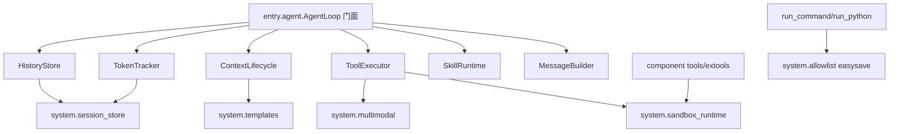

# Evolve Agent 复用性重构计划

## 目标边界

本次只改 `origin_agent/` 源码，不读取或修改 `workspace/` 下代码文件，不运行或构建 `origin_agent`。前端如需验证，执行阶段会停下来提示你手动验证。

核心目标：

- 将 [d:\__TEMP__\evolve-agent\origin_agent\entry\agent.py](d:\__TEMP__\evolve-agent\origin_agent\entry\agent.py) 拆为 `entry/agent/` 包。
- 将 [d:\__TEMP__\evolve-agent\origin_agent\system\prompt.py](d:\__TEMP__\evolve-agent\origin_agent\system\prompt.py) 中模板获取能力抽出复用，避免 agent 内硬编码 fallback。
- 提供统一 sandbox 单例入口。
- allowlist 改为 `third/easysave` 持久化，两个 allowlist 放入同一个文件，通过不同 key 读写，并兼容旧 JSON 文件。
- 会话存储路径统一由一个对象/工具提供 `ensure` 与 `get`。
- 多模态消息构造、脱敏推送、vision 拒绝检测统一接口。
- 提供后端通用存储、模板、事件 payload、路径工具函数。
- 前端只做低风险复用性收敛。

## 目标结构

## 后端改动计划

### 1. `agent.py` 拆为 `entry/agent/` 包

将当前 [d:\__TEMP__\evolve-agent\origin_agent\entry\agent.py](d:\__TEMP__\evolve-agent\origin_agent\entry\agent.py) 迁移为目录包，保留导入兼容：

- 新建 `origin_agent/entry/agent/__init__.py`
  - 对外重导出 `AgentLoop`。
  - 保证现有 `from entry.agent import AgentLoop` 不变。
- 新建 `origin_agent/entry/agent/loop.py`
  - 保留 `AgentLoop` 门面和主消息循环。
  - 保留 `process_message`、`interrupt`、`is_interrupted`、`set_session_manager`、`set_tool_event_callback` 等公开 API。
- 新建 `origin_agent/entry/agent/history.py`
  - 管理 `_histories`、JSONL 消息追加/读取/覆写、消息编辑、前端回放转换。
- 新建 `origin_agent/entry/agent/tokens.py`
  - 管理 token usage 的 easysave 读写和 `_last_prompt_tokens`。
- 新建 `origin_agent/entry/agent/lifecycle.py`
  - 管理上下文压缩、会话终结、会话旋转、合并会话、继承上下文。
- 新建 `origin_agent/entry/agent/executor.py`
  - 管理工具执行、审批、超时、工具统计、工具结果截断、事件推送。
- 新建 `origin_agent/entry/agent/skills.py`
  - 管理 skill prompt 缓存、自定义 hooks、vision 支持缓存读取。
- 新建 `origin_agent/entry/agent/messages.py`
  - 管理 system prompt 组装、history + memory + hook 的消息构建、自动标题。

兼容约束：

- [d:\__TEMP__\evolve-agent\origin_agent\gateway\server.py](d:\__TEMP__\evolve-agent\origin_agent\gateway\server.py) 仍可导入 `entry.agent.AgentLoop`。
- 对当前外部依赖的私有状态提供兼容属性：`_session_rotated_notify`、`_token_usage`、`_tool_stats`，避免一次性破坏 dashboard/gateway。
- 保持行为优先，不在拆包时改变消息循环状态机。

### 2. 模板读取统一

新增 `origin_agent/system/templates.py`：

- `read_text(path)`：统一读取文件，失败返回空字符串或抛出受控错误。
- `select_template_root(lang)`：统一中文模板根目录选择。
- `read_template(name, lang="zh", required=False)`：支持 `compress.txt`、`compress_full.txt`、`auto_title.txt`、`base.txt`、`tools.txt` 等。
- `read_prompt_template(name, lang)`：返回模板内容，不在调用方硬编码 fallback。

改造：

- [d:\__TEMP__\evolve-agent\origin_agent\system\prompt.py](d:\__TEMP__\evolve-agent\origin_agent\system\prompt.py) 使用 `system.templates`。
- `entry/agent/lifecycle.py` 和 `entry/agent/messages.py` 使用同一模板接口。
- 删除 agent 内部 `compress.txt` / `compress_full.txt` / `auto_title.txt` 的重复路径判断。
- “不需要硬编码 fallback”的落地方式：模板缺失时返回空，由调用方使用已有保守默认行为或跳过 LLM 摘要；如果该模板对功能是必需的，则返回明确错误日志，而不是内联长 fallback prompt。

### 3. 统一 sandbox 单例

新增 `origin_agent/system/sandbox_runtime.py`：

- `set_sandbox(sandbox)`
- `get_sandbox()`
- `require_sandbox()`
- `resolve_read(path)` / `resolve_write(path)` 可选轻包装

改造：

- [d:\__TEMP__\evolve-agent\origin_agent\component\tools\filesystem.py](d:\__TEMP__\evolve-agent\origin_agent\component\tools\filesystem.py) 不再自持 `_sandbox`，改为调用统一入口。
- [d:\__TEMP__\evolve-agent\origin_agent\component\tools\read_image.py](d:\__TEMP__\evolve-agent\origin_agent\component\tools\read_image.py) 删除独立 sandbox 单例。
- `component/tools/code.py`、`shell.py`、`frontend.py`、`run_python.py`、`component/extools/*` 逐步改为从统一入口获取 sandbox。
- [d:\__TEMP__\evolve-agent\origin_agent\main.py](d:\__TEMP__\evolve-agent\origin_agent\main.py) 只设置一次 sandbox，不再分别给多个工具模块注入。

### 4. allowlist 使用 easysave

新增 `origin_agent/system/allowlist.py`：

- 使用 `third/easysave` 的 `save/load/contains`。
- 单文件：`workspace/logs/allowlists.json`。
- key：`shell`、`python`。
- 兼容旧文件：
  - `workspace/logs/shell_allowlist.json`
  - `workspace/logs/python_allowlist.json`
- 读取策略：先读 easysave 新文件；如果 key 不存在，再读旧 JSON；读到后写入新文件对应 key。
- 写入策略：只写新 easysave 文件；旧文件不删除。

改造：

- [d:\__TEMP__\evolve-agent\origin_agent\component\tools\shell.py](d:\__TEMP__\evolve-agent\origin_agent\component\tools\shell.py) 调用 `load_allowlist("shell", seed)` / `save_allowlist("shell", entries, seed)`。
- [d:\__TEMP__\evolve-agent\origin_agent\component\tools\run_python.py](d:\__TEMP__\evolve-agent\origin_agent\component\tools\run_python.py) 调用 `load_allowlist("python", seed)` / `save_allowlist("python", entries, seed)`。
- seed 仍保持：shell 为 `dir`、`ls`、`echo .`，python 为空。

风险控制：allowlist 是安全关键路径，新 helper 必须在读取失败时返回 seed 而不是放宽权限。

### 5. 会话存储路径统一

新增 `origin_agent/system/session_store.py`：

- `SessionStoreRoot(base_dir)` 或 `get_session_store(history_store_dir)`。
- `ensure_session_dir(session_id)`。
- `session_dir(session_id)`。
- `messages_path(session_id)`。
- `summary_path(session_id)`。
- `token_usage_key(session_id)` / `token_usage_file()`。
- `index_path()`。

落地策略：

- JSONL 消息历史继续使用 JSONL，不迁移到 easysave。
- `summary.txt` 可以保持文本，因为它是人类可读产物；如果严格按“除 JSONL 以外持久化都用 easysave”，则本次把 summary 改为 `session_meta.json` easysave key：`summary:{session_id}`。为了兼容现有摘要，先读 easysave，缺失再读旧 `summary.txt`，成功后写入 easysave。
- token usage 改用 easysave，兼容旧 `token_usage.json`。

改造：

- `entry/agent/history.py` 只通过 session store 获取 `messages.jsonl`。
- `entry/agent/tokens.py` 通过 session store + easysave 读写 token usage。
- `entry/agent/lifecycle.py` 通过 session store 读写 summary。
- [d:\__TEMP__\evolve-agent\origin_agent\gateway\chat.py](d:\__TEMP__\evolve-agent\origin_agent\gateway\chat.py) 的 session index 后续可迁移，但本轮优先不动它的行为，只收敛路径创建入口。

### 6. 多模态消息统一接口

新增 `origin_agent/system/multimodal.py`：

- `is_content_block_rejection(exc)`：统一 agent 和 probe_vision 的异常判断。
- `strip_image_blocks(messages, replacement_text)`：统一图片剥离逻辑。
- `build_image_content_blocks(image, text_payload)`：统一 OpenAI content blocks 构造。
- `extract_tool_image(result)`：统一 `_image` 提取。
- `sanitize_image_payload_for_push(result, keep_metadata=True)`：统一前端推送时移除 base64。
- `vision_cache_load()` / `vision_cache_save()`：把 `probe_vision` 的私有缓存读写迁出。

改造：

- `entry/agent/executor.py` 使用该模块处理 `_image`、`image_url`、tool_result 推送。
- `entry/agent/loop.py` 使用该模块处理 LLM content block 拒绝重试。
- [d:\__TEMP__\evolve-agent\origin_agent\component\tools\probe_vision.py](d:\__TEMP__\evolve-agent\origin_agent\component\tools\probe_vision.py) 使用该模块，不再暴露 `_load_cache` 给 agent。

### 7. 分散重复工具函数收敛

新增 `origin_agent/system/persist.py`：

- easysave 的安全包装：`save_key`、`load_key`、`contains_key`。
- JSONL 专用：`append_jsonl`、`read_jsonl`、`overwrite_jsonl`。
- 原子写入文本：`write_text_atomic`，用于少数仍需要文本文件的地方。

新增 `origin_agent/system/event_payload.py`：

- `to_json_payload(value)`。
- `truncate_payload(value, max_chars, spill_path_provider)`。
- `prepare_tool_event_payload(result)`。

这些函数优先被 `entry/agent/executor.py` 使用，后续可扩展到其他工具。

## 前端改动计划

前端只做低风险复用，不重构整个 `useWebSocket`。

### 1. 提取消息资源解析

新增或扩展 [d:\__TEMP__\evolve-agent\origin_agent\frontend\src\utils.ts](d:\__TEMP__\evolve-agent\origin_agent\frontend\src\utils.ts)：

- `extractMessageResources(messages)`：统一提取 images、audios、downloads。
- 替换 [d:\__TEMP__\evolve-agent\origin_agent\frontend\src\hooks\useWebSocket.ts](d:\__TEMP__\evolve-agent\origin_agent\frontend\src\hooks\useWebSocket.ts) 中 `sessionResources` 的重复逻辑。
- 替换 Drawer 中重复资源扫描逻辑。

### 2. 提取工具结果解析

在 `utils.ts` 增加：

- `parseToolResult(raw)`：统一解析 markdown、download_url、audio_url、playlist、message。
- 替换 `session_history` 回放与实时 `tool_result` 两处重复解析。

### 3. 面板折叠组件

新增 `frontend/src/components/CollapsiblePanel.tsx`：

- 统一 header、title、count、toggle。
- 改造 TaskProgressPanel 与 ClipboardPanel。

### 4. MessageItem 样式收敛

- 将 `MessageItem.tsx` 中 markdown inline style 迁移到 [d:\__TEMP__\evolve-agent\origin_agent\frontend\src\styles\messages.css](d:\__TEMP__\evolve-agent\origin_agent\frontend\src\styles\messages.css)。
- 不改消息渲染行为，只改复用方式。

## 验证策略

由于项目规则禁止我运行或构建 `origin_agent`，执行阶段不会运行 Python、pnpm、lint、build。

可做的静态验证：

- 只读检查 import 路径是否闭合。
- 检查旧导入 `from entry.agent import AgentLoop` 是否仍成立。
- 检查 `workspace/` 代码文件没有被读取或修改。
- 修改后用 linter 诊断工具读取编辑文件的静态诊断；前端诊断不作为构建结果。

需要你手动执行的验证：

- `python run.py` 启动。
- 发送普通消息。
- 调用 shell allow once / allow always。
- 调用 run_python allow always。
- 上传/读取图片后验证 vision 支持与不支持两种路径。
- 打开历史会话，验证消息、summary、token usage 兼容读取。
- 如前端变更完成后，手动执行前端构建或启动应用验证。