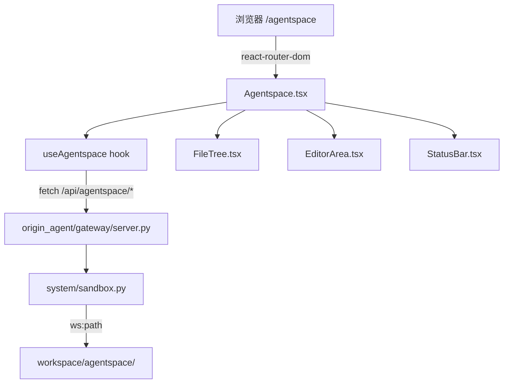

# 目标
在 `origin_agent/frontend` 中新增 `/agentspace` 路由页面，提供文件树 + Monaco 文本编辑器，支持新建/打开/编辑/保存/重命名/删除文件和目录；在 `origin_agent/gateway/server.py` 中新增 `/api/agentspace/*` REST API，统一操作 `ws:` 命名空间。

# 关键决策回顾
- 独立页面：`/agentspace` 通过 react-router 渲染，后端 SPA fallback 兜底。
- 功能范围：仅文件树 + 编辑器，无 Terminal/Extensions/Git/AI Panel。
- 编辑器引擎：Monaco Editor（`@monaco-editor/react`）。
- 样式：复用现有 CSS 变量，布局模仿 VSCode。
- 后端路径：API 接收相对 agentspace 根的路径，后端自动补 `ws:` 前缀。
- 安全：无登录认证，依赖 Sandbox 做路径隔离。

# 架构与数据流



# 后端变更

## 文件：origin_agent/gateway/server.py

新增 `/api/agentspace/*` 路由组，统一使用 `Sandbox(get_runtime_context())` 操作 `ws:` 命名空间。

API 设计：
- `GET /api/agentspace/list?path=<relative>` → 列出目录条目
  - 返回：`{ "entries": [{ "name": string, "type": "file" | "dir" }] }`
- `GET /api/agentspace/read?path=<relative>` → 读取文件内容
  - 返回：`{ "content": string }`
- `POST /api/agentspace/write` → 写入/覆盖文件
  - body：`{ "path": string, "content": string }`
  - 返回：`{ "success": true }`
- `POST /api/agentspace/mkdir` → 创建目录
  - body：`{ "path": string }`
  - 返回：`{ "success": true }`
- `POST /api/agentspace/delete` → 删除文件或空目录
  - body：`{ "path": string }`
  - 返回：`{ "success": true }`
- `POST /api/agentspace/rename` → 重命名/移动
  - body：`{ "oldPath": string, "newPath": string }`
  - 返回：`{ "success": true }`

路径处理函数 `_to_logical_path(relative: str) -> str`：
- 去除首尾 `/`
- 拒绝包含 `..` 或绝对路径的输入
- 返回 `ws:{relative}`

错误处理：
- `SandboxError` → `HTTPException(403/400, detail=str(exc))`
- `FileNotFoundError` → `HTTPException(404)`
- 其他异常 → `HTTPException(500)`

## 文件：origin_agent/system/sandbox.py

当前 `Sandbox` 已具备全部所需方法：`read`、`write`、`create_folder`、`delete`、`move`、`list_dir`、`is_file`、`is_dir`。无需修改。

# 前端变更

## 文件：origin_agent/frontend/package.json

新增依赖：
```json
"dependencies": {
  "@monaco-editor/react": "^4.7.0",
  "monaco-editor": "^0.55.1",
  "react-router-dom": "^6.30.0"
}
```

保持 React 18 不变，选择兼容版本。

## 文件：origin_agent/frontend/src/main.tsx

用 `BrowserRouter` 包裹 `App`：
```tsx
import { BrowserRouter } from "react-router-dom";

ReactDOM.createRoot(document.getElementById("root")!).render(
  <React.StrictMode>
    <BrowserRouter>
      <App />
    </BrowserRouter>
  </React.StrictMode>
);
```

## 文件：origin_agent/frontend/src/App.tsx

引入路由：
```tsx
import { Routes, Route } from "react-router-dom";
import Agentspace from "./pages/Agentspace";

export default function App() {
  // ... existing chat app logic ...
  return (
    <Routes>
      <Route path="/" element={<ExistingChatApp />} />
      <Route path="/agentspace/*" element={<Agentspace />} />
    </Routes>
  );
}
```

注意：现有聊天 App 的逻辑建议抽离为 `ChatApp` 组件，避免 `App.tsx` 过度膨胀。

## 新增文件：origin_agent/frontend/src/types.ts（扩展）

追加类型：
```ts
export interface FileEntry {
  name: string;
  type: "file" | "dir";
}

export interface OpenTab {
  path: string;
  name: string;
  content: string;
  originalContent: string;
  isDirty: boolean;
}
```

## 新增文件：origin_agent/frontend/src/hooks/useAgentspace.ts

职责：封装所有 `/api/agentspace/*` 调用及本地状态。

核心状态：
- `rootEntries: FileEntry[]`
- `expandedDirs: Set<string>`
- `openTabs: OpenTab[]`
- `activeTabPath: string | null`
- `currentDir: string`（用于新建文件时的默认目录）
- `loading: boolean`
- `error: string | null`

核心函数：
- `loadDirectory(path: string)` → 加载目录内容并缓存
- `openFile(path: string)` → 调用 read API，新增 tab 或激活已有 tab
- `saveFile(path?: string)` → 调用 write API，清除 dirty 标记
- `createFile(parentDir: string, name: string)` → mkdir 或 write 空文件
- `createFolder(parentDir: string, name: string)` → mkdir
- `renameFile(oldPath: string, newPath: string)` → rename API + 本地 tab 更新
- `deletePath(path: string)` → delete API + 关闭相关 tab
- `closeTab(path: string)` / `setActiveTab(path: string)`

刷新策略：
- 操作成功后刷新父目录列表
- 不引入全局轮询，依赖用户手动刷新或操作后刷新

## 新增文件：origin_agent/frontend/src/components/agentspace/FileTree.tsx

职责：递归渲染文件树。

Props：
```ts
interface FileTreeProps {
  entries: FileEntry[];
  path: string;
  expandedDirs: Set<string>;
  selectedPath: string | null;
  onToggleDir: (path: string) => void;
  onSelectFile: (path: string) => void;
  onContextMenu: (e: React.MouseEvent, path: string, type: "file" | "dir") => void;
}
```

行为：
- 目录可点击展开/折叠
- 文件点击触发 `onSelectFile`
- 右键菜单支持新建/重命名/删除（由父组件统一处理）
- 使用 `ChevronRight` / `ChevronDown` 图标（可用 SVG 或现有图标）

## 新增文件：origin_agent/frontend/src/components/agentspace/EditorArea.tsx

职责：渲染 tab 栏和 Monaco 编辑器。

Props：
```ts
interface EditorAreaProps {
  tabs: OpenTab[];
  activeTabPath: string | null;
  onTabClick: (path: string) => void;
  onTabClose: (path: string) => void;
  onContentChange: (path: string, value: string) => void;
  onSave: (path: string) => void;
}
```

行为：
- tab 栏显示文件名，dirty 时显示圆点
- Monaco Editor 使用 `vs-dark` 主题
- 根据文件扩展名设置 `language`
- 监听 `onMount` 绑定 `Ctrl+S` / `Cmd+S` 保存快捷键
- 空状态显示提示文字

## 新增文件：origin_agent/frontend/src/components/agentspace/StatusBar.tsx

职责：底部状态栏。

显示：
- 当前打开文件路径
- 当前光标行/列（通过 Monaco `onCursorPositionChange` 获取）
- 文件语言

## 新增文件：origin_agent/frontend/src/pages/Agentspace.tsx

职责：组装整个 /agentspace 页面。

布局：
```
+----------------+--------------------------+
|  FileTree      |  EditorArea              |
|  (resizable)   |                          |
+----------------+--------------------------+
|  StatusBar                                |
+-------------------------------------------+
```

状态管理：
- 使用 `useAgentspace` hook
- 处理右键菜单显示/隐藏
- 处理新建/重命名弹窗

最小功能菜单：
- 文件树顶部一个小工具栏：刷新、新建文件、新建文件夹
- 右键菜单：新建文件、新建文件夹、重命名、删除

## 新增文件：origin_agent/frontend/src/styles/agentspace.css

职责：agentspace 页面专用样式。

需要覆盖的样式：
- `.agentspace-layout`：flex 布局，占满视口
- `.file-tree`：侧边栏，宽度 240px，可拖拽调整（可选 V1 固定宽度）
- `.file-tree-item`：hover/active 状态
- `.editor-tabs`：tab 栏样式
- `.editor-tab`：active/inactive/dirty 状态
- `.status-bar`：底部栏，高度 22px

复用现有 CSS 变量，不引入新的颜色系统。

# 构建与部署

- `origin_agent/__main__.py::_build_frontend()` 已自动运行 `pnpm install && pnpm run build`，新增依赖无需额外脚本。
- `gateway/server.py` 的 `spa_fallback` 路由 `/{full_path:path}` 已在所有 API 路由之后定义，可直接处理 `/agentspace` 的刷新。
- 无需新增后端构建步骤。

# 测试方式

由于 AGENTS.md 禁止运行 `python run.py` 和前端验证命令，测试由用户手动完成：
1. 用户运行 `python run.py --load <config>` 启动服务。
2. 浏览器访问 `http://127.0.0.1:8765/agentspace`。
3. 验证文件树加载、文件打开、编辑、保存、新建、删除、重命名功能。

# 错误处理

- API 返回 4xx/5xx 时，前端通过 toast/alert 显示错误信息。
- 保存失败时不关闭 tab，保留 dirty 状态。
- 删除已打开文件时，关闭对应 tab 并提示。

# 依赖管理

新增前端依赖（由 `pnpm install` 在运行时安装）：
- `@monaco-editor/react@^4.7.0`
- `monaco-editor@^0.55.1`
- `react-router-dom@^6.30.0`

后端无新增依赖。

# 文件清单

修改文件：
- `origin_agent/frontend/package.json`
- `origin_agent/frontend/src/main.tsx`
- `origin_agent/frontend/src/App.tsx`
- `origin_agent/frontend/src/types.ts`
- `origin_agent/gateway/server.py`

新增文件：
- `origin_agent/frontend/src/pages/Agentspace.tsx`
- `origin_agent/frontend/src/components/agentspace/FileTree.tsx`
- `origin_agent/frontend/src/components/agentspace/EditorArea.tsx`
- `origin_agent/frontend/src/components/agentspace/StatusBar.tsx`
- `origin_agent/frontend/src/hooks/useAgentspace.ts`
- `origin_agent/frontend/src/styles/agentspace.css`
