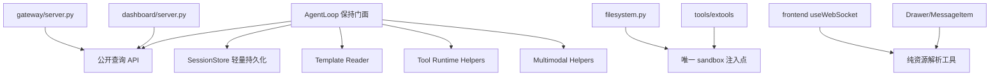

# Evolve Agent 复用性重构新版计划

## 重新检视结论

旧计划方向有价值，但当前代码已经发生变化，必须收窄范围。

关键事实：

- [D:\__TEMP__\evolve-agent\origin_agent\entry\agent.py](D:\__TEMP__\evolve-agent\origin_agent\entry\agent.py) 仍是 1500 行级单体，职责集中在主循环、历史持久化、token 统计、标题生成、上下文压缩、会话终结、工具执行、多模态结果处理、前端回放查询。
- [D:\__TEMP__\evolve-agent\origin_agent\component\approval_allowlist.py](D:\__TEMP__\evolve-agent\origin_agent\component\approval_allowlist.py) 已经存在统一工具 allowlist，并且 [D:\__TEMP__\evolve-agent\origin_agent\entry\agent.py](D:\__TEMP__\evolve-agent\origin_agent\entry\agent.py) 已在工具执行入口按工具名和参数指纹处理 `allow_always`。旧计划里的“合并 shell/python allowlist”应删除。
- [D:\__TEMP__\evolve-agent\origin_agent\component\tools\shell.py](D:\__TEMP__\evolve-agent\origin_agent\component\tools\shell.py) 和 [D:\__TEMP__\evolve-agent\origin_agent\component\tools\run_python.py](D:\__TEMP__\evolve-agent\origin_agent\component\tools\run_python.py) 内部仍保留二次审批兼容路径，但主线已由 AgentLoop 预审批。后续可降级为清理项。
- sandbox 的核心类已在 [D:\__TEMP__\evolve-agent\origin_agent\system\sandbox.py](D:\__TEMP__\evolve-agent\origin_agent\system\sandbox.py)，旧计划无需再新建完整 sandbox_runtime。真正问题是获取方式分裂：`filesystem._s()`、模块级 `_sandbox`、直接导入 `filesystem._sandbox` 混用。
- 多模态链路已经可用：`read_image` 返回 `_image`，AgentLoop 转成 `image_url` content block，`probe_vision` 缓存 vision 能力，API 拒绝时降级剥离图片。旧计划无需再做完整 multimodal 基础设施，只需要把重复判断和 payload 脱敏收敛为小工具。
- 会话持久化仍分散：`messages.jsonl`、`token_usage.json`、`summary.txt` 由 AgentLoop 直接读写，`_index.json` 由 gateway session manager 维护，memory 使用 easysave。新版不迁移格式，只封装路径和原子写入。
- 前端 [D:\__TEMP__\evolve-agent\origin_agent\frontend\src\hooks\useWebSocket.ts](D:\__TEMP__\evolve-agent\origin_agent\frontend\src\hooks\useWebSocket.ts) 仍是高耦合 hook，不适合本轮大拆；适合抽纯资源解析和少量展示组件复用。

## 新目标结构

## 阶段 0：先切断外部私有状态依赖

目的：在拆 AgentLoop 前降低破坏面。

改动范围：

- [D:\__TEMP__\evolve-agent\origin_agent\entry\agent.py](D:\__TEMP__\evolve-agent\origin_agent\entry\agent.py)
  - 增加公开查询入口：`get_all_token_usage()`、`get_all_tool_stats()`、`pop_session_rotated(session_id)`、`add_memory_provider(provider)`。
  - 保持现有私有属性短期不删除，避免一次性破坏外部代码。
- [D:\__TEMP__\evolve-agent\origin_agent\gateway\server.py](D:\__TEMP__\evolve-agent\origin_agent\gateway\server.py)
  - 将直接读取 `_session_rotated_notify` 改为调用 `pop_session_rotated()`。
- [D:\__TEMP__\evolve-agent\origin_agent\dashboard\server.py](D:\__TEMP__\evolve-agent\origin_agent\dashboard\server.py)
  - 将直接读取 `_token_usage`、`_tool_stats` 改为公开查询方法。
- [D:\__TEMP__\evolve-agent\origin_agent\main.py](D:\__TEMP__\evolve-agent\origin_agent\main.py)
  - 将 `agent_loop._memory.add_provider(...)` 改为 `agent_loop.add_memory_provider(...)`。

检查点：外部模块不再新增对 AgentLoop 私有状态的依赖。

## 阶段 1：统一模板读取，保留现有回退行为

目的：先解决旧计划中最确定的重复点，但不改变 prompt 内容。

改动范围：

- 新增 [D:\__TEMP__\evolve-agent\origin_agent\system\templates.py](D:\__TEMP__\evolve-agent\origin_agent\system\templates.py)
  - 提供 `select_template_root(lang)`、`read_template(name, lang="zh")`、`read_template_path(name, lang="zh")`。
  - 只负责路径选择和读取，不内置长 fallback prompt。
- [D:\__TEMP__\evolve-agent\origin_agent\system\prompt.py](D:\__TEMP__\evolve-agent\origin_agent\system\prompt.py)
  - 使用统一模板读取工具读取 `base.txt`、`modes/*.txt`、`tools.txt`。
- [D:\__TEMP__\evolve-agent\origin_agent\entry\agent.py](D:\__TEMP__\evolve-agent\origin_agent\entry\agent.py)
  - 将 `auto_title.txt`、`compress.txt`、`compress_full.txt` 的路径判断改为调用统一模板读取。
  - 原有 fallback 文案先保留在调用点，避免本轮改变运行行为。

检查点：模板目录选择逻辑只剩一处；prompt 文案不变。

## 阶段 2：引入轻量 SessionStore，不迁移格式

目的：把 AgentLoop 中分散的会话路径和文件读写收敛，但保持兼容。

改动范围：

- 新增 [D:\__TEMP__\evolve-agent\origin_agent\system\session_store.py](D:\__TEMP__\evolve-agent\origin_agent\system\session_store.py)
  - 封装 `session_dir(session_id)`、`messages_path(session_id)`、`summary_path(session_id)`、`token_usage_path(session_id)`。
  - 封装 JSONL 追加、JSONL 覆写、JSONL 读取、summary 读写、token usage 读写。
  - 对覆写类操作使用临时文件替换，降低压缩/编辑时损坏风险。
- [D:\__TEMP__\evolve-agent\origin_agent\entry\agent.py](D:\__TEMP__\evolve-agent\origin_agent\entry\agent.py)
  - `_history_path()`、`_persist_message()`、`_load_history_from_disk()`、`_remove_last_user_message()`、`_overwrite_history_file()`、`_token_usage_path()`、`_persist_token_usage()`、`_load_token_usage_from_disk()` 改为委托 SessionStore。

明确不做：

- 不把 `messages.jsonl` 迁移到 easysave。
- 不把 `_index.json` 迁移到 easysave。
- 不改 memory provider 的 easysave 存储。
- 不改变 `summary.txt` 和 `token_usage.json` 的现有兼容路径。

检查点：磁盘格式完全兼容旧会话。

## 阶段 3：统一 sandbox 获取路径

目的：消除工具模块对 `filesystem._sandbox` 的隐式依赖。

改动范围：

- [D:\__TEMP__\evolve-agent\origin_agent\component\tools\filesystem.py](D:\__TEMP__\evolve-agent\origin_agent\component\tools\filesystem.py)
  - 保留唯一 `set_sandbox()` 和 `_s()`。
  - 将其作为本轮唯一 sandbox 注入点。
- [D:\__TEMP__\evolve-agent\origin_agent\component\tools\read_image.py](D:\__TEMP__\evolve-agent\origin_agent\component\tools\read_image.py)
  - 删除独立 `_sandbox` 与 `set_sandbox()`，改为复用 `filesystem._s()`。
- [D:\__TEMP__\evolve-agent\origin_agent\component\tools\list_uploads.py](D:\__TEMP__\evolve-agent\origin_agent\component\tools\list_uploads.py)
  - 同样改为复用 `filesystem._s()`。
- [D:\__TEMP__\evolve-agent\origin_agent\main.py](D:\__TEMP__\evolve-agent\origin_agent\main.py)
  - sandbox 初始化只注入 `component.tools.filesystem`，不再分别注入 read_image/list_uploads。
- `component/extools` 中直接导入 `filesystem._sandbox` 的模块
  - 改为调用 `filesystem._s()`，避免 sandbox 未初始化时返回 `None`。

检查点：工具侧 sandbox 入口收敛为 `filesystem._s()`。

## 阶段 4：清理工具执行重复逻辑，不改变审批状态机

目的：基于当前统一审批现状，减少 handler 内的重复审批分支。

改动范围：

- [D:\__TEMP__\evolve-agent\origin_agent\component\tools\shell.py](D:\__TEMP__\evolve-agent\origin_agent\component\tools\shell.py)
  - 保留 `_pre_approved` 兼容字段识别，但不再承担完整 allowlist 逻辑。
  - schema 中继续声明 danger_level 为 `dangerous`，审批仍由 AgentLoop 统一入口处理。
- [D:\__TEMP__\evolve-agent\origin_agent\component\tools\run_python.py](D:\__TEMP__\evolve-agent\origin_agent\component\tools\run_python.py)
  - 同步收敛审批描述，避免与 AgentLoop 审批逻辑重复。
- 如确认 [D:\__TEMP__\evolve-agent\origin_agent\component\extools\background_service.py](D:\__TEMP__\evolve-agent\origin_agent\component\extools\background_service.py) 也由统一 danger_level 入口覆盖，再做同类清理。

检查点：危险工具仍全部经过 AgentLoop 统一审批；handler 不再维护第二套“始终允许”语义。

## 阶段 5：抽取 AgentLoop 内部低风险模块

目的：开始拆 AgentLoop，但不做包级大迁移。

优先顺序：

- 新增 `entry/agent_support/history.py` 或 `entry/agent_support/session_io.py`
  - 只承接 SessionStore 相关薄封装，AgentLoop 仍保持唯一门面。
- 新增 `entry/agent_support/messages.py`
  - 承接 system prompt、skill prompt、message hooks、history 拼接。
- 新增 `entry/agent_support/multimodal.py`
  - 承接 content block 拒绝判断、图片 block 剥离、`_image` payload 脱敏、vision cache 读取。
- 暂不拆 `_execute_tool()` 为独立 executor。
  - 该方法同时耦合审批、tool registry、memory tools、timeout、统计、事件推送、多模态、结果落盘，是最高风险点。

检查点：`from entry.agent import AgentLoop` 仍保持不变；AgentLoop 对外 API 不变。

## 阶段 6：前端只做纯函数和展示层复用

目的：只做低风险复用，不重构 WebSocket 状态机。

改动范围：

- [D:\__TEMP__\evolve-agent\origin_agent\frontend\src\utils.ts](D:\__TEMP__\evolve-agent\origin_agent\frontend\src\utils.ts)
  - 增加 `extractMessageResources(messages)`，统一图片、音频、下载资源提取。
  - 增加 `parseToolResult(raw)`，统一处理 markdown、download_url、audio_url、playlist。
- [D:\__TEMP__\evolve-agent\origin_agent\frontend\src\hooks\useWebSocket.ts](D:\__TEMP__\evolve-agent\origin_agent\frontend\src\hooks\useWebSocket.ts)
  - 只替换纯解析逻辑，不改变 hook 返回结构。
- [D:\__TEMP__\evolve-agent\origin_agent\frontend\src\components\Drawer.tsx](D:\__TEMP__\evolve-agent\origin_agent\frontend\src\components\Drawer.tsx)
  - 复用 `extractMessageResources()`，保持 UI 不变。
- [D:\__TEMP__\evolve-agent\origin_agent\frontend\src\components\TaskProgressPanel.tsx](D:\__TEMP__\evolve-agent\origin_agent\frontend\src\components\TaskProgressPanel.tsx) 和 [D:\__TEMP__\evolve-agent\origin_agent\frontend\src\components\ClipboardPanel.tsx](D:\__TEMP__\evolve-agent\origin_agent\frontend\src\components\ClipboardPanel.tsx)
  - 只在确认折叠行为一致后再抽共享 `CollapsiblePanel`。

明确不做：

- 不拆 [D:\__TEMP__\evolve-agent\origin_agent\frontend\src\hooks\useWebSocket.ts](D:\__TEMP__\evolve-agent\origin_agent\frontend\src\hooks\useWebSocket.ts) 的状态机。
- 不改 `useWebSocket` 的返回 shape。
- 不重构 [D:\__TEMP__\evolve-agent\origin_agent\frontend\src\App.tsx](D:\__TEMP__\evolve-agent\origin_agent\frontend\src\App.tsx) 编排结构。

## 验证策略

执行阶段遵守当前项目约束：

- 不运行或构建 `origin_agent`。
- 不读取或修改 `workspace/` 下代码文件。
- 不使用脚本做批量修改。
- 前端改动后不自动执行 `pnpm install/build/dev`，需要你手动验证。

可做的静态检查：

- 检查导入路径是否闭合。
- 检查旧入口 `from entry.agent import AgentLoop` 不变。
- 检查 gateway/dashboard/main 不再直接新增 AgentLoop 私有状态依赖。
- 对已编辑文件读取编辑器诊断。

需要你手动验证：

- `python run.py` 启动。
- 普通对话、工具调用、拒绝/允许一次/始终允许。
- `run_command`、`run_python`、后台任务类工具。
- 图片读取与 vision 支持/不支持路径。
- 历史会话打开、标题生成、会话终结/旋转、合并会话。
- 前端资源抽屉、音频、下载、playlist、任务面板、剪贴板面板。