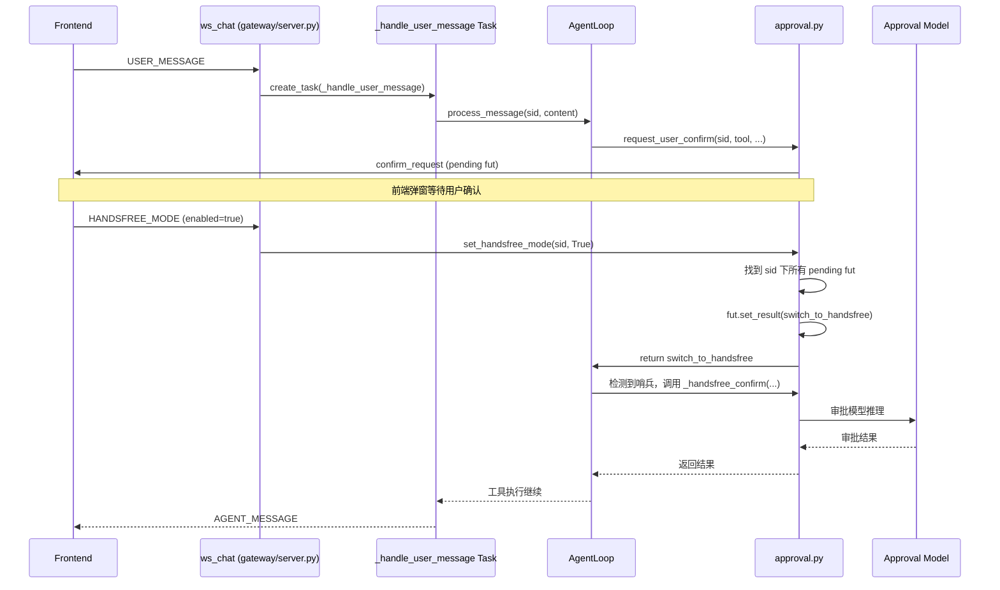

## 目标
修复当前 `HANDSFREE_MODE` 消息在 Agent 工具调用链期间无法被实时处理的问题，使得用户在工具调用链中切换脱手模式后，当前正在等待前端审批的工具能立即转由脱手审批模型处理。

## 根因
`gateway/server.py` 的 `ws_chat` 使用单协程顺序处理所有 WebSocket 消息。`USER_MESSAGE` 分支会 `await _agent_loop.process_message(...)`，这个调用会阻塞整个 `while True:` 循环，直到 Agent 完成当前完整回合（包括整个工具调用链）。因此，用户在工具调用链期间发送的 `HANDSFREE_MODE` 消息会被积压在 TCP 缓冲区中，无法被读取和处理，只有等 `process_message` 返回后才会被消费。

## 技术方案
采用 "WebSocket 消息处理后台化 + Future 哨兵结果" 的组合方案：
- 不改 `request_user_confirm` 的公共接口，不引入异常或 `asyncio.Event`。
- 用 `asyncio.Future.set_result()` 向正在等待的审批请求注入一个内部哨兵结果，实现审批路径的平滑切换。

## 涉及文件
- `origin_agent/gateway/server.py`
- `origin_agent/component/approval.py`

## 模块关系与数据流



## 详细改动

### 1. `origin_agent/component/approval.py`

在 `ApprovalResult` 定义附近增加一个内部哨兵结果（不暴露为合法外部 action）：

```python
_SWITCH_TO_HANDSFREE = ApprovalResult(action="switch_to_handsfree", denied_by="system")
```

修改 `set_handsfree_mode(session_id, enabled)`：
- 更新 `_handsfree_sessions[session_id] = enabled` 后，如果 `enabled=True`，遍历 `_confirm_session_map`。
- 对属于该 session 且尚未完成的 pending `fut`，调用 `fut.set_result(_SWITCH_TO_HANDSFREE)`。
- 这些 `fut` 不能 `pop`，因为 `request_user_confirm` 中需要继续处理；但要记录日志。

修改 `request_user_confirm(...)` 的前端等待分支：
- `await asyncio.wait_for(fut, timeout=APPROVAL_WAIT_TIMEOUT)` 返回后，检查结果。
- 如果 `result.action == "switch_to_handsfree"`：
  - `_pending_confirms.pop(request_id, None)` 清理。
  - 重新检查 `is_handsfree_mode(session_id)`。
  - 如果为真，调用 `_handsfree_confirm(...)` 并返回其结果。
  - 如果为假（极端情况），返回 `deny`。
- 否则正常返回用户确认结果。

### 2. `origin_agent/gateway/server.py`

在 `ws_chat` 中定义内部协程 `_handle_user_message`：
- 接收 `(sid, content, target_sessions)` 参数。
- 将原 `USER_MESSAGE` 分支中从 `target_sessions` 解析到 `process_message` 返回后的所有逻辑（子 Agent 转发、主会话处理、session rotation、回复发送、token usage 推送、evolution shutdown 触发）移入该协程。
- 使用 `nonlocal sid` 在 `session_rotated` 发生时更新外层 `ws_chat` 的 `sid` 变量。
- 外层用 `asyncio.create_task(_handle_user_message(...))` 启动，不阻塞 `while True`。
- 为后台任务添加 `try/except`，捕获并记录异常，避免 "Task exception was never retrieved"。

`HANDSFREE_MODE` 分支保持同步处理（只调用 `set_handsfree_mode`，立即完成）。

### 3. 边界与副作用处理

- `session_rotated`：通过 `nonlocal sid` 同步，确保 `_tool_ws_sinks` 的新映射对 `ws_chat` 后续循环可见，后续控制消息能路由到正确的新 session。
- 并发 `USER_MESSAGE`：`AgentLoop._session_locks` 保证同一 session 的 `process_message` 串行执行；多个后台 Task 会自然排队。
- 竞态：`Future.set_result` 只能生效一次。如果前端确认和状态切换同时触发，只有一方能 `set_result`；另一方检查 `fut.done()` 后静默跳过。
- 子 Agent：`subagent/loop.py` 的 `_queue_for_approval` 使用 `self._parent_session_id` 查询 `is_handsfree_mode`。`set_handsfree_mode` 更新的是主 session 状态，子 Agent 下一次调用 `is_handsfree_mode` 会读到新值；如果子 Agent 正在 `request_user_confirm` 中等待，Future 哨兵同样能触发切换。

## 测试方法

1. 启动服务，确保 approval 模型已配置或处于正常模式。
2. 发送一条触发 dangerous/write 工具的消息，使前端弹出审批确认框。
3. 在确认框未点击时，点击切换脱手模式开关。
4. 验证：
   - 日志中立即出现 `Handsfree mode enabled for session=...`。
   - 当前等待审批的工具不再等待前端，而是调用脱手审批模型。
   - 工具最终按脱手审批结果执行或拒绝。
5. 反向验证：脱手模式下发送消息触发工具，在工具调用链中关闭脱手模式，下一轮的 write 工具不再自动审批（注意：当前正在执行的脱手审批会自然完成，这是可接受的）。

## 提交信息建议

```
[fix] 修复工具调用链中脱手模式切换不生效

- ws_chat 的 USER_MESSAGE 改为后台 Task 执行，释放消息循环
- set_handsfree_mode 触发该 session 所有 pending confirm
- request_user_confirm 识别切换哨兵并转入脱手审批
```