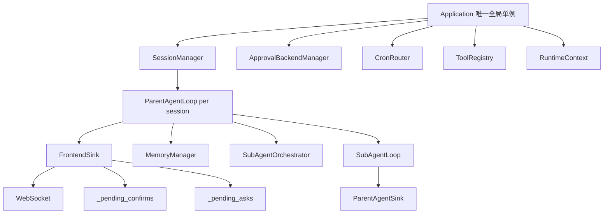

# 重构主/子 Agent 架构计划

## 目标

1. 提取 `BaseAgentLoop` 抽象基类，`ParentAgentLoop` 与 `SubAgentLoop` 作为派生类。
2. 引入 `Application` 作为唯一全局单例，其他业务对象通过它装配和访问。
3. 引入 `AgentSink` 交互抽象：`FrontendSink`（主 Agent）和 `ParentAgentSink`（子 Agent）。
4. 给 `registry.register()` 增加 `availability` 字段，取值 `"every" | "parent" | "subagent"`。
5. 子 Agent 工具集按 `availability` 过滤，禁用所有仅主 Agent 可用的交互类工具。
6. 子 Agent 收件箱改为带类型消息队列，审批/cron/chat 结果统一唤醒循环。
7. Cron 结果由全局 session_id 路由改为 `CronRouter` 按 runtime 路由。
8. 子 Agent 上下文超限时停止、保存历史，并通过收件箱通知父 Agent。
9. `probe_vision_capability` 绑定当前 runtime 的模型配置。

---

## 关键约束（来自需求方）

- 每个 session 对应一个 `ParentAgentLoop` 实例。
- 尽可能避免业务类使用模块级全局变量实现单例。
- 子 Agent 不能创建后台任务（`start_background_service` 等）。
- 子 Agent 上下文超限后不可再被 `chat_subagent` 或 `approval_subagent` 操作。
- 主 Agent 可通过历史内容和自身记忆，用 `run_subagent` 启动不继承历史的新子会话，并通过 `initial_prompt` 传递上下文。
- 允许大型重构，可牺牲部分兼容性。

---

## 最终架构

---

## 阶段一：基础设施与抽象层

### 1.1 创建 `system/application.py`

- 定义 `Application` 类，使用 `__new__` 实现进程级单例。
- 提供 `Application.current()` 类方法。
- 初始化时接收 `RuntimeContext`。
- 持有：
  - `session_manager: SessionManager`
  - `approval_backend_manager: ApprovalBackendManager`
  - `cron_router: CronRouter`
  - `tool_registry: ToolRegistry`
  - `runtime_context: RuntimeContext`
- 提供 `shutdown()` 方法，按依赖顺序停止子系统。
- 修改 `__main__.py`：在启动流程中创建 `Application(runtime_ctx)`，再装配其余子系统。

### 1.2 创建 `entry/agent_sink.py`

- 定义抽象基类 `AgentSink`：
  - `ask_question(question, options, allow_custom) -> Answer`
  - `request_approval(tool_call) -> ApprovalDecision`
  - `emit_tool_call(tool_name, args)`
  - `emit_tool_result(tool_name, result)`
  - `emit_stream_delta(delta)`
  - `emit_usage_update(...)`
  - `emit_progress(...)`
  - `emit_clipboard_display(...)`
- 定义 `FrontendSink(AgentSink)`：
  - 持有 `loop: ParentAgentLoop` 和 `ws: WebSocket`。
  - 内部持有 `_pending_confirms: dict[str, Future]` 和 `_pending_asks: dict[str, Future]`。
  - `request_approval` 向 WebSocket 发送 `confirm_request` 并等待 Future。
  - `ask_question` 向 WebSocket 发送 `ask_request` 并等待 Future。
  - 流式/工具事件通过 `loop._tool_event_callback` 或内部方法发送。
- 定义 `ParentAgentSink(AgentSink)`：
  - 持有 `loop: SubAgentLoop`。
  - `ask_question` 返回错误（子 Agent 不应调用）。
  - `request_approval` 把 `PendingToolCall` 放入 `loop._pending_approvals` 并通知父 Agent（通过 outbox + orchestrator 推送）。
  - 事件写入子 Agent outbox。

### 1.3 创建 `entry/base_agent_loop.py`

- 定义抽象基类 `BaseAgentLoop`：
  - `session_id: str` 作为实例字段。
  - `app: Application` 作为实例字段。
  - `_history: list[dict]`、`_inbox: Inbox`、`_cancel_event: asyncio.Event`。
  - `_hooks_context: str | None` 在初始化时加载。
  - 抽象方法：
    - `_get_llm_client() -> LLMClient`
    - `_get_context() -> Any`
    - `_get_sink() -> AgentSink`
    - `_get_tool_definitions() -> list[dict]`
    - `_on_context_over_limit() -> None`
    - `_build_system_prompt() -> str`
  - 具体方法：
    - `process_message(user_message) -> str`：主入口（替代原先带 session_id 参数的版本）。
    - `_run_turn() -> LLMResponse`：统一 LLM 调用。
    - `_handle_tool_calls(tool_calls: list[ToolCall]) -> list[dict]`：逐个执行工具。
    - `_execute_tool(tc: ToolCall) -> dict`：处理 readonly 直接执行与非 readonly 审批。
    - `_append_history(entry)`、`_build_messages()`。
    - `_check_cancel()`。
    - `_flush_inbox()`：把 inbox 中 pending 消息按角色合并进 history。
- 引入 `Inbox` 与 `InboxMessage`：
  - `InboxMessage` 子类：`UserMessage`、`ApprovalDecisionMessage`、`CronResultMessage`、`ContextLimitMessage`、`InterruptMessage`。
  - `Inbox` 提供 `put(msg)`、`get_pending()`、`wait()`、`wake()`。

### 1.4 修改 `abstract/tools/registry.py`

- 在 `ToolEntry.__slots__` 中增加 `"availability"` 字段。
- 在 `ToolEntry.__init__` 中增加 `availability: str = "every"` 参数。
- 在 `ToolRegistry.register()` 签名中增加 `availability: str = "every"`。
- 新增查询方法：
  - `get_availability(name: str) -> str`
  - `get_definitions_for_availability(scope: str) -> list[dict]`，根据 `"parent"`/`"subagent"`/`"every"` 过滤。
- 确保 `get_definitions()` 继续兼容现有调用，availability 过滤由调用方显式使用新方法。

---

## 阶段二：主 Agent 重构

### 2.1 创建 `entry/parent_agent_loop.py`

- 定义 `ParentAgentLoop(BaseAgentLoop)`：
  - 接收 `app: Application`、`session_id: str`、`frontend_sink: FrontendSink`。
  - 持有 `memory_manager: MemoryManager`、`subagent_orchestrator: SubAgentOrchestrator`、`session_store: SessionStore`。
  - 实现 `_get_llm_client()`：返回使用 `RuntimeContext` 的 `LLMClient`。
  - 实现 `_get_context()`：返回 `app.runtime_context`。
  - 实现 `_get_sink()`：返回 `self._frontend_sink`。
  - 实现 `_get_tool_definitions()`：返回 `availability in ("every", "parent")` 的工具 + memory 工具 schema。
  - 实现 `_on_context_over_limit()`：保留并复用现有 `_rotate_session_for_continuation` 逻辑。
  - 实现流式 LLM：`_stream_llm_response()`，在 `_run_turn()` 中调用。
  - 保留 session 旋转、归档、token 统计、tool resources 持久化等逻辑。

### 2.2 重构 `entry/agent.py`

- 将 `AgentLoop` 类的大部分逻辑迁移到 `BaseAgentLoop` / `ParentAgentLoop`。
- 保留 `AgentLoop` 作为 `ParentAgentLoop` 的兼容别名（可选），或在重构完成后删除。
- 保留 `entry/agent_support/messages.py` 中的 `collect_hooks_context` 调用，改为在 `BaseAgentLoop.__init__` 中加载一次。

### 2.3 创建 `gateway/session_manager.py`

- 从 `gateway/server.py` 的 `sessions` 全局变量和 HTTP 端点逻辑中抽出 `SessionManager`。
- `SessionManager` 持有：
  - `app: Application`
  - `session_id -> ParentAgentLoop`
  - `session_id -> SessionMetadata`
- 方法：
  - `create_session(session_id) -> ParentAgentLoop`
  - `get_loop(session_id) -> ParentAgentLoop | None`
  - `terminate_session(session_id)`
  - `archive_session(session_id)`
  - `rotate_session(old_sid, new_sid)`

### 2.4 重构 `gateway/server.py`

- 移除模块级业务全局变量：`_agent_loop`、`_tool_ws_sinks`、`_pending_confirms`、`_confirm_session_map`、`_pending_asks`、`_ask_session_map`、`_cron_push_loop`。
- 保留 FastAPI app 和 HTTP/WS 路由定义。
- WebSocket 连接建立时，通过 `Application.current().session_manager.create_session(sid)` 创建 `ParentAgentLoop`。
- 把 WebSocket 实例设置到 `ParentAgentLoop.frontend_sink.ws`。
- HTTP 端点通过 `Application.current().session_manager.get_loop(sid)` 获取 loop。
- `http_confirm` 和 `http_ask` 端点改为调用 `FrontendSink._resolve_confirm` / `_resolve_ask`，通过 session manager 找到对应 sink。
- 删除 `set_agent_loop()`、`set_cron_event_loop()` 等旧注入函数。
- `_send_tool_event()` 逻辑迁移到 `FrontendSink`。

### 2.5 迁移交互类工具到 `availability="parent"`

修改以下工具的 `registry.register()` 调用：
- `component/tools/ask_question.py`
- `component/tools/clipboard_display_tools.py`（两个工具）
- `component/tools/progress_tools.py`（两个工具）
- `component/tools/frontend.py`（`validate_frontend`）
- `component/mutliagenttools/*.py`（所有 multiagent 工具）
- `component/extools/background_service.py`（两个工具）

为它们添加 `availability="parent"`。

---

## 阶段三：子 Agent 重构

### 3.1 重构 `subagent/loop.py`

- 让 `SubAgentLoop` 继承 `BaseAgentLoop`。
- 接收 `app: Application`、`session_id: str`、`parent_session_id: str`、`sub_runtime_context: SubRuntimeContext`。
- 实现 `_get_llm_client()`：基于 `SubRuntimeContext` 构造 `LLMClient`（替换现有 `_MockCtx` 技巧）。
- 实现 `_get_context()`：返回 `self._sub_runtime_context`。
- 实现 `_get_sink()`：返回 `ParentAgentSink(self)`。
- 实现 `_get_tool_definitions()`：返回 `availability in ("every", "subagent")` 的工具。
- 实现 `_on_context_over_limit()`：
  1. 设置 `_cancel_event` 和 `_context_limited = True`。
  2. 调用 `save_history(path)` 保存完整历史到 `agentspace/subagents/{name}/{session_id}.jsonl`。
  3. 往 inbox 放入 `ContextLimitMessage(saved_path=...)`。
  4. 通知父 Agent（通过 outbox）。
- 移除旧的 `_inbox: list[str]`，改用 `Inbox`。
- 移除 `_wake_event`，统一使用 `Inbox.wait()` / `wake()`。
- 保留 `approve_tools(decisions)` 方法，但改为向 inbox 放入 `ApprovalDecisionMessage`。
- 保留 `inject_parent_message(...)`，改为向 inbox 放入 `UserMessage`。
- 保留 `save_history(path)`、`stop()`、`completed`、`terminated`、`round_active`、`outbox`、`pending_approvals_info` 等外部接口。

### 3.2 重构 `subagent/orchestrator.py`

- 移除模块级 `_orchestrator` 全局变量和 `get_orchestrator()` / `set_orchestrator()` 函数。
- 让 `SubAgentOrchestrator` 由 `ParentAgentLoop` 持有（每父 session 一个实例）。
- `SubAgentOrchestrator` 接收 `parent_loop: ParentAgentLoop` 或 `app: Application`。
- 内部持有：
  - `_parent_session_id: str`
  - `_active: dict[str, SubAgentLoop]`
  - `_waiting_queue: deque[WaitingEntry]`
  - `_subagent_names: dict[str, str]`
- `launch(...)` 创建 `SubAgentLoop` 实例并启动 `asyncio.Task`。
- `chat(...)` / `approve(...)` / `stop(...)` 改为通过 `SubAgentLoop` 的 inbox 交互。
- 周期收集循环 `_cycle_loop` 改为监听子 Agent outbox，或在 inbox 事件驱动下触发。
- `_push_subagent_ws(...)` 改为通过 `parent_loop.frontend_sink` 发送。
- `_build_tool_set()` 改为调用 `app.tool_registry.get_definitions_for_availability("subagent")`。

### 3.3 重构 `subagent/context.py`

- 保持 `SubRuntimeContext` 基本不变。
- 在 `build_subagent_context` 中，把 `tool_timeout` 也填充到 `SubRuntimeContext`（当前代码中未设置，但基类会用到）。

---

## 阶段四：Cron 与审批系统

### 4.1 创建 `component/cron_router.py`

- 定义 `CronRouter`：
  - `_registrations: dict[str, BaseAgentLoop]`，key 为 `session_id`（或 `runtime_id`）。
  - `register(session_id, loop)` / `unregister(session_id)`。
  - `dispatch(session_id, task_id, name, exit_code, stdout_preview)`：查找 loop 并调用 `loop.inbox.put(CronResultMessage(...))`。
- 由 `Application` 持有。

### 4.2 重构 `component/extools/cron_tools.py`

- 在 `_CronTask` dataclass 中保留 `session_id` 字段。
- 移除 `_cron_event_callbacks` 全局回调列表。
- `_notify_cron_event(...)` 改为调用 `Application.current().cron_router.dispatch(...)`。
- `_run_task()` 不再直接调用 agent loop，只把结果投递到 router。
- `wait_cron` / `schedule_cron` 等工具标记 `availability="every"`。

### 4.3 重构 `component/approval.py`

- 移除对 `gateway.server` 的 `_pending_confirms`、`_confirm_session_map`、`_tool_ws_sinks` 的直接导入。
- `request_user_confirm(...)` 增加 `sink: AgentSink` 参数（或 `loop: BaseAgentLoop` 参数，内部取 `loop.sink`）。
- 正常模式审批通过 `sink.request_approval(tool_call)` 完成。
- `_handsfree_sessions` 和脱手模式逻辑保留，但 `set_handsfree_mode()` 改为通过 `Application.current().session_manager.get_loop(session_id)` 找到 sink 并取消/切换。
- `_approval_backend` 懒加载逻辑迁移到 `ApprovalBackendManager`，`component/approval.py` 只保留 `ApprovalBackend` 抽象和 `ApprovalResult`。

### 4.4 重构工具 handler 的 context 传递

- 修改 `ToolRegistry.dispatch()`：
  - 签名改为 `dispatch(name: str, args: dict, context: ToolContext) -> Any`。
  - `ToolContext` 小对象包含 `loop: BaseAgentLoop`。
  - 对同步/异步 handler 通过 `inspect` 判断兼容性，逐步迁移。
- 修改 `BaseAgentLoop._execute_tool()`：
  - 构造 `ToolContext(self)` 并传给 `dispatch()`。
- 逐步迁移以下工具使用 `context.loop` 替代全局导入：
  - `component/tools/ask_question.py`
  - `component/tools/probe_vision.py`
  - `component/tools/clipboard_display_tools.py`
  - `component/tools/progress_tools.py`

---

## 阶段五：Vision 探测与工具标记

### 5.1 重构 `component/tools/probe_vision_capability.py`

- `probe_vision_capability` 标记 `availability="every"`。
- handler 不再调用 `get_runtime_context()`，而是通过 `context.loop.context` 获取当前 loop 的模型配置：
  - `ParentAgentLoop` 返回 `RuntimeContext.llm_model`。
  - `SubAgentLoop` 返回 `SubRuntimeContext.model`。
- 缓存 key 改为 `(loop.session_id, model)` 或 `(loop.runtime_id, model)`。

### 5.2 标记所有工具的 `availability`

遍历 `origin_agent/component/tools/*.py` 和 `origin_agent/component/extools/*.py` 中所有 `registry.register()` 调用，根据以下规则设置：
- 需要前端 WebSocket 或最终用户交互： `"parent"`
- 通用文件/Shell/代码/搜索/读写工具： `"every"`
- 子 Agent 未来可能专属： `"subagent"`（当前可能无）
- 未明确分类的默认 `"every"`

---

## 阶段六：清理与验证

### 6.1 清理遗留全局变量

- 检查 `origin_agent/gateway/server.py`、`origin_agent/subagent/orchestrator.py`、`origin_agent/component/approval.py`、`origin_agent/component/extools/cron_tools.py`、`origin_agent/component/extools/background_service.py` 是否还有模块级业务状态。
- 保留纯配置/常量/类型别名。

### 6.2 更新入口和启动流程

- `origin_agent/__main__.py`：
  - 创建 `Application(runtime_ctx)`。
  - 装配 `SessionManager`、`ApprovalBackendManager`、`CronRouter`。
  - 启动 gateway server，server 通过 `Application.current()` 访问业务对象。
- `origin_agent/__init__.py` 或相关启动文件：
  - 确保 `Application` 在进程退出时调用 `shutdown()`。

### 6.3 冒烟检查

- 启动流程能创建 `Application`。
- WebSocket 连接能创建 `ParentAgentLoop`。
- `run_subagent` 能创建 `SubAgentLoop` 并过滤 `"parent"` 工具。
- `ask_question` 在主 Agent 中仍通过 WebSocket 工作。
- `wait_cron` 在子 Agent 中到期后结果回到子 Agent inbox。
- 子 Agent 上下文超限后能保存历史并通知父 Agent。

> 注：本计划不运行构建/测试命令（遵守项目规则），冒烟检查由代码审查和启动流程观察完成。