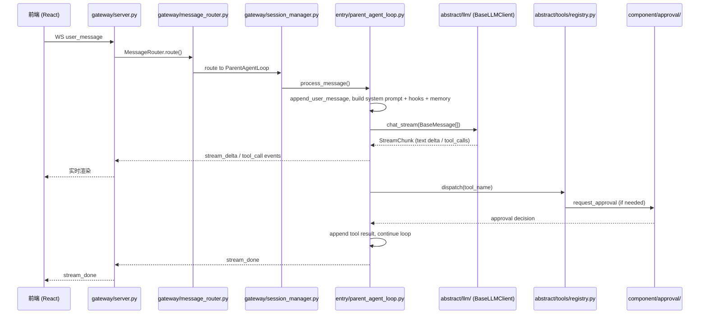

# Evolve Agent — 开发者文档

本文档面向需要理解、修改或扩展 Evolve Agent 的开发者。若你只是想安装和使用，请阅读根目录的 `README.md`。

---

## 设计目标

Evolve Agent 是一个以**运行时自我代码进化**为核心目标的 Agent。其设计围绕以下原则：

- **唯一持久化源码**：`origin_agent/` 是唯一的源码真相源。所有运行时副本均由其派生，修改只对源码生效。
- **运行时副本隔离**：`workspace/fast_agent_space/`、`workspace/slow_agent_space/`、`workspace/.fallback/` 彼此隔离，任何进化失败都不会直接破坏当前运行实例。
- **fast-slow-fallback 演化循环**：Agent 通过工具链修改进化目标副本，验证通过后触发热交换；若新代码运行异常，自动回退到备份。
- **会话级隔离 + 全局索引**：每个用户连接对应独立会话，会话历史、资源、子代理均按会话隔离，同时维护全局索引支持检索与管理。

---

## 源码与运行时布局

```
origin_agent/              <- 唯一持久化源码真相源（修改这里）
workspace/
  fast_agent_space/        <- 当前运行的 agent 副本
  slow_agent_space/        <- 进化目标副本（fork: 命名空间）
  .fallback/               <- 上一次 fast 的备份
  agentspace/              <- agent 工作目录（ws: 命名空间）
  sessions/                <- 会话持久化
  logs/                    <- 运行时日志、进化状态
```

---

## 启动与生命周期

1. `run.py` 将 `origin_agent/` 复制到 `fast_agent_space/` 和 `slow_agent_space/`。
2. 启动 `fast_agent_space/__main__.py`。
3. `__main__.py` 解析 CLI、构造 `RuntimeContext`、构建前端。
4. `main.py` 中的 `Application` 单例初始化 gateway、沙盒、工具发现、审批后端、SessionManager、ParentAgentLoop、SubAgentOrchestrator。
5. 启动 uvicorn，监听 `WS /ws/chat` 与 REST API。
6. 用户连接后，`SessionManager` 创建新的 `ParentAgentLoop` 实例并绑定 `FrontendSink`。

进化流程：

1. Agent 通过工具链读取 `fork:` 命名空间中的源码，修改后写入 `slow_agent_space/`。
2. 调用 `validate_code` / `validate_frontend` 完成语法与构建验证。
3. 调用 `evolve_code` 完成深度验证并请求以退出码 `-1` 退出。
4. `run.py` 执行 `fast -> .fallback` 备份、`slow -> fast` 交换，重启 agent。
5. 若进化后运行出错，进入 fallback 模式，由 `.fallback/` 修复 `fast_agent_space/`。

---

## 模块地图

| 模块 | 职责 | 详细文档 |
|---|---|---|
| `entry/` | Agent 主循环与抽象：`BaseAgentLoop`、`ParentAgentLoop`、`MultiAgentLoop`、`AgentSink`、`ToolExecutor`、`StreamConsumer` | [entry/DEV-README.md](origin_agent/entry/DEV-README.md) |
| `subagent/` | 子代理编排与生命周期：`SubAgentOrchestrator`、`SubAgentLoop` | [subagent/DEV-README.md](origin_agent/subagent/DEV-README.md) |
| `gateway/` | WebSocket / HTTP 网关、消息路由、会话管理、Dashboard | [gateway/DEV-README.md](origin_agent/gateway/DEV-README.md) |
| `component/` | 工具实现、审批系统（目录化）、MCP 桥接、Cron 路由 | [component/DEV-README.md](origin_agent/component/DEV-README.md) |
| `abstract/` | 抽象层：LLM 客户端、工具注册表、AST 发现、技能、插件、MCP 客户端 | [abstract/DEV-README.md](origin_agent/abstract/DEV-README.md) |
| `frontend/` | React + Vite + TypeScript 前端 | [frontend/DEV-README.md](origin_agent/frontend/DEV-README.md) |
| `system/` | 基础设施：`Application`、`RuntimeContext`、沙盒、路径工具、会话存储、模板、转换工具 | 见下文 |
| `evolve/` | 进化系统：代码交换与验证 | 见下文 |
| `entity/` | 常量与纯类型定义：`messages.py`（`BaseMessage` 体系）、`puretype.py`、`constant.py` | 见相关模块文档 |
| `templates/` | Prompt 模板与模式切换（含 `multiagent/`、`evolve/`、`llm/`、`messages/` 子目录） | 见 `system/prompt.py` |

---

## 端到端数据流



主要阶段说明：

- **消息接收**：`gateway/server.py` 通过 WebSocket 接收 `user_message`，经 `gateway/message_router.py` 路由，交给 `SessionManager` 分配到对应 `ParentAgentLoop`。
- **上下文组装**：`entry/agent_support/messages.py` 加载 `custom_hooks`、memory 上下文、system prompt，组装成 `BaseMessage` 列表。
- **流式生成**：通过 `abstract/llm/` 抽象层的 `BaseLLMClient.chat_stream()` 调用大模型（具体后端由 `custom_llm_client/` 插件提供），`ParentAgentLoop` 实时解析 `StreamChunk` 中的文本增量与工具调用。
- **工具执行**：通过 `abstract/tools/registry.py` 按名分发；只读 / 白名单工具直接执行，其余进入审批流程（`component/approval/`）。
- **前端推送**：所有事件（流式文本、工具调用、工具结果、任务进度、子代理更新）通过 `FrontendSink` 经 WebSocket 推回前端。

---

## 子代理与多代理系统

Evolve Agent 内置两套多代理运行时：

### 子代理模式（SubAgent）

- `subagent/orchestrator.py` 的 `SubAgentOrchestrator` 按父会话维护子代理上下文。
- 每个子代理是独立的 `SubAgentLoop`（继承 `BasePrivateChatAgentLoop`），拥有独立的 LLM 配置与历史。
- `component/mutliagenttools/` 提供注册、启动、对话、审批、停止、列表等工具。
- 子代理的工具可见性由 `availability` 位掩码控制：通常只能看到标记为 `SUBAGENT` 或 `EVERY` 的工具。
- 审批结果和子代理输出会周期性注入父 Agent 的消息循环。

详见 [subagent/DEV-README.md](origin_agent/subagent/DEV-README.md)。

### 多 Agent 协作模式（MultiAgent）

- 通过 `enter_multi_agent` 工具切换，不可逆。切换后所有用户消息由 `MultiAgentLoop` 处理。
- 所有参与 Agent 共享同一份对话历史，每条用户消息触发一轮并发响应。
- Agent 可在回复中通过 `response_characters` 指定下一轮的响应者，按轮次级联直到无人指定或达到最大深度。
- `MultiAgentWorker` 是单个 Agent 的一轮响应执行器，由 `MultiAgentLoop` 创建并聚合 token 统计。
- 多 Agent 模式下 multiagent 工具集被禁用。

---

## 路径沙盒

所有文件操作必须使用逻辑路径前缀，禁止裸路径、`..` 遍历和绝对路径。

| 前缀 | 映射目录 | 模式 | 用途 |
|------|----------|------|------|
| `fork:` | `workspace/slow_agent_space/` | fast | 读写进化代码 |
| `ws:` | `workspace/agentspace/` | fast / fallback | 通用 I/O |
| `fix:` | `workspace/.fallback/` | fallback | 修复目标 |
| `skills:` | `skills/` | fast / fallback | 技能读写 |

沙盒实现位于 `system/sandbox.py`。

---

## 扩展点

系统提供多个热扩展点，无需修改核心源码：

- **自定义工具**：在 `custom_tools/` 目录下编写 `.py` 文件，使用 `registry.register()` 注册，启动时由 AST 扫描自动发现。
- **自定义 LLM 客户端**：在 `custom_llm_client/` 目录下编写 `.py` 文件，暴露 `create_llm_client(runtime_context, profile)` 工厂函数，返回 `BaseLLMClient` 子类实例。内置 `openai_client.py` 和 `anthropic_client.py`。
- **自定义钩子**：在 `custom_hooks/` 下实现 `hook_tag_name()` 与 `hook_message()`，返回的上下文块会追加到用户消息末尾。
- **本地模型**：在 `custom_models/` 下放置 `.gguf` 文件，可作为 Adventure 审批模型自动加载。
- **技能文件**：运行时 `skills/` 目录存放 `SKILL.md`，通过 `load_skill` / `list_skills` 工具加载。`pre-skills/` 提供参考模板。
- **插件**：`abstract/plugins/discover.py` 基于目录扫描插件，解析 `plugin.yaml`，启发式检测 provider 类型。
- **MCP**：`component/mcp_tools.py` 读取 `workspace/mcp_config.json`（默认），通过 `abstract/mcp/client.py` 连接 MCP server 并桥接工具。

---

## 基础设施与未拆分模块

### `system/`

- `system/application.py`：`Application` 进程级唯一单例，持有所有子系统引用（`RuntimeContext`、`SessionManager`、`ToolRegistry`、`ApprovalBackend`、`CronRouter`、`SubAgentOrchestrator` 等）。通过 `Application.current()` 访问，避免模块级全局变量。
- `system/context.py`：`RuntimeContext`，贯穿整个应用的生命周期上下文。
- `system/sandbox.py`：路径沙盒与命名空间解析。
- `system/session_store.py`：单个会话的文件读写（`history.es`、`messages.jsonl`、`summary.txt` 等）。
- `system/prompt.py` / `system/templates.py`：System Prompt 组装与模板渲染。
- `system/convert.py`：类型转换工具（`as_enum()`、`as_bool()`）。
- `system/error_utils.py`：异常降级与日志辅助，用于可恢复副作用失败时记录日志但不中断主流程。
- `system/pathutils.py` / `system/atomic_io.py` / `system/subprocess_utils.py`：路径、IO、子进程工具。

### `evolve/`

- `evolve/code.py`：进化编排，提供 `finalize_evolution()` 触发退出码 `-1`。
- `evolve/validator.py`：Python 语法与 `py_compile` 目录级检查。

### `entity/`

- `entity/messages.py`：`BaseMessage` 消息体系，包括 `BaseMessage`、`CharacterConversationMessage`、`CharacterSystemMessage`、`ToolResultMessage`、`History` 等。所有 LLM 调用统一使用 `list[BaseMessage]` 而非 `list[dict]`。
- `entity/puretype.py`：纯数据类型定义，包括 `LLMResponse`、`StreamChunk`、`Role`、`ToolAvailability`、`ToolDangerLevel` 等。
- `entity/constant.py`：全局常量。

---

## 开发者阅读顺序建议

1. 先通读本文件，建立整体架构认知。
2. 根据你关心的领域阅读对应子模块 DEV-README：
   - 改主循环、消息处理 -> `entry/DEV-README.md`
   - 改网关、会话、前端协议 -> `gateway/DEV-README.md`
   - 改工具、审批、MCP -> `component/DEV-README.md`
   - 改抽象层、注册表、LLM 客户端 -> `abstract/DEV-README.md`
   - 改前端 UI -> `frontend/DEV-README.md`
   - 改子代理 -> `subagent/DEV-README.md`
3. 深入具体源码时，从 `__main__.py` -> `main.py` -> `system/application.py` -> `gateway/server.py` -> `entry/parent_agent_loop.py` 这条主线开始追踪。