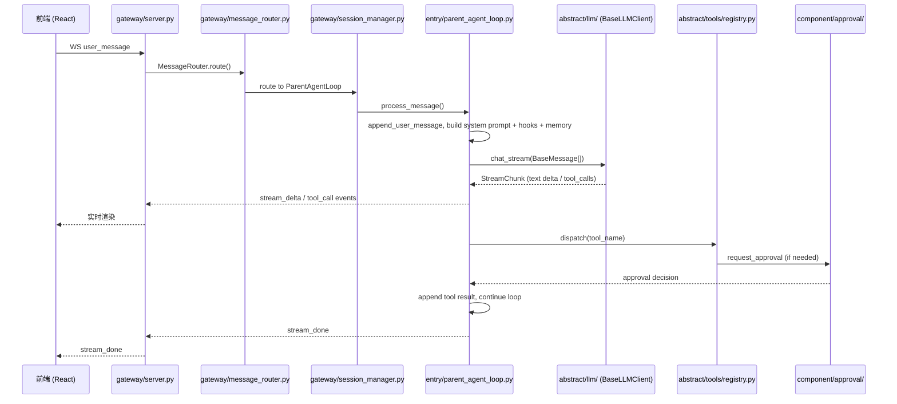

# Evolve Agent — 开发者文档

本文档面向需要理解、修改或扩展 Evolve Agent 的开发者。若你只是想安装和使用，请阅读根目录的 `README.md`。

---

## 设计目标

Evolve Agent 是一个以**运行时自我代码进化**为核心目标的 Agent。其设计围绕以下原则：

- **唯一持久化源码**：`origin_agent/` 是唯一的源码真相源。所有运行时副本均由其派生，修改只对源码生效。
- **运行时副本隔离**：`workspace/fast_agent_space/`、`workspace/slow_agent_space/`、`workspace/.fallback/` 彼此隔离，任何进化失败都不会直接破坏当前运行实例。
- **fast-slow-fallback 进化循环**：Agent 通过工具链修改进化目标副本，验证通过后触发热交换；若新代码运行异常，自动回退到备份。
- **会话级隔离 + 全局索引**：每个用户连接对应独立会话，会话历史、资源、子代理均按会话隔离，同时维护全局索引支持检索与管理。

---

## 源码与运行时布局

> workspace 及其内部目录（fast/slow 空间、agentspace、logs）均为**默认配置名**，可由 config.py 参数（`workspace_path`、`fast_agent_space_path`、`slow_agent_space_path`、`agentspace_path_name`、`logs_path_name`）覆盖；只有 `.fallback/` 为 run.py 硬编码固定名。下列以默认名描述。

```
origin_agent/              <- origin仓库：唯一持久化源码真相源（修改这里）
workspace/                 <- 运行时根（默认名；整体被 gitignore）
  fast_agent_space/        <- fast仓库：当前运行的 agent 副本（默认名）
  slow_agent_space/        <- slow仓库：进化目标副本（fork: 命名空间）（默认名）
  .fallback/               <- fallback仓库：上一次 fast 的备份 / 回退修复体（固定名）
  agentspace/              <- 工作空间：agent 工作目录（ws: 命名空间）（默认名）
  sessions/                <- 会话持久化
  logs/                    <- 运行时日志、进化状态（默认名）
```

---

## 启动与生命周期

1. `run.py` 将 `origin_agent/` 复制到 `fast_agent_space/` 和 `slow_agent_space/`。
2. 启动 `fast_agent_space/__main__.py`。
3. `__main__.py` 解析 CLI、构造 `RuntimeContext`、构建前端。
4. `main.py` 中的 `Application` 单例初始化 gateway、沙盒、`AgentspaceService`、工具发现、审批后端、SessionManager、ParentAgentLoop、SubAgentOrchestrator。
5. `AgentspaceService` 在 Gateway 接受请求前启动垃圾桶恢复与文件变化 watcher；watcher 不可用时降级但不影响 REST、版本校验和文件锁。
6. 启动 uvicorn，监听 `WS /ws/chat`、REST API 与 Agentspace SSE。
7. 用户连接后，`SessionManager` 创建新的 `ParentAgentLoop` 实例并绑定 `FrontendSink`。

进化流程：

1. Agent 通过工具链读取 `fork:` 命名空间中的源码，修改后写入 `slow_agent_space/`。
2. 调用 `validate_code` / `validate_frontend` 完成语法与构建验证。
3. 调用 `evolve_code` 完成深度验证并请求以退出码 `-1` 退出。
4. `run.py` 执行 `fast -> .fallback` 备份、`slow -> fast` 交换，重启 agent。
5. 若进化后运行出错，进入 fallback 模式，由 `.fallback/` 修复 `fast_agent_space/`。

---

## 模块地图

| 模块 | 职责 | 详细文档 |
|---|---|---|
| `entry/` | Agent 主循环与抽象：`BaseAgentLoop`、`ParentAgentLoop`、`ColloquyLoop`、`MultiAgentLoop`、`LoopSessionManager`、`AgentSink`、`ToolExecutor`、`StreamConsumer`、`SessionMessageQueue`（会话级消息队列）、`tool_post_dispatch.finalize_tool_result`（工具结果统一后处理） | [entry/DEV-README.md](origin_agent/entry/DEV-README.md) |
| `subagent/` | 子代理编排与生命周期：`SubAgentOrchestrator`、`SubAgentLoop`、`TaskAgentLoop`（临时Agent：无系统提示词、无持久化、纯文本回复即终止） | [subagent/DEV-README.md](origin_agent/subagent/DEV-README.md) |
| `gateway/` | WebSocket / HTTP 网关、消息路由、会话管理 | [gateway/DEV-README.md](origin_agent/gateway/DEV-README.md) |
| `component/` | 工具实现、审批系统（目录化）、MCP 桥接、Cron 路由、桌面自动化（`automation/`）、浏览器控制（`browser/`） | [component/DEV-README.md](origin_agent/component/DEV-README.md) |
| `abstract/` | 抽象层：LLM 客户端、工具注册表（含 `ToolsetEntry` 工具集元数据与渐进式加载）、AST 发现、技能、插件、MCP 客户端 | [abstract/DEV-README.md](origin_agent/abstract/DEV-README.md) |
| `frontend/` | React + Vite + TypeScript 前端 | [frontend/DEV-README.md](origin_agent/frontend/DEV-README.md) |
| `system/` | 基础设施：`Application`、`RuntimeContext`、沙盒、路径工具、会话存储、模板、LSP（`lsp.py`）、转换工具 | 见下文 |
| `evolve/` | 进化系统：代码交换与验证 | 见下文 |
| `entity/` | 常量与纯类型定义：`messages.py`（`BaseMessage` 体系）、`puretype/`（包）、`constant.py` | 见相关模块文档 |
| `templates/` | Prompt 模板 `.txt` 文件与模式切换（含 `modes/`、`multiagent/`、`subagent/`、`approval/`、`evolve/`、`llm/`、`messages/` 子目录） | 见 `system/prompt.py` |

---

## 端到端数据流


```mermaid
sequenceDiagram
    participant FE as 前端 (React)
    participant GW as gateway/server.py
    participant MR as gateway/message_router.py
    participant SM as gateway/session_manager.py
    participant PAL as entry/parent_agent_loop.py
    participant LLM as abstract/llm/ (BaseLLMClient)
    participant TR as abstract/tools/registry.py
    participant APP as component/approval/

    FE->>GW: WS user_message
    GW->>MR: MessageRouter.route()
    MR->>SM: route to ParentAgentLoop
    SM->>PAL: process_message()
    PAL->>PAL: append_user_message, build system prompt + hooks + memory
    PAL->>LLM: chat_stream(BaseMessage[])
    LLM-->>PAL: StreamChunk (text delta / tool_calls)
    PAL-->>GW: stream_delta / tool_call events
    GW-->>FE: 实时渲染
    PAL->>TR: dispatch(tool_name)
    TR->>APP: request_approval (if needed)
    APP-->>PAL: approval decision
    PAL->>PAL: append tool result, continue loop
    PAL-->>GW: stream_done
    GW-->>FE: stream_done
```

主要阶段说明：

- **消息接收**：`gateway/server.py` 通过 WebSocket 接收 `user_message`，经 `gateway/message_router.py` 路由，交给 `SessionManager` 分配到对应 `ParentAgentLoop`。
- **上下文组装**：`entry/agent_support/messages.py` 加载 `custom_hooks`、memory 上下文、system prompt，组装成 `BaseMessage` 列表。
- **流式生成**：通过 `abstract/llm/` 抽象层的 `BaseLLMClient.chat_stream()` 调用大模型（具体后端由 `custom_llm_client/` 插件提供），`ParentAgentLoop` 实时解析 `StreamChunk` 中的文本增量与工具调用。
- **工具执行**：通过 `abstract/tools/registry.py` 按名分发；工具集加载检查在 `dispatch`/`async_dispatch` 中统一拦截未加载工具，`ToolExecutor` 在审批前做前置快速拒绝；只读 / 白名单工具直接执行，其余进入审批流程（`component/approval/`）。工具定义按会话已加载工具集动态生成（渐进式加载），首轮只加载 `core` 工具集，其他工具集通过 `LoadToolset` 按需加载。
- **前端推送**：所有事件（流式文本、工具调用、工具结果、任务进度、子代理更新）通过 `FrontendSink` 经 WebSocket 推回前端。

---

## 子代理与多代理系统

Evolve Agent 内置两套多代理运行时：

### 子代理模式（SubAgent）

- `subagent/orchestrator.py` 的 `SubAgentOrchestrator` 按父会话维护子代理上下文。
- 每个子代理是独立的 `SubAgentLoop`（继承 `BasePrivateChatAgentLoop`），拥有独立的 LLM 配置与历史。
- `component/multiagenttools/` 提供注册、启动、对话、审批、停止、列表等工具。
- 子代理的工具可见性由 `availability` 位掩码控制：通常只能看到标记为 `SUBAGENT` 或 `EVERY` 的工具。
- 审批结果和子代理输出会周期性注入父 Agent 的消息循环。

详见 [subagent/DEV-README.md](origin_agent/subagent/DEV-README.md)。

### 多 Agent 协作模式（MultiAgent）

- 通过 `enter_multi_agent` 工具切换，不可逆。切换后所有用户消息由 `MultiAgentLoop` 处理。
- 所有参与 Agent 共享同一份对话历史，每条用户消息触发一轮并发响应。
- Agent 可在回复中通过 `response_characters` 指定下一轮的响应者，按轮次级联直到无人指定或达到最大深度。
- `MultiAgentWorker` 是单个 Agent 的一轮响应执行器，由 `MultiAgentLoop` 创建并聚合 token 统计。
- 多 Agent 模式下 multiagent 工具集被禁用。

### Colloquy（随意聊聊）

- 内置的固定闲聊会话（session ID `____buildin_colloquy__`，常量 `COLLOQUY_SESSION_ID`），启动时由 `main.py` 调用 `SessionManager.ensure_colloquy_session()` 确保存在，不出现在普通会话列表中且不可删除。
- 由 `entry/colloquy_loop.py::ColloquyLoop`（继承 `ParentAgentLoop`）处理，仅暴露白名单工具集（`COLLOQUY_TOOLSET_WHITELIST`，filesystem/core/shell/python 等，不含进化工具），超长历史按 `COLLOQUY_COMPRESS_RATIO` 滑动窗口压缩为摘要。

---

## 路径沙盒

所有文件操作必须使用逻辑路径前缀，禁止裸路径、`..` 遍历和绝对路径。

> 下表映射目录所涉 workspace 内部名为**默认配置名**，实际由 config.py 参数决定（`slow_agent_space_path`、`agentspace_path_name` 等）；`.fallback/` 为硬编码固定名。权威映射见 `system/sandbox.py::namespace_bases()`。

| 前缀 | 映射目录 | 模式 | 用途 |
|------|----------|------|------|
| `fork:` | `workspace/slow_agent_space/` | fast | 读写进化代码 |
| `ws:` | `workspace/agentspace/` | fast / fallback | 通用 I/O |
| `fix:` | `workspace/.fallback/` | fallback | 修复目标 |
| `skills:` | `skills/` | fast / fallback | 技能读写 |
| `third:` | `third/` | fast / fallback | 第三方子模块（只读） |
| `custom_hooks:` | `custom_hooks/` | fast / fallback | 自定义钩子（只读） |
| `custom_llm_client:` | `custom_llm_client/` | fast / fallback | 自定义 LLM 客户端（只读） |
| `custom_tools:` | `custom_tools/` | fast / fallback | 自定义工具（只读） |

**没有 `self:` 命名空间** — agent 不能读取或修改自身运行时副本，进化完全通过 `fork:`/`fix:` 实现。

沙盒实现位于 `system/sandbox.py`（权限表 `_PERMISSIONS`，映射 `namespace_bases()`）。

---

## Agentspace 编辑器数据流

- 用户文件操作由前端 `agentspaceApi.ts` 调用 Gateway typed REST，再委托 `Application.agentspace_service`；Service 负责路径校验、按目录优先自然排序、内容 SHA-256 版本与原子写。
- 用户删除进入 `ws:.trash/` 的事务垃圾桶；Evolve Agent `Delete` 的永久删除与审批语义保持不变。
- 内置 Agent 文件工具在明确接触 `ws:` 路径时登记回复轮次文件锁，主Agent、参与Agent、子Agent与临时Agent在各自回复收尾后释放。
- `watchdog` 把外部变化送入事件总线，Gateway 通过 `GET /api/agentspace/events` SSE 推送；前端以事件作为缓存失效信号，并通过 REST 重新取得权威快照。依赖不可用时界面显示同步降级。
- 编辑器保存携带预期版本；冲突返回 HTTP 409，前端保留本地草稿并显示 Monaco 差异比较，禁止静默覆盖。

---

## 扩展点

系统提供多个热扩展点，无需修改核心源码：

- **自定义工具**：在 `custom_tools/` 目录下编写 `.py` 文件，使用 `registry.register()` 注册，启动时由 AST 扫描自动发现。
- **自定义 LLM 客户端**：在 `custom_llm_client/` 目录下编写 `.py` 文件，暴露 `create_llm_client(runtime_context, profile)` 工厂函数，返回 `BaseLLMClient` 子类实例。内置 `openai_client.py`、`anthropic_client.py`、`kscc_client.py` 和 `lmstudio_client.py`。
- **自定义钩子**：在 `custom_hooks/` 下实现 `hook_tag_name()` 与 `hook_message()`，返回的上下文块会追加到用户消息末尾。
- **本地模型**：在 `custom_models/` 下放置 `.gguf` 文件，可作为审批模型自动加载。
- **技能文件**：运行时 `skills/` 目录存放 `SKILL.md`，通过 `load_skill` / `list_skills` 工具加载。`pre-skills/` 提供参考模板。
- **插件**：`abstract/plugins/discover.py` 基于目录扫描插件，解析 `plugin.yaml`，启发式检测 provider 类型。
- **MCP**：`component/mcp_tools.py` 读取 `workspace/mcp_config.json`（默认），通过 `abstract/mcp/client.py` 连接并桥接工具；`abstract/mcp/schema.py` 在注册和 sampling 的 provider 边界规范化工具参数 schema。该层按 JSON Schema 结构位置处理嵌套内容，保护名为 `properties` 的业务参数，并将异常 `additionalProperties` 转为合法形式；它不改变实际 MCP `tools/call` 参数。
- **Agent 舞台层**：会话级背景渲染层，位于聊天区背景之上、聊天气泡之下。Agent 通过 `ws:sessions/<session_id>/stage/` 目录写入 `index.html` 及图集/动画资源，前端以透明 iframe 渲染，默认鼠标穿透。独立于会话网页 `site/`。系统提示词通过 `build_session_stage_block()` 注入。
- **会话聊天区自定义样式**：会话级聊天区 CSS 覆盖层。Agent 通过 `ws:sessions/<session_id>/chat-style/index.css` 写入 CSS，前端探测并经 PostCSS 作用域处理后注入 `<style>` 标签，仅作用于 `.chat-area` 聊天区。禁止 `@import`，允许 `@font-face`（`ChatStyle-` 前缀）和 `@keyframes`。CSS 缺失、超限（256 KiB）或作用域处理失败时恢复默认样式。用户可通过顶部栏命令菜单独立暂停 Agent 舞台层和聊天区自定义样式。系统提示词通过 `build_session_chat_style_block()` 注入。

---

## 基础设施与未拆分模块

### `system/`

- `system/application.py`：`Application` 进程级唯一单例，持有所有子系统引用（`RuntimeContext`、`LLMProfileStore`、共享 Profile 锁、`AgentspaceService`、`SessionManager`、`ToolRegistry`、`ApprovalBackend`、`CronRouter`、`SubAgentOrchestrator` 等）。通过 `Application.current()` 访问，避免模块级全局变量。
- `system/agentspace/`：Agentspace 编辑器后端业务包。`AgentspaceService` 统一版本化 CRUD、用户垃圾桶、按 Agent 回复轮次持有的文件锁、文件变化 watcher、SSE 事件总线和用户变更摘要；Gateway 与内置工具均通过该服务协作。
- `system/llm_profile_store.py`：进程内唯一的 LLM Profile 注册表。仅支持 `llm_profiles.es` 的 `v2` key，直接持有并保存 `LLMProfileData` 根对象；Profile 间多模态分工使用根列表中的实例引用，Gateway 通过单 Profile CRUD 修改。
- `system/context.py`：`RuntimeContext`，贯穿整个应用的生命周期上下文。
- `system/sandbox.py`：路径沙盒与命名空间解析。
- `system/session_store.py`：单个会话的文件读写（`history.es`、`summary.txt`、`token_usage.json`、`tool_resources.json` 等）；活动 LLM Profile 仅以 `{"profile_name": ...}` 名称指针保存。旧版 `messages.jsonl` 已由 `scripts/migrate_v0_to_v1.py` 迁移到会话 v1 格式。
- `system/prompt.py` / `system/templates.py`：System Prompt 组装与模板渲染。
- `system/convert.py`：类型转换工具（`as_enum()`、`as_bool()`）。
- `system/error_utils.py`：异常降级与日志辅助，用于可恢复副作用失败时记录日志但不中断主流程。
- `system/pathutils.py` / `system/atomic_io.py`：路径与原子 IO 工具。
- `system/subprocess_utils.py`：子进程 I/O 编码工具与 `SubprocessRunner`（子进程同步 `run()`、真异步 `run_async()` 和逐行消费 `run_async_line_processor()` 执行、活动进程登记与按会话中断终止进程树；由 `Application` 持有全局单例并注入 `Sandbox` 委托）。
- `system/search_engine.py`：`SearchFiles` / `Grep` 的搜索引擎封装。Windows x64 优先使用随 Agent 分发的固定版本 `ripgrep`（`origin_agent/vendor/ripgrep/win32-x64/rg.exe`），不可用、校验失败或单次兼容错误时回退 Python；统一处理 ignore/hidden 过滤、`limit` 截断、`full_scan`、`exhaustive`、`engine` 与 `warning` 返回字段。
- 主会话强制中断：`IMainSessionLoop` 提供活动任务登记与 `request_interrupt()` 权威入口（普通模式/多Agent模式共用）；`StreamConsumer` 提供 5 分钟流式空闲超时、部分结果快照与主动关闭；前端中断按钮为后端权威流程，不再乐观显示"已中断"。
- `system/lsp.py`：LSP 服务器进程管理与诊断（`component/tools/lsp.py` 工具调用；App 关闭时清理 LSP 进程）。
- `system/modality_capability.py`：多模态能力探测与缓存（探针已内化为系统自动行为：伪装 Read 工具调用，按 模态 × 消息路径六路并发探测 tool/user 消息的图片/音频/视频支持；easysave 缓存按 model+base_url 联合索引；`build_modality_prompt_block()` 每轮生成 system prompt 注入块；`forward_modality_to_ref_profile()` 把活跃模型不支持的模态转发到 profile 引用的其他模型）。

### `evolve/`

- `evolve/code.py`：进化编排，提供 `finalize_evolution()` 触发退出码 `-1`。
- `evolve/validator.py`：Python 语法与 `py_compile` 目录级检查。

### `entity/`

- `entity/messages.py`：`BaseMessage` 消息体系，包括 `BaseMessage`、`CharacterConversationMessage`、`CharacterSystemMessage`、`ToolResultMessage`、`History` 等。所有 LLM 调用统一使用 `list[BaseMessage]` 而非 `list[dict]`。
- `entity/puretype/`：纯数据类型包，按职责拆分为 `_base`、`approval`、`llm`、`skills`、`session`、`agent`、`ws`、`lsp`、`runtime`、`extools` 子模块。包括 `LLMResponse`、`StreamChunk`、`Role`、`ToolAvailability`、`ToolDangerLevel` 等。
- `entity/gentype.py`：泛型工具类型（`RefWrapper[T]` 可变引用容器，供 loop 与 `ToolExecutor` 等组件共享可变值，如工具循环计数器）。
- `entity/constant.py`：全局常量。

---

## 开发者阅读顺序建议

1. 先通读本文件，建立整体架构认知。
2. 根据你关心的领域阅读对应子模块 DEV-README：
   - 改主循环、消息处理 -> `entry/DEV-README.md`
   - 改网关、会话、前端协议 -> `gateway/DEV-README.md`
   - 改工具、审批、MCP -> `component/DEV-README.md`
   - 改抽象层、注册表、LLM 客户端 -> `abstract/DEV-README.md`
   - 改前端 UI -> `frontend/DEV-README.md`
   - 改子代理 -> `subagent/DEV-README.md`
3. 深入具体源码时，从 `__main__.py` -> `main.py` -> `system/application.py` -> `gateway/server.py` -> `entry/parent_agent_loop.py` 这条主线开始追踪。