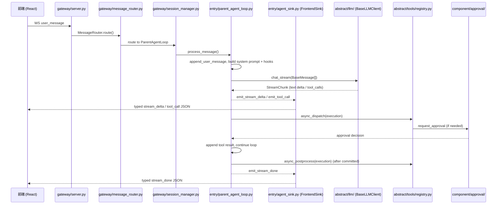

# Evolve Agent — 开发者文档

本文档面向需要理解、修改或扩展 Evolve Agent 的开发者。若你只是想安装和使用，请阅读根目录的 `README.md`。

---

## 设计目标

Evolve Agent 是一个以**运行时自我代码进化**为核心目标的 Agent。其设计围绕以下原则：

- **快速失败与只崩溃软件**：逻辑之外的错误直接传播，禁止以通用捕获、空结果、默认请求或无依据的重试继续执行。HTTP 请求由 FastAPI 处理失败，普通返回值保持 BaseModel；该边界不会回滚共享内存或已完成写入，状态修改应优先采用先校验、准备数据、提交的顺序。原子写和 `finally` 资源释放仍是正常生命周期约束。
- **唯一持久化源码**：`origin_agent/` 是唯一的源码真相源。所有运行时副本均由其派生，修改只对源码生效。
- **运行时副本隔离**：`workspace/fast_agent_space/`、`workspace/slow_agent_space/`、`workspace/.fallback/` 彼此隔离，任何进化失败都不会直接破坏当前运行实例。
- **fast-slow-fallback 进化循环**：Agent 通过工具链修改进化目标副本，验证通过后触发热交换；若新代码运行异常，自动回退到备份。
- **会话级隔离 + 全局索引**：每个用户连接对应独立会话，会话历史、资源、子代理均按会话隔离，同时维护全局索引支持检索与管理。

---

## 源码与运行时布局

> workspace 及其内部目录（fast/slow 空间、agentspace、logs）均为**默认配置名**，可由 config.py 参数（`workspace_path`、`fast_agent_space_path`、`slow_agent_space_path`、`agentspace_path_name`、`logs_path_name`）覆盖；只有 `.fallback/` 为 run.py 硬编码固定名。下列以默认名描述。

```
dev_helpers/              <- 开发者与开发助手AI辅助脚本，不属于运行时仓库
origin_agent/              <- origin仓库：唯一持久化源码真相源（修改这里）
workspace/                 <- 运行时根（默认名；整体被 gitignore）
  fast_agent_space/        <- fast仓库：当前运行的 agent 副本（默认名）
  slow_agent_space/        <- slow仓库：进化目标副本（fork: 命名空间）（默认名）
  .fallback/               <- fallback仓库：上一次 fast 的备份 / 回退修复体（固定名）
  agentspace/              <- 工作空间：agent 工作目录（ws: 命名空间）（默认名）
  dynamic_sandbox_spaces.es <- fast 模式全局动态沙盒空间配置（独立 easysave 根对象）
  sessions/                <- 会话持久化（各主会话含 approval_mode.es 审批模式状态）
  logs/                    <- 运行时日志、进化状态（默认名）
```

## origin仓库内容边界

`origin_agent/` 会被整体派生为 fast仓库、slow仓库和 fallback仓库，因此只允许包含正式运行源码和构建必需文件。禁止在其中新增或保留自动化测试源、测试运行配置、测试夹具和测试专用入口。发现违规内容时，应从 origin仓库定向移除，不得通过复制过滤、`.gitignore` 或其他忽略规则隐藏；运行时仓库的复制语义保持不变。

---

## 开发辅助脚本

`dev_helpers/` 服务于开发者与开发助手AI，独立于 origin仓库和应用生命周期。`read_history.py` 提供 History辅助读取：复用只读 `third/easysave.raw_load()`、项目 `entity.typeref.make_config()`、`History_Version` 和正式History/媒体类型，还原真实History后输出以占位符替换图片/音频/视频载荷的 JSON，并保留消息类型、顺序、媒体身份/发送开关及文字描述。模型公开迭代接口自动保留当前字段；不重复实现对象图协议。`last_user_message` 以索引展示；不调用会清理未配对工具调用的 `SessionStore.read_history()`，不修改原模型或写回任何持久化文件。

辅助脚本允许配置origin/third导入路径复用库代码，但不得启动origin仓库应用、导入运行入口或创建Application；导入依赖禁写字节码。只处理受信任的本地项目History：easysave会导入存储类型，不提供处理外来文件的安全隔离。该例外与工具入口已登记于根目录 `AGENTS.md`。

使用时先执行 `python dev_helpers/read_history.py --session <精确会话ID> --summary`，再用 `--start` / `--limit` 读取小范围正文；默认单文字字段4000字符、总输出24000字符，文字截断显式报告，总输出超限直接失败。默认只读 `workspace/sessions/<ID>/history.es`，不扫描会话目录；自定义路径使用 `--path` 或 `--sessions-root`。脚本完整解析输入文件，降低的是开发助手AI上下文占用，而非文件读取量或进程内存。用户对运行时文件读取的授权规则仍适用。详细接口、边界与已授权实际读取记录见 [dev_helpers/README.md](dev_helpers/README.md)。

---

## 启动与生命周期

1. `run.py` 将 `origin_agent/` 复制到 `fast_agent_space/` 和 `slow_agent_space/`。
2. 启动 `fast_agent_space/__main__.py`。
3. `__main__.py` 解析 CLI、构造 `RuntimeContext`、构建前端，随后 `asyncio.run(App(ctx).run())`；返回后由 App 解除关闭硬截止 watchdog。
4. `main.py::App` 只负责创建唯一 `Application`、平台信号处理（统一经 `RuntimeSystem.request_shutdown`）、等待关闭事件与退出码映射；不再持有 Gateway 实例、第二份关闭事件或各子系统清理逻辑。
5. `Application` 继承 `AsyncArchitecture`，`start()` 按固定拓扑顺序串行注册 20 个 `AsyncSystem`（RuntimeSystem→…→ToolDiscoverySystem→GatewaySystem），先用 graphlib 校验依赖图完整性，注册失败即按逆序注销已注册节点并传播；全部唤醒后 `RuntimeSystem.mark_running()` 并激活 Cron，输入接收才开放。`AgentspaceService` 的垃圾桶恢复与 watcher 在 `virtual_awake` 完成，启动失败直接传播（D2）。
6. `GatewaySystem` 启动 uvicorn，监听 `WS /ws/chat`、REST API 与 Agentspace SSE。聊天页的 Agent 舞台层、会话网页和会话聊天区自定义样式复用各自已有的会话 WebSocket接收 typed `agentspace_event`，不再建立额外 SSE；独立 Agentspace 编辑器继续使用一条 SSE。`server.py` 只含静态 `APIRouter` 与 `build_router_app()` 工厂，运行实例、socket、serve 任务与 ready 事件均由 `GatewaySystem`（最后唤醒、首先注销）持有；启动前端口占用按退出 0 的普通业务拒绝（`GatewayPortBusyError`），bind 竞态失败属启动失败。
7. 用户连接后，`SessionManager` 创建新的 `ParentAgentLoop` 实例并绑定 `FrontendSink`。

关闭由 `Application.shutdown()` 单一协调任务执行（重复请求等待同一任务）：

1. `RuntimeSystem.request_shutdown` 原子封闭新输入，记录首个关闭原因（失败永远优先于进化）；跨线程请求经 `call_soon_threadsafe` 唤醒主循环。
2. Gateway 封闭新业务（HTTP 503、WS 1001）但保留既有输出连接；SessionManager/SubAgentOrchestrator 冻结队列与 Inbox；CronRouter 停止安排 Timer；ToolRegistry/MCP 封闭新调用。
3. 停止各会话在途生成与工具调用，取消路由后台任务；解除待审批/提问等待。
4. 子Agent未消费 Inbox 落各自 History 并保存（临时Agent不持久化），未交接反馈经专用接口并入父会话关闭批次；主/多会话按 sequence 只落 History 一次，严格写盘，不触发模型、标题、摘要或旋转（D4/D5）。
5. History 刷新完成后才结束 SSE/WS（1001）与 uvicorn serve 任务。
6. 按装配逆序逐一 `unregister` 全部 System；任一必要写盘或资源释放失败合并上抛，进程以退出码 1 结束，绝不返回进化成功 -1（D6）。关闭硬截止 60 秒由 RuntimeSystem 的 daemon watchdog 兜底，超时 `os._exit(1)`；成功路径由 `__main__` 在 `asyncio.run` 及其线程池结束后解除 watchdog。

Shell会话由 `Application.current().get_system(IShellManager)` 统一持有。Agent 通过五个 Shell 工具跨工具调用操作 Windows ConPTY；单条命令完成或当前回复结束不触发停止，未完成任务或后续可复用时保留 Shell会话，只有明确需要销毁整个 Shell 时才调用 `StopShell`。WebSocket 断线不停止，自动旋转迁移到延续会话，手动终结、永久删除、进化热交换与应用关闭时停止。Shell 输出仅由 Agent 拉取，前端资源抽屉只显示元数据与停止按钮。单个 Shell会话的原生 PTY 访问通过生命周期同步边界收敛，停止流程先等待 reader 收尾再关闭原生对象，并保留超时兜底日志；该防御性处理不等同于已确认 `0xC0000005` 根因。

2026-10-13 首次观察到待复现现象（来源：运行时日志）：手动终结主会话停止其遗留 Shell会话时，进程树终止后 ConPTY reader 线程持续阻塞于 `pty.read()`，未在 `SHELL_STOP_WAIT_SECONDS`（5 秒）期限内退出；`_stop_state_blocking` 按设计抛 `LifecycleFailure("Shell reader did not stop")`，经 `RuntimeSystem.record_failure` 放大为全应用 FAILURE 关闭（关闭协议 D6），fast仓库 进程以退出码 1 结束；force_init 启动时回退修复被禁用（fallback仓库 已与 origin仓库 同源），run.py 直接退出。同一失败实例在关闭日志的 ExceptionGroup 中多次嵌套出现，来源是停止任务复用、`_cleanup_failures` 聚合与 `RuntimeSystem.failures` 记录的叠加，属日志表现而非多个独立失败。该行为属停止流程超时兜底的设计内放大，reader 阻塞根因（pywinpty ConPTY 管道读行为）未确认，等待复现后再评估是否收窄此类清理失败的影响面，当前不改代码。

2026-10-16 再次观察到同类 reader 退出超时（来源：用户提供的运行时日志）：主会话 `91c8567f965b` 显式调用 `StopShell` 停止 Shell `384128d6e160`，03:50:39.193 开始停止，约 5 秒后出现 `Shell reader did not stop`，按既有 `record_failure` 路径请求全应用失败关闭；force_init 禁用 fallback，最终退出 1。对照本次工具对象化改动，ShellManager、生命周期公共实现与等待常量均未改变，StopShell仍await原handler，属于迁移前已记录故障的再次出现，而非新后处理阶段触发；底层阻塞/EOF原因仍未确认。已在 `system/shell_manager.py::_stop_state_blocking()` 的 reader 等待处登记 TODO，后续调查 pywinpty/ConPTY 读取的安全唤醒及释放顺序，当前只补注释，不改失败传播或放宽超时。同一停止任务及清理失败的重复聚合解释了多层异常组，不据此判断为多次独立停止故障。

主会话永久删除使用进程内删除中标记封闭并发恢复：Gateway 先使现有 WebSocket失效并停止子Agent，再回收活动回复、运行时 Loop、消息队列、客户端信息和 Cron 注册，最后删除持久化索引/目录及附带资源。已建立连接以 WebSocket 4004关闭码停止旧 ID重连；握手前拒绝通过会话状态接口二次确认。显式恢复已经删除或删除中的 ID不会创建随机新会话，当前前端固定切换到“随意聊聊”。

进化流程：

1. Agent 通过工具链读取 `fork:` 命名空间中的源码，修改后写入 `slow_agent_space/`。
2. 调用 `validate_code` / `validate_frontend` 完成语法与构建验证。
3. 调用 `evolve_code` 完成深度验证；通过只在本次工具调用登记调用级进化意图（`ToolContext.request_evolution()`），`finalize_evolution` 不再直接修改运行器。
4. 所属 Loop 的 `store_tool_result` 在该工具结果严格保存成功后才消费意图并调用 `RuntimeSystem.request_shutdown(EVOLUTION)`；保存失败不产生进化成功。请求之后立即停止后续模型/工具，未执行的 tool_calls 补现有中断占位。
5. `run.py` 执行 `fast -> .fallback` 备份、`slow -> fast` 交换，重启 agent。
6. 若进化后运行出错，进入 fallback 模式，由 `.fallback/` 修复 `fast_agent_space/`。

---

## 模块地图

| 模块 | 职责 | 详细文档 |
|---|---|---|
| `entry/` | Agent 主循环与抽象：`BaseAgentLoop`、`ParentAgentLoop`、`ColloquyLoop`、`MultiAgentLoop`、`LoopSessionManager`、`AgentSink`、`ToolExecutor`、`StreamConsumer`、`SessionMessageQueue`（会话级消息队列）、`tool_execution.accept_tool_batch`（工具批次接收声明）、`tool_post_dispatch.ToolPostprocessor`（工具结果提交后统一后处理） | [entry/DEV-README.md](origin_agent/entry/DEV-README.md) |
| `subagent/` | 子代理编排与生命周期：`SubAgentOrchestrator`、`SubAgentLoop`、`TaskAgentLoop`（临时Agent：无系统提示词、无持久化、纯文本回复即终止） | [subagent/DEV-README.md](origin_agent/subagent/DEV-README.md) |
| `gateway/` | WebSocket / HTTP 网关、消息路由、会话管理 | [gateway/DEV-README.md](origin_agent/gateway/DEV-README.md) |
| `component/` | 工具实现、审批系统（目录化）、MCP 桥接、Cron 路由、桌面自动化（`automation/`）、浏览器控制（`browser/`） | [component/DEV-README.md](origin_agent/component/DEV-README.md) |
| `abstract/` | 抽象层：LLM 客户端、对象工具注册表（`BaseTool`/`BaseToolSet` 工具集元数据与渐进式加载）、AST 发现、技能、插件、MCP 客户端 | [abstract/DEV-README.md](origin_agent/abstract/DEV-README.md) |
| `frontend/` | React + Vite + TypeScript 前端 | [frontend/DEV-README.md](origin_agent/frontend/DEV-README.md) |
| `system/` | 基础设施：`Application`、`RuntimeContext`、沙盒、路径工具、会话存储、模板、LSP（`lsp.py`）、转换工具 | 见下文 |
| `evolve/` | 进化系统：代码交换与验证 | 见下文 |
| `entity/` | 常量与消息体系：`puretype/`（消息前纯类型）、`messages.py`（`BaseMessage` 体系）、`puretype_after/`（消息后纯类型），以及 `constant/`（按职责拆分的全局常量包，`__init__.py` 统一导出） | 见相关模块文档 |
| `templates/` | Prompt 模板 `.txt` 文件与模式切换（含 `modes/`、`multiagent/`、`subagent/`、`approval/`、`evolve/`、`llm/`、`messages/` 子目录） | 见 `system/prompt.py` |

---

## 端到端数据流


```mermaid
sequenceDiagram
    participant FE as 前端 (React)
    participant GW as gateway/server.py
    participant MR as gateway/message_router.py
    participant SM as gateway/session_manager.py
    participant PAL as entry/parent_agent_loop.py
    participant FS as entry/agent_sink.py (FrontendSink)
    participant LLM as abstract/llm/ (BaseLLMClient)
    participant TR as abstract/tools/registry.py
    participant APP as component/approval/

    FE->>GW: WS user_message
    GW->>MR: MessageRouter.route()
    MR->>SM: route to ParentAgentLoop
    SM->>PAL: process_message()
    PAL->>PAL: append_user_message, build system prompt + hooks
    PAL->>LLM: chat_stream(BaseMessage[])
    LLM-->>PAL: StreamChunk (text delta / tool_calls)
    PAL-->>FS: emit_stream_delta / emit_tool_call
    FS-->>FE: typed stream_delta / tool_call JSON
    PAL->>TR: async_dispatch(execution)
    TR->>APP: request_approval (if needed)
    APP-->>PAL: approval decision
    PAL->>PAL: append tool result, continue loop
    PAL->>TR: async_postprocess(execution) (after committed)
    PAL-->>FS: emit_stream_done
    FS-->>FE: typed stream_done JSON
```

主要阶段说明：

- **消息接收**：`gateway/server.py` 通过 WebSocket 接收 `user_message`，`gateway/message_router.py` 在路由内同步完成目标校验并登记输入记录，再由 `GatewaySystem.spawn_work` 启动准备任务，交给 `SessionManager` 分配到对应 `ParentAgentLoop`。
- **上下文组装**：`entry/agent_support/messages.py` 加载钩子与 system prompt，将钩子返回的上下文扩展块和历史消息组装成 `BaseMessage` 列表。
- **流式生成**：通过 `abstract/llm/` 抽象层的 `BaseLLMClient.chat_stream()` 调用大模型（具体后端由 `custom_llm_client/` 插件提供），`ParentAgentLoop` 实时解析 `StreamChunk` 中的文本增量与工具调用。正式 `create_llm_client()` 统一返回 `EmptyResponseRetryClient` 装饰器：正文零长度且无工具调用的正常返回最多尝试3次（初次+2次，等待1秒/2秒），耗尽通过现有错误出口结束，不写空assistant；纯工具调用合法，网络/认证/解析错误、取消和关闭失败不由这层重试。流式正文/思考/工具增量实时透传，失败空尝试的usage与结束原因不作为完成；各尝试的思考在同一流中连续展示但不加入重试输入。已有工具参数片段而无完整调用且无正文时明确失败、不重播。子Agent、临时Agent的非流式调用与辅助模型同样适用；模态探针持续空会整体失败且不写能力缓存，审批持续空不放行。该预算独立于Provider/SDK已有网络重试，实际HTTP次数和耗时可能更多，详细边界见 `abstract/DEV-README.md`。仅完成源码与只读审阅，未运行校验或启动应用，等待用户人工验收。
- **工具执行**：工具来源为 `BaseTool` 子类，各模块以顶层固定名称 `TOOLSET` 声明 `BaseToolSet`；`ToolRegistry` 直接持有 `BaseTool` 对象，模型返回的整批 tool calls 在写入 assistant 消息前经 `accept_tool_batch()` 按每个工具的 `accepts_following_calls` 声明截断，后续调用不审批、不执行、不配对并向前端发送 `tool_calls_discarded`。`ToolExecutor` 在审批前做前置快速拒绝，`async_dispatch(execution)` 执行工具调用前的 `before_handle` 与工具主体 `handle` 并写回 `body_executed`/`body_completed_normally`/`result`/`state`；工具结果写入 History 后，`ToolPostprocessor.after_committed()` 对已提交调用调用工具调用后的 `after_handle`。工具集加载检查在分发中统一拦截未加载工具（工具对象与四阶段执行已按任务文件 v8 实施并静态复核，完整任务复核与用户验收仍待完成）。主会话 safe 始终免审批，write 在手动模式也直接执行；dangerous 在手动模式由用户审批，write/dangerous 在脱手模式由审批模型审批，非 critical 可由参数匹配的白名单放行；critical 在手动/脱手模式均由用户审批，YOLO 则全部免审批（`component/approval/`，不改变工具权限与执行校验）。工具定义按会话已加载工具集动态生成（渐进式加载），首轮只加载 `core` 工具集，其他工具集通过 `LoadToolset` 按需加载。手动/脱手/YOLO 模式由 Application持有的 `ApprovalModeStore` 按主会话缓存，并将 `SessionApprovalModeState` BaseModel直接交给 easysave保存到 `approval_mode.es`；Gateway连接时读取恢复后的服务端权威值，前端不持久化该模式。
- **前端推送**：实时事件（流式文本、工具调用、工具结果、任务进度、子代理更新）通过 `FrontendSink` 经 WebSocket 推回前端。正典聊天历史不再在连接时整体回放：Gateway 先发送 typed `history_sync` 元数据，前端再通过 REST 取得全历史骨架与可见范围的历史内容页；`History` / `history.es` 仍保持整体存储。工具请求和匹配结果在前端以每个 `tool_call_id` 一张工具调用卡片显示；工具结果内部 `_meta` 与 `_queued_messages` 不作为普通 JSON 正文展示，分别通过耗时元数据和 `embedded_messages` 独立渲染；孤立结果保留降级行。聊天页会话视觉所需的 Agentspace 变化也通过同一会话 WebSocket的 typed `agentspace_event`推送，页面内事件总线扇出到三个视觉 hook；独立 Agentspace 编辑器仍使用 SSE。会话状态预检、History骨架和历史内容页具有15秒硬截止；超时显示持久通知，并在 WebSocket可用时以不进入 History 的脱敏 `client_diagnostic`记录 Gateway warning。

- **流式事件类型边界**：`StreamConsumer` 将 `ToolCallRequest` / `ToolCallDelta` 实例直接传入 `IAgentSink`；`FrontendSink` 构造 `StreamDeltaEvent` / `StreamDoneEvent`，仅在 `_send_stream_event()` 中序列化一次。工具增量是 WebSocket顶层对象，计时元信息保持 `MessageMetrics` 类型，不再经过内部 JSON往返或前端 `JSON.parse(content)`。两种事件在前端组成按 `type` 区分的联合，并在接收边界验证结构。Gateway未使用的字符串事件回调和启动注册已移除，其他非流式协议保持不变；部署时前后端同步更新并刷新旧页面。

- 前端主聊天区使用全历史骨架 + 历史内容页：Gateway 进程内 `History` 仍是正典对象，连接与轮次结束仅通过 `history_sync` 宣告消息数，正文按 History 索引范围读取。前端以 Virtuoso 只挂载可视行；工具调用请求与匹配的工具结果按 `tool_call_id` 合并为同一工具调用卡片，实时 user/assistant/tool/system 行都通过明确的 `live_id → history_row_id` 关联提升到正典位置，只有完成交接的行才从实时尾部清理。
- 主聊天区被动追底由 `useChatScrollController` 统一协调：实时提交、正典交接的布局提交和列表总高度变化只提交可取消的单帧追底请求，执行时以 Virtuoso scroller 的物理底部为唯一锚点；最新流式消息超过视口时不定位到消息顶部。用户主动滚动、主动改变消息高度或会话状态离开 `following` 时取消待执行追底；`atBottomStateChange(false)` 不独立触发反馈循环。物理指标继续驱动底部状态、自动追底和显式回底动作；回到底部按钮由 `ChatArea` 挂载时常驻，不受内容数量、初始化、物理离底或 `followMode` 控制。异步回底按动作序号和会话代际取消，过期请求不得接管新操作。
- 快速滚动占位沿用 Virtuoso 原行高度，避免展开长消息在正文与占位之间切换时发生高度跳变。无 History 索引且非业务状态的握手欢迎文本仅作为连接通知，不进入聊天 Footer；其他系统消息及顶部连接状态保持不变。
- 流式结束时位于聊天视口内的普通长回复保留展开；后端在存入 History 后、对应 `history_sync` 前通过 `system.stream_meta` 发送 `stream_id`、History 索引和可选 `live_history_links`权威关联，前端在 skeleton 已包含目标行时先提升到正典位置，REST 内容页到达后覆盖临时内容并原子传递展开选择。缺失关联时保留实时行并记录诊断，不按正文或顺序猜测。
- 主聊天区右侧为轮次导航条（`RoundNavRail`）：每条目对应一条 Role 为 `user` 的展示行，点击跳转到该消息（目标消息顶部落在视口中部略偏上），当前轮高亮并自动保持可见；骨架 user 行由后端投影附带 `content_excerpt` 摘要。本地性能遥测由用户在顶部栏命令菜单手动启用，默认关闭且不上传消息正文。
- 顶部栏命令菜单提供 system 角色用户消息显示开关，默认显示并保存为浏览器全局偏好。关闭时仅隐藏 Role 为 `user` 且角色名为 `system` 的消息，覆盖主聊天历史/实时行、子会话及工具结果嵌入消息；轮次导航条和分页/滚动定位使用过滤后的展示行顺序，完整 History、原始索引、正典交接与模型上下文保持不变，系统状态和错误提示不受影响。

---

## 子代理与多代理系统

Evolve Agent 内置两套多代理运行时：

### 子代理模式（SubAgent）

- `subagent/orchestrator.py` 的 `SubAgentOrchestrator` 是 framework `AsyncSystem`，按父会话维护子代理上下文；它通过 `SessionManager` 查询真实父会话，不再依赖启动用 Loop。子Agent输入由 `InputDeliveryBuffer` 记录，停止先等待任务收尾再刷新Inbox和保存普通子AgentHistory，反馈经 `SubAgentFeedbackDelivery` 一次性交接。
- 每个子代理是独立的 `SubAgentLoop`（继承 `BasePrivateChatAgentLoop`），拥有独立的 LLM 配置与历史；启动过程登记启动状态，不设置活跃数量上限，显式历史加载失败会拒绝启动并回滚，不会静默从空历史继续。
- `subagent/profile.py::CharacterProfileResolver` 每次动态扫描 `ws:characters/roleplay/` 与 `ws:characters/task/`，从 `profile.md.meta` 的 `[llm_profile]` 解析当前 LLM Profile、读取 `[description]` 简介，并按 `[profile]` 的多行逻辑路径加载多个独立系统提示词；角色名称跨类型全局唯一。主Agent系统提示词每次构建时注入当前可运行角色的名称、类型和简介。
- `component/multiagenttools/` 提供动态发现、启动、对话、审批、停止和列表工具，不再提供显式注册工具。
- 子代理的工具可见性由 `availability` 位掩码控制：通常只能看到标记为 `SUBAGENT` 或 `EVERY` 的工具。
- 审批结果和子代理输出会周期性注入父 Agent 的消息循环。

详见 [subagent/DEV-README.md](origin_agent/subagent/DEV-README.md)。

### 临时Agent（TaskAgent）

- `RunTaskAgent` 只接收单个 prompt，并在调用发生时取得父主会话活动 LLM Profile的非持久化深快照；后续 Profile切换或编辑不影响已经启动的临时Agent。
- 临时Agent无系统提示词、无历史持久化，产生纯文本结果后立即终止；不设置临时Agent数量上限。
- 工具范围严格为“已加载工具集 ∩ `TASKAGENT` 可用范围 ∩ `safe` 危险等级”，定义生成和执行期均校验，因此不会进入审批流程。
- 初始工具集状态默认从 `core` 开始；符合相同权限交集的 `LoadToolset` 可以加载其他工具集，但加载本身不扩大授权范围。

### 多 Agent 协作模式（MultiAgent）

- 通过 `enter_multi_agent` 工具切换，不可逆。切换后所有用户消息由 `MultiAgentLoop` 处理。
- 所有参与 Agent 共享同一份对话历史，每条用户消息触发一轮并发响应。
- Agent 可在回复中通过 `response_characters` 指定下一轮的响应者，按轮次级联直到无人指定或达到最大深度。
- `MultiAgentWorker` 是单个 Agent 的一轮响应执行器，由 `MultiAgentLoop` 创建并聚合 token 统计。
- 多 Agent 模式下 multiagent 工具集被禁用。

### Colloquy（随意聊聊）

- 内置的固定闲聊会话（session ID `____buildin_colloquy__`，常量 `COLLOQUY_SESSION_ID`），启动时由 `main.py` 调用 `SessionManager.ensure_colloquy_session()` 确保存在，不出现在普通会话列表中且不可删除。
- 由 `entry/colloquy_loop.py::ColloquyLoop`（继承 `ParentAgentLoop`）处理，仅暴露白名单工具集（`COLLOQUY_TOOLSET_WHITELIST`，filesystem/core/shell/python 等，不含进化工具），超长历史按 `COLLOQUY_COMPRESS_RATIO` 滑动窗口压缩为摘要。

---

## 路径沙盒

所有文件操作必须使用逻辑路径前缀，禁止裸路径、`..` 遍历和绝对路径。

逻辑路径的格式为 `命名空间:相对路径`：路径段之间统一使用 `/`，但路径不能以 `/` 或 `\` 开始或结束，也不能包含 `\`。目录路径同样不使用末尾斜杠，例如使用 `ws:reports/2026`，不要使用 `ws:reports/2026/`。文档中的目录示例有时以末尾 `/` 表示“这是一个目录”；该写法只是说明性记号，不能原样作为文件工具的 `path` 参数。

这样限制是为了让同一个物理路径只有一个逻辑表示。`ws:reports` 和 `ws:reports/` 在 Windows 文件系统中可能指向同一目录，但会成为不同的逻辑字符串，导致 Agentspace 文件锁、路径比较、文件变化事件和文件修改记录出现不一致。反斜杠属于 Windows 物理路径语法；禁止它可以避免 `ws:reports\2026` 与 `ws:reports/2026` 产生两个逻辑表示。不自动删除末尾斜杠或把反斜杠转换成正斜杠，格式错误按快速失败处理。

> 下表映射目录所涉 workspace 内部名为**默认配置名**，实际由 config.py 参数决定（`slow_agent_space_path`、`agentspace_path_name` 等）；`.fallback/` 为硬编码固定名。权威映射见 `system/sandbox.py::namespace_bases()`。

| 前缀 | 映射目录 | 模式 | 用途 |
|------|----------|------|------|
| `fork:` | `workspace/slow_agent_space/` | fast | 读写进化代码 |
| `ws:` | `workspace/agentspace/` | fast / fallback | 通用 I/O |
| `fix:` | `workspace/.fallback/` | fallback | 修复目标 |
| `skills:` | `skills/` | fast / fallback | 技能读写 |
| `third:` | `third/` | fast / fallback | 第三方子模块（只读） |
| `custom_hooks:` | `custom_hooks/` | fast / fallback | 自定义钩子（只读） |
| `custom_llm_client:` | `custom_llm_client/` | fast / fallback | 自定义 LLM 客户端（只读） |
| `custom_tools:` | `custom_tools/` | fast / fallback | 自定义工具（只读） |
| 用户定义的动态前缀 | 用户授权的规范化绝对目录 | fast | 全局共享；每项为工具层只读或读写 |

fast 模式的动态沙盒空间由 Application 持有的 Sandbox 单例统一管理，配置直接以
`DynamicSandboxSpaceData` 根对象保存到 `RuntimeContext.workspace/dynamic_sandbox_spaces.es`，
不属于 `ws:`、会话或 LLM Profile。目录可暂时不存在；不存在时配置保留但该空间
不可读写，目录恢复后自动恢复。所有 Agent 共享动态映射；只有普通模式和多Agent模式
主Agent可在加载 `sandbox` 工具集后，通过 critical 的 `AddSandboxSpace` /
`RemoveSandboxSpace` 修改。用户也可从所有会话的右侧 Tab 栏打开动态沙盒空间 Tab，
通过 REST 接口直接查询、创建、更新和删除配置；更新不通过删除后重新添加，空间名称不可修改。
随意聊聊会话只能使用已有空间，临时Agent无动态空间提示词。
动态只读权限与现有只读空间相同，仅约束标准 Sandbox 文件 API，并非 OS 级 ACL。

**没有 `self:` 命名空间** — agent 不能读取或修改自身运行时副本，进化完全通过 `fork:`/`fix:` 实现。

沙盒实现位于 `system/sandbox.py`（权限表 `_PERMISSIONS`，映射 `namespace_bases()`）。

---

## Agentspace 编辑器数据流

- 用户文件操作由前端 `agentspaceApi.ts` 调用 Gateway typed REST，再委托 `Application.current().get_system(IAgentspaceService)`；Service 负责路径校验、按目录优先自然排序、内容 SHA-256 版本与原子写。
- 前端本地版本计算优先使用浏览器原生 Web Crypto；远程普通 HTTP 部署下 `crypto.subtle` 不可用时自动回退到纯 TypeScript SHA-256 实现（`utils/sha256.ts`），结果与服务端 Python `hashlib.sha256` 完全一致，不改变版本/冲突流程。
- 用户删除进入 `ws:.trash/` 的事务垃圾桶；Evolve Agent `Delete` 的永久删除与审批语义保持不变。
- 内置 Agent 文件工具在明确接触 `ws:` 路径时登记回复轮次文件锁，主Agent、参与Agent、子Agent与临时Agent在各自回复收尾后释放。
- `watchdog` 把外部变化送入事件总线。独立 Agentspace 编辑器通过 `GET /api/agentspace/events` SSE 接收缓存失效信号；聊天页会话视觉通过已有会话 WebSocket的 `agentspace_event`接收同源事件，避免每个视觉功能建立长连接。两者都通过 REST 重新取得权威快照；依赖不可用时界面显示同步降级。
- 编辑器保存携带预期版本；冲突返回 HTTP 409，前端保留本地草稿并显示 Monaco 差异比较，禁止静默覆盖。
- Monaco Editor 和 DiffEditor 的 Web Worker 由 `services/monacoEnvironment.ts` 集中配置，应用入口在 React 渲染前初始化；Worker 通过 Vite `?worker` 打包为同源构建资源，远程普通 HTTP 部署下从当前应用地址加载。

---

## 扩展点

系统提供多个热扩展点，无需修改核心源码：

**文档边界**：DEV 文档和 README（包括 `custom_*` 目录自身的 README）只描述扩展机制、公共接口、加载流程和通用约定，不登记 `custom_*` 目录中的具体工具、客户端、钩子、模型或其专属参数、协议、行为及验收记录。教学示例须独立于当前扩展内容，不作为实际扩展清单。扩展专属常量和类型留在所属 custom 目录，origin仓库只提供通用接口。

- **自定义工具**：在 `custom_tools/` 目录下编写 `.py` 文件，声明顶层固定名称 `TOOLSET = BaseToolSet(...)`，其中持有 `BaseTool` 子类实例；导入只创建无连接、无 Application 查询的工具对象，`ToolDiscoverySystem` 按 AST 识别 `TOOLSET` 后交给唯一 `ToolRegistry` 注册并预热，导入期不注册、不取得运行时服务。
- **自定义 LLM 客户端**：在 `custom_llm_client/` 目录下编写 `.py` 文件，暴露 `create_llm_client(runtime_context, profile)` 工厂函数，返回 `BaseLLMClient` 子类实例。
- **自定义钩子**：在 `custom_hooks/` 下实现 `hook_tag_name()` 与 `hook_message()`，返回的上下文块会追加到用户消息末尾。
- **本地模型**：在 `custom_models/` 下放置 `.gguf` 文件，可作为审批模型自动加载。
- **技能文件**：运行时 `skills/` 目录存放 `SKILL.md`，通过 `load_skill` / `list_skills` 工具加载。`pre-skills/` 提供参考模板。
- **插件**：`abstract/plugins/discover.py` 基于目录扫描插件，解析 `plugin.yaml`，启发式检测 provider 类型。
- **MCP**：`MCPSystem` 读取并校验 `mcp_config.json`，由 `MCPCore` 连接服务器并注册远程工具，远程与资源/提示词工具统一为 `MCPTool`，服务器元数据为 `MCPToolSet`；`component/mcp_tools.py` 以 `MCPRefreshTool` 与顶层 `TOOLSET` 声明 `MCPRefresh`。单 server 的配置校验失败或连接失败（含 401）只记录错误日志并跳过该 server 的工具注册，不中止应用启动、不影响其他已连通 server；失败原因在 `MCPSystem.status()` 与 `MCPRefresh` 结果的 `error`/`errors` 中可见。刷新在同名同集锁内用 `register_tool(MCPTool(...), replace=True)` 原子替换，只注销新集合中已消失的名称（含资源/提示词辅助工具）。OAuth 按 Provider 独立回调端口并显式持有 `MCPOAuthManager`，认证任务、HTTP 回调线程与 401 dedup 均有完整归属；stdio 进程由 `MCPStdioTransport` 直接持有真实句柄和独立 cleanup task，不猜测宿主 PID。关闭时 `close_admission` 拒绝新工作，`stop_calls` 确认请求/连接任务实际退出，`shutdown` 等待 OAuth、stdio、cleanup 全部完成后才释放；资源未退出不伪装成功。`abstract/mcp/schema.py` 在注册和 sampling 的 provider 边界规范化工具参数 schema。
- **会话变量池**：`ws:sessions/<主会话ID>/variables/`中的数字/字符串JSON标量与同级.meta，文件是唯一真相。ReadSessionVariables在filesystem工具集safe全量读取，与只读会话变量Tab的REST共用解析服务；Tab位于媒体输入后，注册表共十项。meta支持label/description/min/max/integer/percent/display，percent=true仅显示×100，约束违规保留真实值。AgentspaceService持有无缓存叶服务，不新增System、watcher或WS类型。自动旋转/单源分支独立复制，多父合并按sources/<父ID>分组；捕获/复核受预算限制，无法完整继承时明确拒绝并要求修复，来源不提前归档。普通子Agent保留旋转前父ID，晚到写入不自动同步；读改写非原子，主Agent统一结算，重新生成不回滚，删除会话后文件保留。池限512变量/4096节点/16层/单文件64KiB/逻辑512KiB/响应1MiB/2秒软截止，继承另有512KiB复核额度。右侧会话变量 Tab 使用同一会话 Tab 能力探测；存在变量条目或可展示问题时启用，普通空目录或无问题的普通 `.meta` 不启用，完整变量池仍在进入 Tab 后读取。
- **Agent 舞台层**：会话级背景渲染层，位于聊天区背景之上、聊天气泡之下。Agent 通过 `ws:sessions/<session_id>/stage/` 目录写入 `index.html` 及图集/动画资源，前端以透明 iframe 渲染，默认鼠标穿透。`Layout` 统一管理舞台层探测并订阅聊天 WebSocket扇出的 Agentspace事件，AgentStageLayer 只负责渲染；`stage/index.html` 是部署提交标记，资源应先写、入口最后写，只有入口文件的新内容版本经 1 秒安静窗口后重建 iframe。`resync` 和非入口资源变化不会重置正在运行的舞台。独立于会话网页 `site/`。系统提示词通过 `build_session_stage_block()` 注入。
- **会话网页**：独立于 Agent 舞台层的完整网页预览。Agent 通过 `ws:sessions/<session_id>/site/` 部署 `index.html` 及引用资源；前端提前用 HEAD 探测入口并监听聊天 WebSocket中的该目录 Agentspace事件，部署完成后启用右侧会话网页 Tab。首次点击该 Tab 后才创建 iframe、加载网页正文及引用资源，悬停/仅聚焦不触发加载；同会话切 Tab 保留网页，切会话、返回原会话或刷新页面后重新等待点击。首次激活后资源连续变化仍等待 1 秒安静窗口后热刷新 iframe，隐藏 Tab 也可刷新；入口文件或整个目录被删除/移走后禁用 Tab 并回聊天，已激活的同会话重新部署后可自动重建 iframe。未激活会话部署/更新只改变探测状态，不创建 iframe。
- **会话聊天区自定义样式**：会话级聊天区 CSS 覆盖层。Agent 通过 `ws:sessions/<session_id>/chat-style/index.css` 写入 CSS，前端探测并经 PostCSS 作用域处理后注入 `<style>` 标签，仅作用于 `.chat-area` 聊天区。禁止 `@import`，允许 `@font-face`（`ChatStyle-` 前缀）和 `@keyframes`。CSS 缺失、超限（256 KiB）或作用域处理失败时恢复默认样式。用户可通过顶部栏命令菜单独立暂停 Agent 舞台层和聊天区自定义样式。系统提示词通过 `build_session_chat_style_block()` 注入。

---

## 基础设施与未拆分模块

- **会话视觉资源重定向**：`stage.meta`、`site.meta`、`chat-style.meta` 的 `[redirect]` 由 Gateway 服务端单层解析，稳定入口用 HTTP 307 指向有效逻辑目录；非法配置静默回退，前端 Hook 只消费最终 URL并自动刷新。
- **会话视觉资源状态**：会话 status REST 经公开服务接口读取的非持久化 `visual_resources`，包含 stage/site/chat_style 的状态、源目录、有效目录、重定向标志和错误原因，不写入 History 或会话索引。

### system/

- `system/application.py`：`Application` 进程级唯一单例（继承 `AsyncArchitecture`），通过 `Application.current()` 访问。`start()` 用 graphlib 校验依赖图后按固定拓扑顺序串行注册全部 20 个 System，全部唤醒后 `mark_running()` 并激活 Cron；`shutdown()` 是唯一关闭协调任务，先业务停止与 History 提交，再按逆拓扑 `unregister`（RV10 顺序），失败合并上抛并保留 RuntimeSystem 失败记录。`Application` 不保留服务镜像字段，也不暴露 `runtime_context` 属性；各业务系统经类型化 `app.get_system(IRuntimeSystem).context` 取得唯一 `RuntimeContext`。
- `system/runtime.py`：`RuntimeSystem`（`AsyncSystem`），持有唯一 `RuntimeContext`、应用状态、输入接收同步边界、跨线程关闭请求与失败记录；还持有进程级**主Agent角色名**（启动时从 `ws:SOUL.md.meta` 的 `[character_name]` 读取，缺失回退到 `DEFAULT_MAIN_AGENT_CHARACTER_NAME`，运行期由 `RefreshIdentity` 工具刷新）。`context` 为只读属性；完整应用装配在 P22 完成，中间阶段代码不具备启动条件。
- `system/character_avatars.py`：角色头像映射的纯函数组装（非 System、无缓存）。`collect_character_avatars()` 实时读 `ws:SOUL.md.meta` 与 `ws:characters/roleplay|task/*` 的 `[avatar]` 键，产出「角色名 → /files URL」条目（`CharacterAvatarsResponse`）；仅校验可读、是文件与 ≤`AVATAR_MAX_BYTES`（5 MiB），不限扩展名。Gateway `GET /api/characters/avatars`（no-store + `to_thread`）调用；声明无效仅条目级 error，不阻断。
- `component/approval/system.py`：`ApprovalSystem` 已改为 AsyncSystem，依赖 RuntimeSystem、LLMProfileStore，持有唯一模式Store、后端管理器和白名单Store。类型化入口是 `Application.current().get_system(IApprovalSystem)`；模型审批作为请求级任务等待，生命周期及清理失败继续传播，完整应用装配尚待后续阶段。
- `entry/agent_sink.py::FrontendSink`：已继承 `AsyncSystem` 与 `AgentSink`，依赖 RuntimeSystem；无参构造，`virtual_awake` 取得 RuntimeSystem 并创建 TaskOwner。`Application.frontend_sink` 属性已移除，全量引用迁移为 `get_system(IFrontendSink)`。发送与交互属请求级操作：新交互（审批/提问）只在 RUNNING 接收，既有结果与 History 回显在 STOPPING 仍允许到关闭输出，发送期限不超过 `SHUTDOWN_SEND_TIMEOUT_SECONDS`（1秒）；网络断线/发送超时不回滚 History，模型构造/序列化错误与内部错误传播。`cancel_pending_interactions` 同步解除所有待审批/提问 Future；`close_all_connections` 以标准 1001 关闭所有连接，结束连接前等待/取消真实发送任务及交接，不把自身登记进同一 Owner 再等待；`close_session` 保留永久删除 4004 语义。所有原 emit 签名与消息协议保持不变，typed stream boundary 不退化。`ParentAgentSink` 不作为 System，转发经 `get_system(IFrontendSink)` 取得唯一实例。
- `component/approval/mode_store.py`：由 ApprovalSystem 持有的唯一会话级审批模式存储。按会话惰性读取 `approval_mode.es` 的 easysave `v1` key，并通过 `entity/typeref.py` 的 stable type token重建 `SessionApprovalModeState`；业务 `RLock`保护缓存事务，easysave负责路径锁、前置 `.bak`、同目录临时文件与原子替换。模式变更先更新内存再尽力保存，写入失败不回滚；损坏、缺 key或类型错误回退手动模式。新建及自动延续、单源分支、多父合并产生的主会话统一初始化为手动模式，归档保留，永久删除随会话目录清理。
- `system/agentspace/`：Agentspace 编辑器后端业务包。`AgentspaceService` 已注册为 framework `AsyncSystem`（依赖 `RuntimeSystem`、`Sandbox`），由 `virtual_awake` 取得依赖并完成原 start 工作（绑定 EventHub、恢复垃圾桶、启动 watcher）；持有 `visual_resources: SessionVisualResourceService` 只读叶服务。统一版本化 CRUD、用户垃圾桶、按 Agent 回复轮次持有的文件锁、文件变化 watcher、`AgentspaceEventHub`和用户变更摘要；Gateway 将同一事件总线适配为独立编辑器 SSE与聊天 WebSocket typed事件，内置工具通过该服务协作。watcher 启动失败不再降级（D2）。
- `system/llm_profile_store.py`：`LLMProfileStore` 已注册为 framework `AsyncSystem`（依赖 `RuntimeSystem`），无参构造，由 `virtual_awake` 取得 `RuntimeContext` 确定 agentspace 路径并加载 v2 根对象。Store 自身创建唯一的共享 `threading.RLock`，通过 `locked()` 上下文管理器暴露同一把锁，替代原 `Application.profile_lock`；SessionMetadataService、审批后端及 Gateway Profile CRUD 经此接口进入事务边界。仅支持 `llm_profiles.es` 的 `v2` key，直接持有并保存 `LLMProfileData` 根对象；Profile 间多模态分工、审批 Profile、全局元数据 Profile、工具链摘要 Profile以及图片/音频/视频三条全局多模态回退引用均使用根列表中的实例引用，Gateway 通过 `get_system(ILLMProfileStore)` 的单 Profile CRUD 和全局用途引用接口修改。写入先准备候选根、成功保存后提交共享内存，不再捕获任意异常做内存回滚；更新通过显式两阶段复制并重连引用图准备候选，提交保留原 Profile 实例身份和引用身份。删除可在同次根保存中清空审批/元数据/工具链摘要引用，但其他 Profile 与全局多模态引用仍阻止删除。不存在的文件允许初始化，已有文件缺 v2 key 直接失败；不启用未知存储字段跳过，缺失字段仍遵循 easysave/Pydantic 默认值语义。存储层保留外层临时文件原子替换，不做备份清理专属重试；Profile 文件与会话名称指针不构成跨文件事务。
- 前端模型配置抽屉通过“模型配置 / 全局配置引用”分页分别管理 Profile 定义和全局用途引用。模型定义按客户端、端点纵向分组，详情单项展开、先只读后编辑；切分页保留内存草稿，离开未保存配置时明确确认。会话待用 Profile 选择只在顶部栏修改，浏览器按会话独立保存名称；无本地覆盖时通过 `GET /api/sessions/{id}/llm-profile` 读取持久化指针及既有全局最近使用回退。选择本身不写服务端，发送到主会话或重新生成才提交；`resume` 保持后端当前配置。全局配置引用页还管理工具链摘要 Profile 与图片、音频、视频三条独立回退引用，状态分别经 `/api/toolchain-summary/profile`、`/api/modality/profiles` 和 `toolchain_summary_profile_changed`、`modality_profile_changed` 同步。旧浏览器全局选择不猜测迁移到任何会话。
- `system/session_metadata.py`：`SessionMetadataService` 已改为 framework `AsyncSystem`（依赖 `RuntimeSystem`、`LLMProfileStore`），无参构造，由 `virtual_awake` 取得依赖并创建本服务的 `SessionStore`。不创建独立 Profile 事务锁，原 `Application.profile_lock` 语义统一经 `LLMProfileStore.locked()` 访问同一把共享 RLock。全局元数据 Profile优先；未配置时按目标会话持久化的活动 Profile回退。统一生成标题、标签和摘要，并为分支、合并与自动旋转提供摘要保障。明确配置不可用时不静默回退。工具链摘要 Profile（`LLMProfileData.toolchain_summary_profile`）为 `CompressHistory` 和独立 `CompressToolChains` 折叠工具链生成紧凑链摘要（`generate_tool_chain_summary`），未配置时回退到目标会话活动 Profile；解析/校验/客户端创建与元数据共用 `_resolve_session_profile_fallback`、`_assert_profile_usable`、`_create_client_for_profile`，模板为 `toolchain_summary.txt` / `toolchain_summary_input.txt`。五个完整异步操作通过 `TaskOwner.run_request()` 登记，包含读取、模型调用、解析与必要写盘；普通请求异常交回原业务边界，用户取消不被误报为整个应用失败。首条用户消息自动标题经同步入口 `maybe_generate_first_title`（路由层判定无标题+非空文本后调用）：同一同步代码段内检查+登记 per-session 防重集合，`task_owner.create` 派发一次性后台任务（不套 run_request）；LLM 失败回退 30 字符截取，停机竞态静默放弃，`CancelledError` 传播，finally 对称清理防重。`close_admission()` 在 STOPPING 期间仍可封闭接收，`cancel_pending()` 等待实际任务及结果交接，生命周期/清理失败继续传播。关闭消息刷新不调用生成接口。
- `abstract/tools/registry.py`：`ToolRegistry` 已迁移为依赖 RuntimeSystem 的 AsyncSystem，模块级单例与兼容代理已移除。工具表直接保存 `BaseTool` 对象，工具集元数据直接使用 `BaseToolSet`；`register_toolset(toolset, merge=True)` 装载/合并声明，`register_tool(tool, replace=True)` 供 MCP 动态刷新原子替换，查询入口为 `get_tool`/`get_toolset`。`async_dispatch(execution)` 执行 before/handle，`async_postprocess(execution)` 在结果提交后托管 after，二者复用同一 TaskOwner 与真实同步 Future。异步工具通过 TaskOwner.run_request 托管；包含同步历史扫描、磁盘读取或 CPU 密集计算的工具应声明为同步工具，交给 ToolRegistry 的专用线程池执行，不能因为 handler 声明为 async 就在事件循环线程执行阻塞逻辑；同步工具由唯一执行器持有真实 Future，取消等待不删除仍在运行的线程登记。停止分发、请求取消、真实工作等待及线程池异步关闭分别核对结局，生命周期失败继续传播。
- `abstract/tools/discover.py`：`ToolDiscoverySystem` 依赖工具所需的已就绪 System，按固定顺序扫描五个 component 子包与可选 custom_tools，AST 只识别顶层固定名称 `TOOLSET` 并登记唯一模块集合；最后注册 MCP 管理工具和固定 `BaseToolSet` 工具集元数据，不重新建立 MCP 连接。退役的 `register_tools`、旧全局注册表导入、`ui_event_router` 导入与导入期注册直接拒绝；读取/语法/导入/注册错误直接失败，未授权名称覆盖拒绝会抛错；保留 Python 模块缓存，不通过重载或注入修补发现。
- `system/lifecycle.py`：`TaskOwner.create/track` 负责后台任务，`run_request` 负责有明确结果等待方的请求。`cancel` 登记预期取消并复用固定截止；`is_idle` 同时要求任务结束和交接完成，取消后仍运行的任务不能从所有权记录中移除。原生线程/子进程仍由各 System 持有真实资源，不由异步包装任务的结束替代。
- `system/context.py`：`RuntimeContext`（`BaseModel`，不可变运行时配置）。全局 `set_runtime_context`/`get_runtime_context` 单例入口已删除；配置唯一真相来源由 `RuntimeSystem` 持有，经 `app.get_system(IRuntimeSystem).context` 取得。
- `system/sandbox.py`：`Sandbox` 已注册为 framework `AsyncSystem`（依赖 `RuntimeSystem` 与 `SubprocessRunner`），无参构造，`virtual_awake` 取得依赖并加载动态空间；由 Application 在 P22 装配后经 `app.get_system(ISandbox)` 取得。路径沙盒、固定命名空间解析，以及 fast 模式全局动态沙盒空间的严格加载、原子持久化、增删改、目录可用性和权限管理；`Sandbox.read()` 按 UTF-8、系统编码和 Windows 常见编码自动探测，返回准确原文，分页只按 LF 定位原文行片段，保留 CRLF、孤立 CR 与末尾换行；工具 `Read` 在其上独立应用正文单行展示截断，未截断内容保持原文。编辑和 LSP 使用的 `limit=0` 路径仍返回完整解码原文。`write()` / `append()` 禁用平台换行转换，按传入文本原样写入 UTF-8，避免 Windows 上 `PatchEdit` 写回时给已有 CRLF 增加一个 CR；`PatchEdit` 按原文匹配与替换，已有异常换行不自动修复。动态配置位于 workspace 根且由唯一 Sandbox 实例持有。动态沙盒空间 Tab 通过 Gateway REST 复用该单例。所有调用方（包括内置文件工具与自定义扩展）统一经 `app.get_system(ISandbox)` 取得，不再从 `filesystem._s` 跨工具引用或 `Application.current().sandbox` 旧属性获取。
- `system/text_preview.py`：无 I/O 的 `truncate_lf_lines` 纯函数，由 Read 在原文分页统计后调用。Read 新参数 `max_line_chars` 默认 1000，仅允许正整数且可显式提高、不能关闭；按 Unicode 码点保留每行前 N 个正文字符，超限附加 ` ... [truncated]`（含前导空格），标识及 LF/CRLF 行尾不占额度，孤立 CR 仍按正文计数。成功文本结果附带 `max_line_chars`、`truncated`、`truncated_lines`（原文件绝对 0-indexed 行索引）；原行数和分页不变，`remaining=0` 仍可有截断。标识不是原文，PatchEdit 使用前需检查截断状态，必要时提高有限上限重读。自动附带 meta、目录和媒体不应用此展示策略，内部完整读取不变；这不是总输出预算或全文件解码内存限制。
- `system/file_metadata.py`：Read 的元数据文件纯文本解析器，`parse_meta_content(content)` 按独立的 `[key]` 行解析一层字符串字典，保留值的原始空白和换行；非法/重复键及前导非空文字抛带行号的 `MetaFormatError`。`component/tools/filesystem.py` 负责通过 Sandbox 读取目标完整名称追加 `.meta` 的同级文件，目录也使用同级 `目录名.meta`；命名空间根目录不附带，显式 `.meta` 不继续嵌套。成功时结果附加 `meta` 字典，缺失省略，元数据访问/解析失败附加错误字符串而保留原结果。会话视觉源目录的 `redirect` 由 `system/session_visual_resources.py` 单层消费，Read 只在 `meta.redirect` 中报告错误，不跟随目标。目录列表隐藏 `.meta` 文件（后缀不区分大小写，保留同后缀目录），其他文件工具与前端文件树不变。自动附带的元数据完整读取不受正文分页或单行字符限制影响；显式 Read `.meta` 目标则按文本正文分页及截断，但不继续查找 `.meta.meta`。ws: 元数据文件沿用回复轮次文件接触登记；当前不自动维护文件。
- `system/session_store.py`：单个会话的文件读写（`history.es`、`summary.txt`、`token_usage.json`、`tool_resources.json` 等）；活动 LLM Profile 仅以 `{"profile_name": ...}` 名称指针保存。旧版 `messages.jsonl` 已由 `scripts/migrate_v0_to_v1.py` 迁移到会话 v1 格式。`history.es` 通过 easysave 的安全写入事务保存：同目录临时文件、刷新/同步、原子替换和前置备份；残留 `.bak` 会阻断后续保存并要求人工处理，读取侧不自动恢复损坏文件。
- `system/prompt.py` / `system/templates.py`：System Prompt 组装与模板渲染。
- `system/convert.py`：类型转换工具（`as_enum()`、`as_bool()`）。
- `system/error_utils.py`：异常降级与日志辅助，用于可恢复副作用失败时记录日志但不中断主流程。
- `system/pathutils.py` / `system/atomic_io.py`：路径与原子 IO 工具。
- `system/subprocess_utils.py`：`SubprocessRunner` 已注册为 framework `AsyncSystem`（依赖 `RuntimeSystem`），是内部子进程同步/异步执行、活动进程登记与中断终止的唯一所有者；提供 `close_admission()`/`terminate_all()`/`wait_idle()` 关闭接口，由 Application 在 P22 装配后经 `app.get_system(ISubprocessRunner)` 取得。代码验证、搜索、LSP 等基础设施继续复用。`build_subprocess_env` 为显式参数纯函数，无隐式全局配置读取。
- `StartShell` 在 Windows 上启动 powershell/pwsh 时使用 `-NoProfile`，并通过启动阶段内部 `-Command` 优先尝试移除 PSReadLine，失败时回退为关闭预测；第一阶段不提供历史、预测和方向键等行编辑能力。Agent 依赖显式的 `EVOLVE_PYTHON` 与 namespace 环境变量。
- Shell 单行输入通过 ConPTY 发送单独的 CR（`\r`）作为 Enter，不发送 CRLF；未换行提示符作为待提交逻辑行，在最后原始输出静默 0.4 秒后提交并立即返回，因此 InterruptShell 和 ReadShell 不必等待 30 秒硬截止。
- `system/search_engine.py`：`SearchFiles` / `Grep` 的搜索引擎封装。Windows x64 优先使用随 Agent 分发的固定版本 `ripgrep`（`origin_agent/vendor/ripgrep/win32-x64/rg.exe`），不可用、校验失败或单次兼容错误时回退 Python；ripgrep 匹配、Python 回退和上下文读取均按 LF 计行，孤立 CR 不会错位；统一处理 ignore/hidden 过滤、`limit` 截断、`full_scan`、`exhaustive`、`engine` 与 `warning` 返回字段。
- 主会话强制中断：`IMainSessionLoop` 只登记已经取得处理锁的单次回复 task；长期 `SessionMessageQueue` consumer 不属于中断目标。`request_interrupt()` 先设置轮次取消事件并等待协作式收尾，超时后只强制取消该轮 task；轮次 finally 在下一条消息开始前清除取消状态。`StreamConsumer` 自行竞速取消信号与流读取，并作为异步迭代器的唯一关闭者。前端以 `history_sync.processing` 的 true/false 为主会话处理状态权威。
- `gateway/session_manager.py`：SessionManager已改为AsyncSystem，virtual_awake加载索引与随意聊聊索引，外部统一get_system取得。S16已接入输入记录、主/多Agent逐项保存确认、工具结果先提交再发送与退役Loop交接；S17的SubAgentOrchestrator通过其公开关闭反馈入口完成子会话交接；S21完成Gateway提前接收登记，P22完成Application最终装配。
- `component/cron_router.py`：CronRouter已迁移为依赖RuntimeSystem/Sandbox/SubprocessRunner的AsyncSystem，持久任务严格加载但不启动Timer，RUNNING后由Application统一activate。工具和API只经公开实例方法操作；冻结保留持久任务，命令使用独立进程会话键，先终止命令再确认Timer退出。快照与原子写串行，失败传播，关闭后不再投递新模型工作。
- `component/browser/system.py`：`BrowserSystem` 已迁移为依赖RuntimeSystem的AsyncSystem，持有唯一Playwright/CDP连接、端点和全部自有无头进程；可选浏览器仍按需启动。请求与清理分别持有，原生进程确认退出后才回收句柄，用户自有浏览器不被终止。`_connection.py`只保留无状态函数，main.py重复清理已移除。
- `system/lsp.py`：`LSPManager` 已迁移为依赖 RuntimeSystem/Sandbox 的 AsyncSystem，工具和文件诊断附加通过 `get_system(ILSPManager)` 取得实例。唤醒不启动 pyright，按需 start 保持；启动握手与正常响应共用唯一 reader，复用 Runtime 主 loop。最终关闭在线程中等待进程和 reader/stderr 退出，失败保留资源并传播；旧模块 getter/cleanup 与 main.py 重复清理已移除。
- `system/modality_capability.py`：`ModalityCapabilitySystem` 已迁移为依赖 RuntimeSystem/LLMProfileStore 的 AsyncSystem，独占探测锁、媒体及缓存路径。探测与转发请求由 TaskOwner 管理，六路子探针使用 TaskGroup 完整收尾；HTTP 400 模态拒绝经模块级 `_is_modality_rejection` 统一判定，只识别客户端归一化的 abstract 层 `LLMAPIStatusError(400)`（openai/anthropic 协议非流式由客户端转换、流式回退经 `StreamChunk.error_code` 重建），system 层不依赖具体 SDK 异常族；认证/网络/超时不写入不支持缓存。有状态调用经 get_system，纯媒体构造和显式引用解析保持函数。多模态能力探测与缓存（探针已内化为系统自动行为：伪装 Read 工具调用，按 模态 × 消息路径六路并发探测 tool/user 消息的图片/音频/视频支持；easysave 缓存按 model+base_url 联合索引；`build_modality_prompt_block()` 每轮生成 system prompt 注入块；`resolve_modality_reference_profile()` 按活动 Profile 对应引用优先、全局图片/音频/视频回退引用次之解析目标；`forward_modality_to_ref_profile()` 只将明确的模态/Provider 请求失败转换为转发错误，其他异常继续抛出）。`build_media_content_block()` 提供不附加 prompt 的共享单媒体块构造入口。多模态预检调用（`ParentAgentLoop._run_tool_loop` 与 `MultiAgentWorker`）纳入模型错误转换边界：无法转发（`ModalityForwardUnavailableError`）时终止本轮并把配置指引持久化展示给前端，provider 错误降级为用户可见错误。

### `evolve/`

- `evolve/code.py`：进化编排，提供 `finalize_evolution()` 触发退出码 `-1`。
- `evolve/validator.py`：Python 语法与 `py_compile` 目录级检查。

### `entity/`

- `entity/messages.py`：`BaseMessage` 消息体系，包括 `BaseMessage`、`CharacterConversationMessage`、`CharacterSystemMessage`、`ToolResultMessage`、`History` 等。所有 LLM 调用统一使用 `list[BaseMessage]` 而非 `list[dict]`；`History.remove_message_with_pairing()` 返回稳定的 `SessionMessageDeletionResult`。
- `entity/puretype/`：消息前纯类型包，不依赖正式消息类；按职责拆分为 `_base`、`approval`、`llm`、`skills`、`session`、`subagent`、`agent`、`ws`、`lsp`、`runtime`、`extools` 子模块。包括 `LLMResponse`、`StreamChunk`、`Role`、`ToolAvailability`、`ToolDangerLevel`、子Agent编排结果/快照模型以及 Agent Loop 公共操作结果模型。`ToolChainSpan` 仅含索引，仍位于 `puretype/session.py`。
- `entity/puretype_after/`：消息后纯类型包，供依赖正式消息类的纯字段模型使用。`session.py::ToolChainReplacement` 保持 `start` / `end` / `messages: list[BaseMessage]`，直接导入真实 `BaseMessage`，无需压缩工具补装配。依赖方向为 `puretype_after → messages → puretype`，后期包也可依赖前期包；前期包不得直接、间接或仅在 `TYPE_CHECKING` 下反向依赖消息体系或后期包，消息定义层的模块级依赖不得反向导入后期包。两个包分别显式导出自己的类型，前期包不重新导出后期类型；这里的先后是类型依赖顺序，不是应用生命周期阶段。既有持久化类的定义路径、类型映射和存储版本保持不变。
- **会话离线导出**：`entry/session_export.py` 与 `BaseAgentLoop` 提供完整隔离捕获、非持久化实例/代际及线程侧摘要投影；`GatewaySystem.session_exports` 持有 `system/session_export.py::SessionExportService`，通过 `/export/snapshot`、`/export/resource`、`/export/verify` 只读采集及下载前复核。前端 `features/sessionExport/` 生成含自包含 `index.html`、清单和说明的 ZIP，独立阅读器通过固定产物路由加载后内嵌，不克隆在线虚拟列表 DOM。服务端保证不同工具请求 ID 绝对唯一，沿用正式工具配对；保留所有现存思考/上下文/system消息、工具调用和已支持媒体、chat style/stage，缺失显式报告，跨源不代理抓取。仅空闲可导出，变化拒绝，不改 History、不调用模型、不创建Loop。新增纯类型分别位于 `entity/puretype/session_export.py` 与 `entity/puretype_after/session_export.py`，常量位于 `entity/constant/session_export.py`，不改变 easysave/typeref。源码已接入，构建/断网打开等运行验收尚未执行，由用户按 `.tasks/2026-10-15_2-session-static-export.md` 验收；更新必须同步后端源码和前端构建，不能仅刷新页面。
- `entity/gentype.py`：泛型工具类型（`RefWrapper[T]` 可变引用容器，供 loop 与 `ToolExecutor` 等组件共享可变值，如工具循环计数器）。
- `entity/constant/`：按职责拆分的全局常量包。`constant/__init__.py` 显式重新导出历史公共名称，保持 `from entity.constant import ...` 兼容；`sandbox.py` 保留 `Namespace` 与 `is_namespaced_path()`，其余常量按基础、限制、超时、协议、Shell、文件系统、搜索、Agentspace、上传、聊天样式、HTTP、LLM、Agent、子Agent、多Agent、Cron、会话搜索、Watching、Skill、随意聊聊和 easysave 版本职责分模块维护。

### 前端主聊天统一渲染行补充

主聊天区将历史 skeleton、历史内容页和实时消息统一投影为 Virtuoso 数据行。每条消息首次出现时确定稳定 `renderId`；后端 History 行 ID只作为 `historyRowId`关联字段，正典交接不得替换渲染 key。实时行进入正典位置时保留同一组件实例，折叠状态与高度记录均按 `renderId`维护；Virtuoso 离屏卸载仍按正常虚拟化规则执行。

`stream_meta`中的 `live_history_links`仍是唯一权威关联来源。历史页面乱序、关联缺失、身份不匹配或页面错误时保留实时行，不按正文或数组顺序猜配。`ChatLiveFooter`只承载等待状态、页错误和底部留白，流结束可见性判断改为查询统一聊天列表。

---

## 独立工具链压缩

`core` 工具集新增 `CompressToolChains`（`component/tools/compress_tool_chains.py`），没有业务参数，仅压缩当前会话全部历史中的完整工具链。用户消息、system 消息和不带工具调用的普通回复保持原样；工具链内带调用的 assistant 正文及工具结果由链摘要替代，不截断会话轮次、不要求 Agent 编写会话摘要。每条链须含真实工具调用、全部调用已有配对结果，并达到既有 `TOOL_CHAIN_COMPRESS_MIN_CHARS`（4000 字符）；未完成链及纯 `CompressedToolChain` 占位链跳过，含新增真实调用的混合链仍可压缩。

`CompressHistory` 仍替换旧轮次并压缩保留轮次内的链，二者共用 `component/tools/_history_compression.py::prepare_tool_chain_replacements()`，由唯一 `SessionMetadataService` 使用工具链摘要 Profile（未配置则回退目标会话活动 Profile）逐链生成摘要。共享入口只返回非持久化 `ToolChainReplacement`，所有摘要成功后才修改 History；生成失败/期间取消不提交压缩，写盘失败沿原生命周期传播，不伪装成功或承诺内存自动回滚。无可压缩链时返回零计数，不调用模型或写历史。两工具通过公开 `BaseAgentLoop.reset_context_tokens()` 重置旧 prompt token 计数，不修改累计用量。

新工具与现有压缩工具同为 `MAIN` / `critical` / `no_timeout`：普通模式主Agent和随意聊聊会话可用，手动/脱手模式由用户审批，YOLO免审批；不扩展到多Agent、子Agent或临时Agent，不新增工具集、模型配置、UI事件或持久化版本。源码已实施并静态复核，未运行校验、构建或应用验收。

## 主会话媒体实例发送控制

前端右侧 Tab 栏新增媒体输入 Tab（显示标题「媒体输入」），独立于原资源 Tab。界面采用中文相册式网格，图片预览默认可见，视频只在临近视口加载静帧，音频用类型图标；点击独立资源后打开中文详情窗，集中大预览、元信息和发送开关。中文文案由正式JSON数据资源加载，源码标识保持英文。清单只列当前主会话 History 的实际图片、音频、视频块，不按内容/路径/URL去重；用户附件、Read tool结果与user路径follow-up分别保留独立实例。普通模式、随意聊聊和多Agent模式共享这一控制范围，子Agent/临时Agent独立History不纳入。媒体输入 Tab 的右侧按钮由会话 Tab 能力探测提前判断：能力探测确认媒体实例数量大于零才启用，探测未知/失败或数量为零时禁用；探测只返回计数，完整媒体清单仍在进入 Tab 后读取。

`entity/messages.py::MediaBlock` 持有 `media_id`、`send_multimodal`、逻辑来源、工具关联与可信描述标记；三个原媒体类保持类名、type token和wire输出。状态随History BaseModel直接交给easysave保存，旧缺字段默认开启并在首次访问/请求前补齐稳定身份；GET身份迁移也必须写盘成功。重复非空ID或损坏字段快速失败，不自动修复。

BaseAgentLoop开关更新采用候选History先保存、成功后只改原媒体块，保持既有消息引用。`prepare_main_multimodal_request` 每次请求在首个await前固定媒体开关/消息视图；开启沿能力路由直传或转发，关闭优先可信描述/单跳转发，只有无可用配置或明确模态不支持才占位。网络、认证、超时、未知400和空描述继续错误。迟到描述只改缓存，不覆盖最新开关；重新开启可从未被文字替换的原历史视图恢复媒体。

普通模式准备视图精确重连最后用户消息引用，保留原动态后缀；多Agent仍使用原 `last_user_message=None`，不新增后缀注入。客户端忠实发送收到的内容，上层发送控制不改变 LLM 客户端公共接口。

新增typed REST：分页 `GET /api/sessions/{id}/history/media`、单实例 `PUT .../media/{media_id}`、按需单媒体 `GET .../media/{media_id}/content`。处理中可改，保存后的下一请求生效；已开始请求不撤回。归档用户写403，未恢复Loop409，实例不存在404，应用停止503；不创建Loop或独立读取活动History。清单不含Base64/描述正文；图片网格使用单块端点懒加载原媒体，视频临近视口才挂载metadata请求，详情窗按点击加载播放器。预览不调用模型，退出Tab或关闭详情停止播放；不是新增后端缩略缓存，原文件可能较大。

关闭不是全局隐私禁传：转发目标仍收到原媒体，新Read产生新默认开启实例。原聊天展示与磁盘/内存History体积不变，开关仍全量写History且首次转发可能有等待/费用。已完成源码实施，尚未运行构建、类型检查或应用验收；由用户按任务文件场景验证。

媒体列表响应 `GET /api/sessions/{id}/history/media` 在分页 `items` 之外新增六个全 History 聚合字段：`enabled_count`/`disabled_count`（开启/关闭直接发送实例数）、`enabled_inline_payload_chars`/`disabled_inline_payload_chars`（对应状态中内联载荷字符之和，字符数非字节数）、`enabled_unknown_payload_count`/`disabled_unknown_payload_count`（`inline_payload_chars=null` 的远程/非内联数量）。聚合由 `entry/history_media.py::project_history_media` 在同次 `iter_history_media` 遍历中计算，包含分页之外的全部实例；前端严格解码并校验 `enabled_count+disabled_count==total_count`、未知载荷数量不超过对应状态数量。

---

## 右侧 Tab 悬停预览

右侧 Tab 栏（十个 Tab：聊天、资源/任务、文件修改、媒体输入、会话变量、子会话、角色档案、会话网页、模型配置、动态沙盒空间）对「启用且非当前」的图标提供只读悬停预览小窗，形式类似 Windows 任务栏悬停窗口但内容为专门组织的摘要。预览只消费页面已加载快照，悬停/聚焦不发请求、不刷新、不切换 activeTab；媒体输入和会话变量 Tab 只有能力探测确认可用后才具备悬停资格；未知不伪装为 0（`null` 未读取、`[]` 才计 0）。

- 数据唯一来源：`features/tabs/TabDataContext.tsx` 的唯一 Provider 持有 `useCharacterProfiles`/`useDynamicSandboxSpaces`/`useSessionMedia`/`useSessionVariables` 各一份，正式 Tab 与预览共享同一快照。
- 摘要纯选择器 `tabPreviewSelectors.ts` 十个选择器 + `useTabPreview.ts` 只读组装 + `TabHoverPreview.tsx`/`useAnchoredHoverPreview.ts` 悬停状态机与几何；中文文案集中在 `tabPreviewLabels.json`。
- 媒体摘要使用两根独立只读进度条（开启/关闭占比 = 状态数量/总数），展示内联载荷字符与未统计数量；聚合独立于当前分页（`useSessionMedia` 的 `aggregate`），翻页不改变全局统计，切会话/404 才清空。
- 变量摘要显示总数/数字/字符串/无效/问题数与扫描完整性，严格区分读取中、尚未读取、空池、错误四态。
- 资源摘要追加最近一项普通 Cron / WaitCron（`is_wait` 只读身份），共同按 `next_run` 升序、`task_id` 字典序打破并列；本地倒计时仅在预览显示时运行。
- 会话资源（Shell/Cron/动态端点）改由 `useSessionStore` 的 Scope 快照（sid+generation）承载，`useWebSocket` 的原轮询经 Token 校验提交，杜绝迟到响应污染新会话。已完成源码实施，尚未运行构建、类型检查或应用验收。

---

## 重新生成的前端历史截断同步

后端原有重新生成流程先截断并保存 History，再通过 `SYSTEM.content` 发送 `regenerate_trim`，之后才调用模型。前端现消费该权威通知：按当前会话双检和严格载荷守卫确认 `keep_count === message_index + 1`，同步取消旧帧/历史请求、递增聊天运行时 `generation` 并移除目标 user 之后的旧正文、工具结果与实时关联，不等 POST 完成，也不在按钮点击时抢先删除。

保留目标 user 和更早历史、草稿、待发送记录、显示偏好及当前活动空占位；目标 user 的上下文扩展字段同步更新。跨截断范围或无法证明结果索引的工具调用卡片正文与已加载标记失效，后续页重取；后到旧历史请求和旧活动轮询不能重新带回被删除内容。`replaceSkeleton` 与实时关联/结束事件生命周期解耦，避免异步补取骨架清掉本代际的新流。

重新生成失败或中断不恢复已删除旧回复。POST 终态只可修改仍属于同一本地请求和 WebSocket 实例的提示；截断确认后网络/HTTP 失败不能将服务端活动置空闲，未确认时也只能清理未被收编的本地乐观空占位。后端协议、持久化、文件/变量池等副作用均不改变。该远程改动原先延期的“漏通知且数量不下降”重连风险，在本次合并中由下节历史更新链路的首次连接完整重载处理；局部截断通知与完整重载指令各自保留，不互相替换。

本次只完成前端源码与开发文档实施及定向静态审阅，未运行校验、构建或应用；具体用户验收见 `.tasks/2026-10-15_3-regenerate-stale-messages.md`。

---

## 历史更新指令

已提交历史发生非追加变更时，后端可发送仅含 `type=history_updated` 与 `session_id` 的类型化指令；当前接入两种压缩工具。前端立即取消旧历史请求、提高请求代际，使旧骨架/正文/关联/资源缓存失效，重新取得完整骨架与按需正文；这不刷新页面，不重放工具，不依赖消息数是否减少。指令之后的新实时行和关联、输入草稿、排队消息及会话业务状态保留。重载失败保持完整重载标志，重试不会再次清掉新流；每次物理连接首次历史同步也完整读取，覆盖断线漏通知的历史缓存恢复。批次后缀仍只用 `tool_calls_discarded`，普通追加和轮次状态仍用 `history_sync`。该通知与网络发送不构成事务或可靠投递确认，源码已接入，运行验收仍待用户执行。

## 会话文件修改记录与文件修改 Tab

文件修改 Tab 位于资源/任务之后，按逻辑路径显示五种内置文件工具 `Write`、`PatchEdit`、`Delete`、`Copy`、`Move` 成功目标的操作类型、次数、修改者和最近时间。主会话汇总所属子Agent及多Agent模式参与Agent，Shell、脚本、自定义工具等来源不纳入。目录目标不形成可见文件条目，不展开内部文件；成功但内容未变也计操作次数。Copy仅记目的，Move同时更新源/实际目的两行但全局只加一次，因此行次数不能求和当全局次数。

唯一 `SessionFileChangeStore` 由 `AgentspaceService.file_changes` 暴露，缓存、逐会话锁和删除封闭标记均为实例字段；Application仍注册20个System。五工具在实际文件目标成功后、宽泛文件错误转换之外同步保存，`FileChangeRecorder` 固定主会话和角色归属；调用级 `ToolExecution.cancel_requested` 与轮次中断共同阻止未进入保存的迟到目标记账，不负责终止原生线程。

持久路径为 `RuntimeContext.workspace/sessions/<主会话ID>/file_changes.es`，与History同级、使用独立easysave `v1` key。聚合根与条目/作者保持BaseModel类型，通过stable type token重建；时间保存为带 `+00:00` 的毫秒精度UTC字符串，不保存datetime对象、文件正文、diff或逐次日志。候选先保存后提交缓存；必要保存失败沿现有LifecycleFailure路径使应用失败关闭，GET读取损坏仅交回请求边界。无记录查询不创建文件，无旧数据回填。

压缩、消息删除、重新生成与归档不改记录；分支、合并、自动旋转的新主会话从空清单开始，旧子Agent继续归原主会话。永久删除先有界等待并封闭统计，再关闭连接/运行时，统计文件随会话目录删除；锁争用5秒返回409且不提前拆除原会话，迟到线程不能重建目录。统计与业务文件/History没有跨文件事务，失败目录操作的部分副作用不追踪。

只读REST为 `GET /api/sessions/{id}/file-changes/summary` 和分页 `GET /api/sessions/{id}/file-changes`（默认100、上限200）；不创建Loop，归档可读。前端唯一 `useSessionFileChanges` 由 `useTabSystem` 持有，经 `TabRenderContext.fileChanges` 共享给页面和纯预览，而不是在TabDataProvider再创建一份。文件修改 Tab按钮始终可进入；页面可见、会话ready且未锁定时，摘要请求结束后间隔3秒串行刷新；完整页仅在激活时按需读，同会话切回重拉。摘要和树分别显示加载中、读取失败、当前没有可显示文件或过期状态；旧响应用会话/请求代际与单调revision拒绝。悬停不请求、不增加轮询，不展示统计起点说明。

本功能仅完成正式源码与只读审阅，未运行校验、构建或应用验收。

## System 接口槽位与装配约定（2026-10-20）

Application 的 20 个 AsyncSystem 使用 `origin_agent/interface/` 中对应的 `I...` 接口作为 framework 注册槽位。`Application._build_system_manifest()` 返回有序的「接口类型、实现实例」配对，启动时直接调用 `register(instance, system_type=interface_type)`；依赖声明、`get_system()` 查询、关闭编排和逆序注销均使用接口类型。Application 在注册前检查实现实例确实继承对应接口，接口重复、依赖缺失、拓扑错误和实现不匹配直接失败。

接口只声明跨模块公开契约，不承载业务实现或 framework 生命周期成员。事件出口契约 `IAgentSink` 也位于接口层：`IFrontendSink` 继承它并追加前端连接/广播能力，`FrontendSink` 与 `ParentAgentSink` 分别实现，`entry/agent_sink.py` 不再定义重复抽象。接口迁移完成前不具备可启动条件；本任务源码未运行验证。


### 目录树展示修订（2026-10-18）

文件修改 Tab 现在只显示实际文件和实际目录条目的只读目录树，父目录仅为结构节点，不计入文件/目录数且没有操作徽章。持久化条目增加 `display_state` 与 `created_by_session`：首次创建以绿色显示，已有路径修改以黄色显示，已有路径删除以红色显示，会话新增路径删除后隐藏；删除后同路径重建为黄色。新增后修改继续保持绿色；新增后删除从树中隐藏；删除后同路径再次创建或成为复制/移动目的地时显示黄色，表示该路径已有历史而非首次新增。每个可见文件徽章仍显示该路径最后一次操作。删除事实和操作次数继续持久化，摘要的文件数只统计当前可见文件，操作次数仍包含隐藏的删除操作。目录目标仍可形成可见目录条目；目录内部文件不展开，父目录仅为合成结构节点。

前端激活 Tab 后顺序读取全部可见分页，构造完整树；切换会话、摘要revision变化、页面隐藏和删除竞态继续由请求代际控制。树加载失败保留旧树并显示过期状态，不展示半页数据；悬停预览只读取摘要，不加载目录树。

## 开发者阅读顺序建议

1. 先通读本文件，建立整体架构认知。
2. 根据你关心的领域阅读对应子模块 DEV-README：
   - 改主循环、消息处理 -> `entry/DEV-README.md`
   - 改网关、会话、前端协议 -> `gateway/DEV-README.md`
   - 改工具、审批、MCP -> `component/DEV-README.md`
   - 改抽象层、注册表、LLM 客户端 -> `abstract/DEV-README.md`
   - 改前端 UI -> `frontend/DEV-README.md`
   - 改子代理 -> `subagent/DEV-README.md`
3. 深入具体源码时，从 `__main__.py` -> `main.py` -> `system/application.py` -> `gateway/server.py` -> `entry/parent_agent_loop.py` 这条主线开始追踪。