# Agent Loop 类关系图

## 继承关系（mermaid）

```mermaid
classDiagram
    class BaseAgentLoop {
        +session_id
        +app
        #_inbox
        #_cancel_event
        #_message_hooks_cache
        #_history
        #_session_store
        #_token_usage
        #_last_prompt_tokens
        +history_store_dir
        +inbox
        +interrupt()
        +is_interrupted()
        +get_token_usage()
        +get_context_tokens()
        +get_session_messages()
        +edit_session_message()
        +delete_session_messages()
        +regenerate_response()
        +get_tool_resources()
        +pop_session_rotated()
        +is_processing()
        +terminate_session()
        +merge_sessions()
        #_check_cancel()
        #_push_usage_update()
        #_persist_token_usage()
        #_persist_message()
        #_overwrite_history_file()
        #_remove_last_user_message()
        #_load_message_hooks()
        #_get_workspace()
        #_collect_hooks_context()
        #_get_hooks_context()
        #_set_dynamic_suffix()
        #_get_sink()*
        #user_character_name*
        #append_user_message()*
        #process_message()*
    }

    class BasePrivateChatAgentLoop {
        #_get_llm_client()*
        #_get_context()*
        #_get_tool_definitions()*
        #_on_context_over_limit()*
        #_build_system_prompt()*
        #_is_readonly_tool()
        #_is_auto_approved_tool()
        #_execute_tool()
        #_get_history()
        #_append_history()
        #_get_memory_context()
        #_build_history_messages()
    }

    class IMainSessionLoop {
        +loop
        +current_character_agent*
        +pop_session_rotated()*
        +get_token_usage()*
        +get_context_tokens()*
        +auto_generate_title()*
        +regenerate_session_tags()*
    }

    class ParentAgentLoop {
        #_frontend_sink
        #_llm
        #_memory
        #_memory_initialized_ids
        #_lifecycle
        #_tool_executor
        #_stream_consumer
        #_tool_event_callback
        #_processing
        #_process_lock
        #_event_loop
        #_last_idle_time
        +subagent_orchestrator
        #_session_manager
        +set_tool_event_callback()
        +set_session_manager()
        +add_memory_provider()
        +get_all_tool_stats()
        +process_message()
        +process_inbox()
        +schedule_inbox_processing()
        +append_user_message()
        +auto_generate_title()
        +regenerate_session_tags()
        +terminate_session()
        +merge_sessions()
        #_run_tool_loop()
        #_maybe_inject_inbox()
        #_append()
        #_blocks_from_dicts()
        #_get_memory_context()
        #_get_full_history()
        #_store_assistant_with_tools()
        #_extract_text()
        #_collect_skill_prompts()
        #_emit_stream_done()
        #_load_history_from_disk()
    }

    class MultiAgentLoop {
        #_history
        #_agents
        #_sink
        #_agent_names
        #_session_store
        #_token_usage
        #_last_prompt_tokens
        +_get_sink()
        +user_character_name
        +append_user_message()
        +current_character_agent
        +get_token_usage()
        +get_context_tokens()
        #_resolve_llm_client()
        +auto_generate_title()
        +regenerate_session_tags()
        +get_session_messages()
        +clear_session()
        +edit_session_message()
        +regenerate_response()
        #_execute_tool()
        +get_tool_resources()
        +terminate_session()
        +merge_sessions()
        +process_message()
        #_get_available_subagents()
        #_cascade()
        #_run_single_agent()
        #_aggregate_worker_usage()
    }

    class MultiAgentWorker {
        +character_name
        #_system_prompts
        #_messages
        #_tools
        #_llm
        #_sink
        #_loop
        #_stream_consumer
        #_tool_executor
        #_total_token_usage
        #_last_prompt_tokens
        +run()
        #_parse_routing_tags()
        #_error_result()
    }

    class ToolExecutor {
        #_loop
        #_llm
        #_tool_stats
        +get_tool_stats()
        +execute()
    }

    class AgentSink {
        +ask_question()*
        +request_approval()*
        +emit_tool_call()*
        +emit_tool_result()*
        +emit_user_message()*
        +emit_assistant_message()*
        +emit_stream_delta()*
        +emit_stream_done()*
        +emit_usage_update()*
        +emit_progress()*
        +emit_clipboard_display()*
        +emit_subagent_update()*
        +emit_system_message()*
    }

    class FrontendSink {
        #_ws_sinks
        #_pending_confirms
        #_confirm_session_map
        #_pending_asks
        #_ask_session_map
        +register_ws()
        +unregister_ws()
        +get_ws()
        +request_approval()
        +resolve_confirm()
        #_deny_session_confirms()
        +ask_question()
        +resolve_ask()
        #_deny_session_asks()
        #_send_msg()
    }

    class ParentAgentSink {
        #_loop
        +ask_question()
        +request_approval()
        +emit_tool_call()
        +emit_tool_result()
        +emit_user_message()
        +emit_assistant_message()
        +emit_stream_delta()
        +emit_stream_done()
        +emit_usage_update()
        +emit_progress()
        +emit_clipboard_display()
        +emit_subagent_update()
        +emit_system_message()
    }

    class SubAgentLoop {
        #_name
        #_ctx
        #_parent_session_id
        #_parent_character_agent
        #_tools
        #_allowed_tool_names
        #_llm
        #_on_message
        #_outbox
        #_pending_approvals
        #_max_turns
        #_last_message_from_parent
        #_paused_event
        #_wake_event
        #_completed
        #_terminated
        #_round_active
        #_build_llm_client()
        +current_character_agent
        +user_character_name
        #_get_llm_client()
        #_get_context()
        #_get_sink()
        #_get_tool_definitions()
        #_build_system_prompt()
        #_on_context_over_limit()
        +append_user_message()
        +run()
        +stop()
        +save_history()
        +inject_parent_message()
        #_maybe_inject_inbox()
        #_queue_for_approval()
        #_execute_approved_tool()
        #_make_tool_msg()
        #_emit()
    }

    class LoopSessionManager {
        #_loop
        #_history_store_dir
        #_session_rotated_notify
        +initialize()
        +is_context_over_limit()
        +rotate_session_for_continuation()
        +terminate_session()
        +pop_session_rotated()
    }

    class _OrchestratorContext {
        #_parent_session_id
        #_agent_loop
        #_active
        #_active_task
        #_waiting_queue
        #_subagent_names
        #_background_task
        #_interrupted
        #_shutting_down
        +launch()
        +chat_user_direct()
        +chat()
        +approve()
        +stop()
        +get_snapshot()
        +shutdown()
        #_drain_outbox()
        #_push_subagent_ws()
        #_start_subagent()
        #_activate_next()
        #_cycle_loop()
        #_collect_and_inject()
    }

    class SessionManager {
        #_app
        #_chat_sm
        #_loops
        #_store_path
        +create_session()
        +get_loop()
        +terminate_session()
        +replace_loop()
        +rotate_session()
    }

    class Sandbox {
        #_ctx
        +resolve()
        +resolve_read()
        +resolve_write()
        +run()
    }

    class _CronTask {
        +task_id
        +session_id
        +name
        +schedule_type
        +schedule_value
        +command
        +cwd
        +should_schedule
        +next_run
        +run_count
        +last_run
        +log_path
        +skip_agent_notify
        +is_wait
        +wait_message
        #_timer
    }

    class CronRouter {
        #_tasks
        #_lock
        +register()
        +unregister()
        +dispatch()
        +cleanup_session_cron_jobs()
        +migrate_session_cron_jobs()
        +list_cron_tasks_for_session()
    }

    BaseAgentLoop <|-- BasePrivateChatAgentLoop
    BaseAgentLoop <|-- MultiAgentLoop
    BasePrivateChatAgentLoop <|-- ParentAgentLoop
    BasePrivateChatAgentLoop <|-- SubAgentLoop
    IMainSessionLoop <|.. ParentAgentLoop
    IMainSessionLoop <|.. MultiAgentLoop
    MultiAgentLoop --> MultiAgentWorker : creates
    ParentAgentLoop --> ToolExecutor : creates
    ParentAgentLoop --> FrontendSink : holds
    ParentAgentLoop --> LoopSessionManager : creates
    ParentAgentLoop --> _OrchestratorContext : has via SubAgentOrchestrator
    ParentAgentLoop --> SessionManager : registered by
    SubAgentLoop --> ParentAgentSink : creates
    AgentSink <|-- FrontendSink
    AgentSink <|-- ParentAgentSink
    _OrchestratorContext --> SubAgentLoop : manages
    SessionManager --> IMainSessionLoop : manages
    Sandbox --> RuntimeContext : holds
    CronRouter --> _CronTask : manages
```

---

## 字段归属（已确认）

| 字段 | 定义类 | 类型 | 说明 |
|---|---|---|---|
| `_inbox` | `BaseAgentLoop` | `Inbox` | 收件箱；子类通过 `self._inbox` 访问属合法继承 |
| `_cancel_event` | `BaseAgentLoop` | `asyncio.Event` | 取消/中断信号；`ToolContext.is_interrupted` 读取 `loop._cancel_event` |
| `_message_hooks_cache` | `BaseAgentLoop` | `list[dict] \| None` | hook 缓存 |
| `_history` | `BaseAgentLoop` / `MultiAgentLoop` | `History` | BaseAgentLoop 定义；MultiAgentLoop 覆盖传入 |
| `_session_store` | `BaseAgentLoop` / `MultiAgentLoop` | `SessionStore \| None` | BaseAgentLoop 定义；MultiAgentLoop 覆盖 |
| `_token_usage` | `BaseAgentLoop` / `MultiAgentLoop` | `int` | 累计 token；MultiAgentLoop 独立维护 |
| `_last_prompt_tokens` | `BaseAgentLoop` | `int` | 最近一次 prompt tokens |
| `_get_sink()` | `BaseAgentLoop` | abstract method | `ToolContext.sink` 调用 `loop._get_sink()` |
| `_overwrite_history_file()` | `BaseAgentLoop` | method | 类内部使用 |
| `_remove_last_user_message()` | `BaseAgentLoop` | method | 类内部使用 |
| `_update_last_user_message()` | `History` | method | 被 `BaseAgentLoop._remove_last_user_message()` 调用，属于跨类访问 |
| `_frontend_sink` | `ParentAgentLoop` | `FrontendSink` | sink 实例 |
| `_llm` | `ParentAgentLoop` | `LLMClient` | LLM 客户端 |
| `_memory` | `ParentAgentLoop` | `MemoryManager` | memory 管理 |
| `_memory_initialized_ids` | `ParentAgentLoop` | `set[int]` | 已初始化 memory provider |
| `_lifecycle` | `ParentAgentLoop` | `LoopSessionManager` | session 生命周期管理 |
| `_tool_executor` | `ParentAgentLoop` | `ToolExecutor` | 工具执行器 |
| `_stream_consumer` | `ParentAgentLoop` | `StreamConsumer` | 流消费器 |
| `_tool_event_callback` | `ParentAgentLoop` | `Callable \| None` | 工具事件回调 |
| `_processing` | `ParentAgentLoop` | `bool` | 是否正在处理 |
| `_process_lock` | `ParentAgentLoop` | `asyncio.Lock` | 处理锁 |
| `_event_loop` | `ParentAgentLoop` | `asyncio.AbstractEventLoop \| None` | 事件循环引用 |
| `_last_idle_time` | `ParentAgentLoop` | `dict[str, float]` | 空闲时间戳 |
| `_session_manager` | `ParentAgentLoop` | `SessionManager \| None` | gateway session manager |
| `_agents` | `MultiAgentLoop` | `dict[str, AgentProfile]` | Agent 配置 |
| `_sink` | `MultiAgentLoop` | `AgentSink` | sink |
| `_agent_names` | `MultiAgentLoop` | `list[str]` | agent 名列表 |
| `_total_token_usage` | `MultiAgentWorker` | `int` | 被 `MultiAgentLoop._aggregate_worker_usage` 读取 |
| `_last_prompt_tokens` | `MultiAgentWorker` | `int` | 被 `MultiAgentLoop._aggregate_worker_usage` 读取 |
| `_loop` | `ToolExecutor` | `IMainSessionLoop` | 持有 loop 引用，访问其内部字段 |
| `_ws_sinks` | `FrontendSink` | `dict[str, WebSocket]` | 实际字段名；`gateway/server.py` 误用 `_ws_map` |
| `_pending_confirms` | `FrontendSink` | `dict[str, Future]` | 外部解析确认结果 |
| `_confirm_session_map` | `FrontendSink` | `dict[str, str]` | 外部映射确认到 session |
| `_pending_asks` | `FrontendSink` | `dict[str, Future]` | 外部解析提问结果 |
| `_ask_session_map` | `FrontendSink` | `dict[str, str]` | 外部映射提问到 session |
| `_loop` | `ParentAgentSink` | `SubAgentLoop` | 持有 SubAgentLoop 引用，访问其内部字段 |
| `_outbox` | `SubAgentLoop` | `list[str]` | 被 orchestrator 读取 |
| `_pending_approvals` | `SubAgentLoop` | `list[PendingToolCall]` | 被 `ParentAgentSink` 读取/写入 |
| `_paused_event` | `SubAgentLoop` | `asyncio.Event` | 被 `ParentAgentSink` 读取/设置 |
| `_emit()` | `SubAgentLoop` | method | 被 `ParentAgentSink` 调用 |
| `_parent_session_id` | `SubAgentLoop` | `str` | 被 `ParentAgentSink` 读取 |
| `_loop` | `LoopSessionManager` | `ParentAgentLoop` | 大量访问 loop 的 protected 字段 |
| `_agent_loop` | `_OrchestratorContext` | `ParentAgentLoop` | 访问父 loop 的 `current_character_agent` 等 |
| `_active` / `_active_task` | `_OrchestratorContext` | `dict` | 管理 SubAgentLoop 实例 |
| `_loops` | `SessionManager` | `dict[str, IMainSessionLoop]` | 管理 loop 映射 |
| `_ctx` | `Sandbox` | `RuntimeContext` | 被多个 extools 直接访问 `sb._ctx.agentspace` |
| `_tasks` | `CronRouter` | `dict[str, dict[str, _CronTask]]` | 被 cron_tools 模块级函数直接访问 |
| `_lock` | `CronRouter` | `threading.Lock` | 被 cron_tools 模块级函数直接访问 |
| `_timer` | `_CronTask` | `threading.Timer` | 被 cron_tools 模块级函数直接访问 |

---

## 已识别的外部访问（跨类/跨模块）

| 访问方 | 被访问字段 | 被访问类 | 位置 | 说明 |
|---|---|---|---|---|
| `ToolContext.sink` | `_get_sink()` | `BaseAgentLoop` | `entry/base_agent_loop.py` | 工具通过 `ctx.sink` 访问 loop 的 sink |
| `ToolContext.is_interrupted` | `_cancel_event` | `BaseAgentLoop` | `entry/base_agent_loop.py` | 工具通过 `ctx.is_interrupted` 读取取消状态 |
| `BaseAgentLoop._remove_last_user_message` | `_update_last_user_message()` | `History` | `entry/base_agent_loop.py` | 跨类调用 History 的 protected 方法 |
| `MultiAgentLoop._aggregate_worker_usage` | `_total_token_usage` | `MultiAgentWorker` | `entry/multi_agent_loop.py` | 读取 worker 内部 token 统计 |
| `MultiAgentLoop._aggregate_worker_usage` | `_last_prompt_tokens` | `MultiAgentWorker` | `entry/multi_agent_loop.py` | 读取 worker 内部 token 统计 |
| `MultiAgentWorker.__init__` | `_cancel_event` | `IMainSessionLoop.loop` (`BaseAgentLoop`) | `entry/multi_agent_worker.py` | 通过 `self._loop.loop._cancel_event` 读取 |
| `MultiAgentWorker.run` | `_history` / `_persist_message()` | `MultiAgentLoop` | `entry/multi_agent_worker.py` | 通过 `self._loop.loop._history` / `_persist_message` 访问 |
| `ToolExecutor.execute` | `_cancel_event` / `_get_sink()` / `_get_hooks_context()` / `session_id` | `BaseAgentLoop` (via `IMainSessionLoop.loop`) | `entry/tool_executor.py` | 通过 `self._loop.loop._xxx` 访问 loop 内部 |
| `ToolExecutor.execute` | `is_interrupted()` / `current_character_agent` | `IMainSessionLoop` / `BaseAgentLoop` | `entry/tool_executor.py` | 访问 loop 状态 |
| `ParentAgentSink.request_approval` | `_parent_session_id`, `_pending_approvals`, `_paused_event`, `_emit()` | `SubAgentLoop` | `entry/agent_sink.py` | 直接访问子 agent 内部字段/方法 |
| `ParentAgentSink.emit_*` | `_emit()` / `_parent_session_id` | `SubAgentLoop` | `entry/agent_sink.py` | 转发事件时读取子 agent 内部 |
| `LoopSessionManager.initialize` | `_session_store`, `_history`, `session_id` | `ParentAgentLoop` | `entry/session_manager.py` | 初始化时读写 loop 内部 |
| `LoopSessionManager.is_context_over_limit` | `_last_prompt_tokens`, `app.runtime_context` | `ParentAgentLoop` | `entry/session_manager.py` | 读取 loop 内部 token 和配置 |
| `LoopSessionManager.rotate_session_for_continuation` | `_remove_last_user_message`, `_append`, `_history`, `_last_prompt_tokens`, `_memory`, `_memory_initialized_ids`, `_session_store`, `_session_manager`, `_llm`, `_get_full_history` | `ParentAgentLoop` | `entry/session_manager.py` | 旋转时大量调用 loop 内部 |
| `LoopSessionManager._terminate_session` | `_session_manager`, `_session_store`, `_history`, `_memory`, `_llm`, `_get_full_history`, `_build_inherited_context` | `ParentAgentLoop` | `entry/session_manager.py` | 终结会话时大量调用 loop 内部 |
| `_OrchestratorContext._drain_outbox` | `_outbox` | `SubAgentLoop` | `subagent/orchestrator.py` | 直接读取并清空 outbox |
| `_OrchestratorContext.get_snapshot` | `_history.messages`, `pending_approvals_info` | `SubAgentLoop` | `subagent/orchestrator.py` | 读取子 agent 历史 |
| `_OrchestratorContext._start_subagent` | `_history` | `SubAgentLoop` | `subagent/orchestrator.py` | 加载历史时覆盖 `_history` |
| `_OrchestratorContext._cycle_loop` | `_last_idle_time` | `ParentAgentLoop` | `subagent/orchestrator.py` | 读取父 loop 空闲时间 |
| `_OrchestratorContext._collect_and_inject` | `outbox` / `_outbox` | `SubAgentLoop` | `subagent/orchestrator.py` | 收集并清空 outbox |
| `_OrchestratorContext._collect_and_inject` | `process_message()` | `ParentAgentLoop` | `subagent/orchestrator.py` | 调用父 loop 公共方法 |
| `gateway/server._push_agentspace_lock_state` | `_ws_map` (应为 `_ws_sinks`) | `FrontendSink` | `gateway/server.py:459` | 访问了不存在的字段，疑似 bug |
| `gateway/server._send_tool_event` | `loop.loop.is_interrupted()` | `BaseAgentLoop` | `gateway/server.py` | 检查 loop 中断状态 |
| `gateway/server._get_loop` | `session_id` | `IMainSessionLoop` / `BaseAgentLoop` | `gateway/server.py` | 获取 loop 后外部操作 |
| `gateway/session_manager.replace_loop` | `_agents` | `MultiAgentLoop` | `gateway/session_manager.py` | 读取 multi loop 的 agents |
| `gateway/session_manager.replace_loop` / `rotate_session` | `session_id` | `BaseAgentLoop` | `gateway/session_manager.py` | 写入 loop 的 session_id |
| `FrontendSink` 外部 | `_ws_sinks`, `_pending_confirms`, `_confirm_session_map`, `_pending_asks`, `_ask_session_map` | `FrontendSink` | `gateway/server.py` (待确认) | gateway 管理前端连接与审批结果 |
| `SubAgentLoop` 外部 | `_outbox` | `SubAgentLoop` | `subagent/orchestrator.py` | orchestrator 读取子 agent outbox |
| `SubAgentLoop` 外部 | `_history` | `SubAgentLoop` | `subagent/orchestrator.py` | orchestrator 读取子 agent history |
| `cron_tools` 模块函数 | `_lock`, `_tasks` | `CronRouter` | `component/extools/cron_tools.py` | 直接访问 CronRouter 内部字段 |
| `cron_tools` 模块函数 | `_timer` | `_CronTask` | `component/extools/cron_tools.py` | 直接访问任务内部 timer |
| `diagram.py` / `mermaid_tools.py` / `docgen_tools.py` / `web_browser.py` | `_ctx` | `Sandbox` | `component/extools/*.py` | 直接访问 Sandbox 的 `_ctx` 获取 agentspace |

> 注：子类对父类 protected 字段的 `self._x` 访问（如 `ParentAgentLoop` 访问 `self._history`）属于合法继承访问，不列入“外部访问”。
