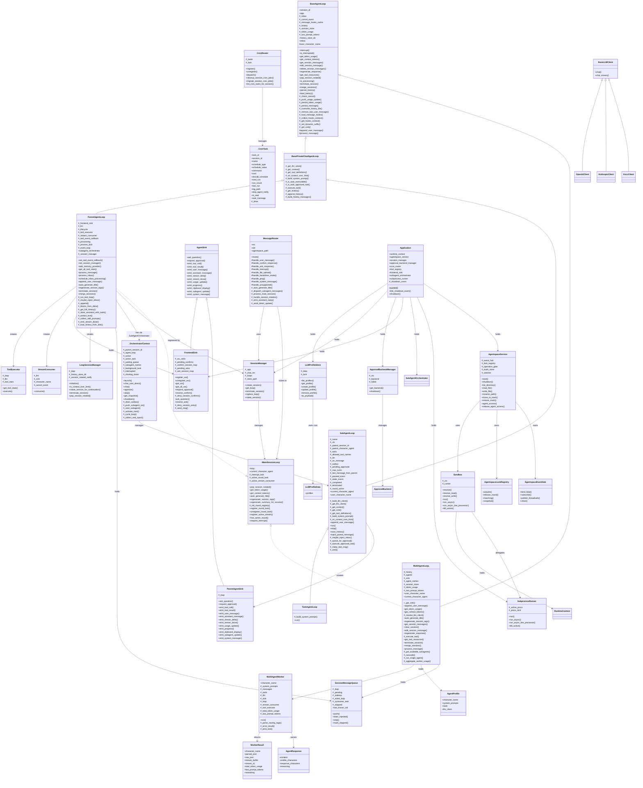

# Agent Loop 类关系图

## 继承关系（mermaid）

```mermaid
classDiagram
    class BaseAgentLoop {
        +session_id
        +app
        #_inbox
        #_cancel_event
        #_message_hooks_cache
        #_history
        #_session_store
        #_token_usage
        #_last_prompt_tokens
        +history_store_dir
        +inbox
        +interrupt()
        +is_interrupted()
        +get_token_usage()
        +get_context_tokens()
        +get_session_messages()
        +edit_session_message()
        +delete_session_messages()
        +regenerate_response()
        +get_tool_resources()
        +pop_session_rotated()
        +is_processing()
        +terminate_session()
        +merge_sessions()
        +persist_history()
        +load_history()
        #_check_cancel()
        #_push_usage_update()
        #_persist_token_usage()
        #_persist_message()
        #_overwrite_history_file()
        #_remove_last_user_message()
        #_load_message_hooks()
        #_collect_hooks_context()
        #_get_hooks_context()
        #_set_dynamic_suffix()
        #_get_sink()*
        #user_character_name*
        #append_user_message()*
        #process_message()*
    }

    class BasePrivateChatAgentLoop {
        #_get_llm_client()*
        #_get_context()*
        #_get_tool_definitions()*
        #_on_context_over_limit()*
        #_build_system_prompt()*
        #_is_auto_executable()
        #_is_auto_approved_tool()
        #_execute_tool()
        #_get_history()
        #_append_history()
        #_build_history_messages()
    }

    class IMainSessionLoop {
        +loop
        +current_character_agent*
        +pop_session_rotated()*
        +get_token_usage()*
        +get_context_tokens()*
        +auto_generate_title()*
        +regenerate_session_tags()*
        +regenerate_summary_for_session()*
        #_interrupt_lock
        #_active_round_task
        #_active_stream_consumer
        #_init_round_registry()
        +register_round_task()
        +unregister_round_task()
        +register_active_stream()
        +has_active_round()
        +request_interrupt()
    }

    class ParentAgentLoop {
        #_frontend_sink
        #_llm
        #_lifecycle
        #_tool_executor
        #_stream_consumer
        #_tool_event_callback
        #_processing
        #_process_lock
        #_event_loop
        +subagent_orchestrator
        #_session_manager
        +set_tool_event_callback()
        +set_session_manager()
        +add_memory_provider()
        +get_all_tool_stats()
        +process_message()
        +process_inbox()
        +schedule_inbox_processing()
        +append_user_message()
        +auto_generate_title()
        +regenerate_session_tags()
        +terminate_session()
        +merge_sessions()
        #_run_tool_loop()
        #_maybe_inject_inbox()
        #_append()
        #_blocks_from_dicts()
        #_get_full_history()
        #_store_assistant_with_tools()
        #_extract_text()
        #_collect_skill_prompts()
        #_emit_stream_done()
        #_load_history_from_disk()
    }

    class MultiAgentLoop {
        #_history
        #_agents
        #_sink
        #_agent_names
        #_session_store
        #_token_usage
        #_last_prompt_tokens
        +_get_sink()
        +user_character_name
        +append_user_message()
        +current_character_agent
        +get_token_usage()
        +get_context_tokens()
        #_resolve_llm_client()
        +auto_generate_title()
        +regenerate_session_tags()
        +get_session_messages()
        +clear_session()
        +edit_session_message()
        +regenerate_response()
        #_execute_tool()
        +get_tool_resources()
        +terminate_session()
        +merge_sessions()
        +process_message()
        #_get_available_subagents()
        #_cascade()
        #_run_single_agent()
        #_aggregate_worker_usage()
    }

    class MultiAgentWorker {
        +character_name
        #_system_prompts
        #_messages
        #_tools
        #_llm
        #_sink
        #_loop
        #_stream_consumer
        #_tool_executor
        #_total_token_usage
        #_last_prompt_tokens
        +run()
        #_parse_routing_tags()
        #_error_result()
        #_emit_text()
    }

    class ToolExecutor {
        #_loop
        #_llm
        #_tool_stats
        +get_tool_stats()
        +execute()
    }

    class SessionMessageQueue {
        #_loop
        #_pending
        #_wakeup
        #_event_loop
        #_consumer_task
        #_stopped
        +last_known_sid
        +push()
        +drain_injected()
        +stop()
        +mark_stopped()
    }

    class StreamConsumer {
        #_llm
        #_sink
        #_character_name
        #_cancel_event
        +consume()
    }

    class AgentSink {
        +ask_question()*
        +request_approval()*
        +emit_tool_call()*
        +emit_tool_result()*
        +emit_user_message()*
        +emit_assistant_message()*
        +emit_stream_delta()*
        +emit_stream_done()*
        +emit_usage_update()*
        +emit_progress()*
        +emit_clipboard_display()*
        +emit_subagent_update()*
        +emit_system_message()*
    }

    class FrontendSink {
        #_ws_sinks
        #_pending_confirms
        #_confirm_session_map
        #_pending_asks
        #_ask_session_map
        +register_ws()
        +unregister_ws()
        +get_ws()
        +get_all_ws()
        +request_approval()
        +resolve_confirm()
        #_deny_session_confirms()
        +ask_question()
        +resolve_ask()
        #_deny_session_asks()
        #_send_msg()
    }

    class ParentAgentSink {
        #_loop
        +ask_question()
        +request_approval()
        +emit_tool_call()
        +emit_tool_result()
        +emit_user_message()
        +emit_assistant_message()
        +emit_stream_delta()
        +emit_stream_done()
        +emit_usage_update()
        +emit_progress()
        +emit_clipboard_display()
        +emit_subagent_update()
        +emit_system_message()
    }

    class SubAgentLoop {
        #_name
        #_ctx
        #_parent_session_id
        #_parent_character_agent
        #_tools
        #_allowed_tool_names
        #_llm
        #_on_message
        #_outbox
        #_pending_approvals
        #_max_turns
        #_last_message_from_parent
        #_paused_event
        #_wake_event
        #_completed
        #_terminated
        #_round_active
        #_build_llm_client()
        +current_character_agent
        +user_character_name
        #_get_llm_client()
        #_get_context()
        #_get_sink()
        #_get_tool_definitions()
        #_build_system_prompt()
        #_on_context_over_limit()
        +append_user_message()
        +run()
        +stop()
        +save_history()
        +inject_parent_message()
        #_maybe_inject_inbox()
        #_queue_for_approval()
        #_execute_approved_tool()
        #_make_tool_msg()
        #_emit()
    }

    class TaskAgentLoop {
        #_build_system_prompt()
        +run()
    }

    class LoopSessionManager {
        #_loop
        #_history_store_dir
        #_session_rotated_notify
        +initialize()
        +is_context_over_limit()
        +rotate_session_for_continuation()
        +terminate_session()
        +pop_session_rotated()
    }

    class _OrchestratorContext {
        #_parent_session_id
        #_agent_loop
        #_active
        #_active_task
        #_waiting_queue
        #_subagent_names
        #_background_task
        #_interrupted
        #_shutting_down
        +launch()
        +chat_user_direct()
        +chat()
        +approve()
        +stop()
        +get_snapshot()
        +shutdown()
        #_drain_outbox()
        #_push_subagent_ws()
        #_start_subagent()
        #_activate_next()
        #_cycle_loop()
        #_collect_and_inject()
    }

    class SessionManager {
        #_app
        #_chat_sm
        #_loops
        #_store_path
        +create_session()
        +get_loop()
        +terminate_session()
        +replace_loop()
        +rotate_session()
    }

    class MessageRouter {
        +ws
        +sid
        +agentspace_path
        +route()
        #handle_user_message()
        #handle_confirm_response()
        #handle_ask_response()
        #handle_interrupt()
        #handle_file_upload()
        #handle_handsfree_mode()
        #handle_ping()
        #handle_system_message()
        #handle_unsupported()
        #_auto_generate_title()
        #_dispatch_subagent_messages()
        #_process_main_session()
        #_handle_session_rotation()
        #_emit_assistant_reply()
        #_send_token_update()
    }

    class LLMProfileStore {
        #_data
        #_lock
        +list_profiles()
        +get_profile()
        +create_profile()
        +update_profile()
        +remove_profile()
        +to_payload()
    }

    class LLMProfileData {
        +profiles
    }

    class Application {
        +runtime_context
        +agentspace_service
        +session_manager
        +approval_backend_manager
        +cron_router
        +tool_registry
        +frontend_sink
        +subagent_orchestrator
        +subprocess_runner
        #_shutdown_event
        +current()$
        +link_shutdown_event()
        +shutdown()
    }

    class ApprovalBackendManager {
        #_ctx
        #_backend
        #_failed
        +get_backend()
        +shutdown()
    }

    class BaseLLMClient {
        +chat()*
        +chat_stream()*
    }

    class AgentProfile {
        +character_name
        +system_prompts
        +tools
        +llm_client
    }

    class AgentResponse {
        +content
        +visible_characters
        +response_characters
        +reasoning
    }

    class WorkerResult {
        +character_name
        +parsed_json
        +raw_json
        +stream_buffer
        +stream_id
        +total_token_usage
        +last_prompt_tokens
        +reasoning
    }

    class AgentspaceService {
        #_event_hub
        #_lock_registry
        #_operation_gate
        #_trash_store
        #_watcher
        +start()
        +shutdown()
        +list_directory()
        +read_file()
        +write_file()
        +rename_path()
        +move_to_trash()
        +restore_trash()
        +agent_access()
        +release_agent_access()
    }

    class AgentspaceLockRegistry {
        +acquire()
        +release_round()
        +matching()
        +snapshot()
    }

    class AgentspaceEventHub {
        +bind_loop()
        +subscribe()
        +publish_threadsafe()
        +close()
    }

    class Sandbox {
        #_ctx
        #_runner
        +resolve()
        +resolve_read()
        +resolve_write()
        +run()
        +run_async()
        +run_async_line_processor()
        +kill_active()
    }

    class SubprocessRunner {
        #_active_procs
        #_procs_lock
        +run()
        +run_async()
        +run_async_line_processor()
        +kill_active()
    }

    class _CronTask {
        +task_id
        +session_id
        +name
        +schedule_type
        +schedule_value
        +command
        +cwd
        +should_schedule
        +next_run
        +run_count
        +last_run
        +log_path
        +skip_agent_notify
        +is_wait
        +wait_message
        #_timer
    }

    class CronRouter {
        #_tasks
        #_lock
        +register()
        +unregister()
        +dispatch()
        +cleanup_session_cron_jobs()
        +migrate_session_cron_jobs()
        +list_cron_tasks_for_session()
    }

    BaseAgentLoop <|-- BasePrivateChatAgentLoop
    BaseAgentLoop <|-- MultiAgentLoop
    BasePrivateChatAgentLoop <|-- ParentAgentLoop
    BasePrivateChatAgentLoop <|-- SubAgentLoop
    SubAgentLoop <|-- TaskAgentLoop
    IMainSessionLoop <|.. ParentAgentLoop
    IMainSessionLoop <|.. MultiAgentLoop
    AgentSink <|-- FrontendSink
    AgentSink <|-- ParentAgentSink
    BaseLLMClient <|-- OpenAIClient
    BaseLLMClient <|-- AnthropicClient
    BaseLLMClient <|-- KsccClient
    MultiAgentLoop --> MultiAgentWorker : creates
    MultiAgentLoop --> AgentProfile : holds
    MultiAgentWorker --> WorkerResult : returns
    MultiAgentWorker --> AgentResponse : parses
    ParentAgentLoop --> ToolExecutor : creates
    ParentAgentLoop --> StreamConsumer : creates
    ParentAgentLoop --> FrontendSink : holds
    ParentAgentLoop --> LoopSessionManager : creates
    ParentAgentLoop --> SessionMessageQueue : holds
    MultiAgentLoop --> SessionMessageQueue : holds
    ParentAgentLoop --> _OrchestratorContext : has via SubAgentOrchestrator
    ParentAgentLoop --> SessionManager : registered by
    SubAgentLoop --> ParentAgentSink : creates
    _OrchestratorContext --> SubAgentLoop : manages
    SessionManager --> IMainSessionLoop : manages
    MessageRouter --> SessionManager : uses
    MessageRouter --> IMainSessionLoop : routes to
    Application --> LLMProfileStore : holds
    LLMProfileStore --> LLMProfileData : owns root
    Application --> SessionManager : holds
    Application --> ApprovalBackendManager : holds
    Application --> FrontendSink : holds
    Application --> SubAgentOrchestrator : holds
    Application --> SubprocessRunner : holds
    Application --> AgentspaceService : holds
    AgentspaceService --> Sandbox : uses
    AgentspaceService --> AgentspaceLockRegistry : owns
    AgentspaceService --> AgentspaceEventHub : owns
    ApprovalBackendManager --> ApprovalBackend : manages
    Sandbox --> RuntimeContext : holds
    Sandbox --> SubprocessRunner : delegates
    CronRouter --> _CronTask : manages
```

---

## 字段归属（已确认）

| 字段 | 定义类 | 类型 | 说明 |
|---|---|---|---|
| `_inbox` | `BaseAgentLoop` | `Inbox` | 收件箱；子类通过 `self._inbox` 访问属合法继承 |
| `_cancel_event` | `BaseAgentLoop` | `asyncio.Event` | 取消/中断信号；`ToolContext.is_interrupted` 读取 `loop._cancel_event` |
| `_message_hooks_cache` | `BaseAgentLoop` | `list[dict] \| None` | hook 缓存 |
| `_history` | `BaseAgentLoop` / `MultiAgentLoop` | `History` | BaseAgentLoop 定义；MultiAgentLoop 覆盖传入 |
| `_session_store` | `BaseAgentLoop` / `MultiAgentLoop` | `SessionStore \| None` | BaseAgentLoop 定义；MultiAgentLoop 覆盖 |
| `_token_usage` | `BaseAgentLoop` / `MultiAgentLoop` | `int` | 累计 token；MultiAgentLoop 独立维护 |
| `_last_prompt_tokens` | `BaseAgentLoop` | `int` | 最近一次 prompt tokens |
| `_agentspace_round_ids` | `BaseAgentLoop` | `dict[str, str]` | 角色名到当前 Agentspace 回复轮次 ID；完整收尾后释放路径锁 |
| `_loaded_toolsets` | `BaseAgentLoop` | `set[str]` | 会话级已加载工具集名称集合；由 `_restore_loaded_toolsets` 从 SessionStore 恢复 |
| `_toolsets` | `ToolRegistry` | `dict[str, ToolsetEntry]` | 工具集元数据表；由 `register_toolset` 或工具注册时自动创建 |
| `round_id` | `ToolContext` | `str` | 当前 Agent 回复轮次唯一 ID，明确 `ws:` 文件接触登记的 owner |
| `_get_sink()` | `BaseAgentLoop` | abstract method | `ToolContext.sink` 调用 `loop._get_sink()` |
| `_overwrite_history_file()` | `BaseAgentLoop` | method | 类内部使用 |
| `_remove_last_user_message()` | `BaseAgentLoop` | method | 类内部使用 |
| `_update_last_user_message()` | `History` | method | 被 `BaseAgentLoop._remove_last_user_message()` 调用，属于跨类访问 |
| `_frontend_sink` | `ParentAgentLoop` | `FrontendSink` | sink 实例 |
| `_llm` | `ParentAgentLoop` | `BaseLLMClient` | LLM 客户端（通过 `create_llm_client()` 工厂构造） |
| `_lifecycle` | `ParentAgentLoop` | `LoopSessionManager` | session 生命周期管理 |
| `_tool_executor` | `ParentAgentLoop` | `ToolExecutor` | 工具执行器 |
| `_stream_consumer` | `ParentAgentLoop` | `StreamConsumer` | 流消费器 |
| `_tool_event_callback` | `ParentAgentLoop` | `Callable \| None` | 工具事件回调 |
| `_processing` | `ParentAgentLoop` | `bool` | 是否正在处理 |
| `_process_lock` | `ParentAgentLoop` | `asyncio.Lock` | 处理锁 |
| `_event_loop` | `ParentAgentLoop` | `asyncio.AbstractEventLoop \| None` | 事件循环引用 |
| `_session_manager` | `ParentAgentLoop` | `SessionManager \| None` | gateway session manager |
| `_interrupt_lock` | `IMainSessionLoop`（公共实现） | `asyncio.Lock` | 同会话中断请求互斥锁 |
| `_active_round_task` | `IMainSessionLoop`（公共实现） | `asyncio.Task \| None` | 当前活动回复任务（队列 consumer 或 HTTP handler task） |
| `_active_stream_consumer` | `IMainSessionLoop`（公共实现） | `StreamConsumer \| None` | 当前活动流消费器，供强制中断时主动关闭底层流 |
| `_agents` | `MultiAgentLoop` | `dict[str, AgentProfile]` | Agent 配置档案 |
| `_sink` | `MultiAgentLoop` | `AgentSink` | sink |
| `_agent_names` | `MultiAgentLoop` | `list[str]` | agent 名列表 |
| `_system_prompts` | `MultiAgentWorker` | `list[str]` | Agent 系统提示词 |
| `_messages` | `MultiAgentWorker` | `list[BaseMessage]` | 该 Agent 视角的历史消息 |
| `_tools` | `MultiAgentWorker` | `list[dict]` | 该 Agent 可用的工具定义 |
| `_llm` | `MultiAgentWorker` | `BaseLLMClient` | LLM 客户端 |
| `_sink` | `MultiAgentWorker` | `AgentSink` | 前端流式输出 sink |
| `_loop` | `MultiAgentWorker` | `IMainSessionLoop` | 所属 MultiAgentLoop 引用 |
| `_stream_consumer` | `MultiAgentWorker` | `StreamConsumer` | 流消费器（每轮独立 stream_id） |
| `_tool_executor` | `MultiAgentWorker` | `ToolExecutor` | 工具执行器（复用统一逻辑） |
| `_total_token_usage` | `MultiAgentWorker` | `int` | 被 `MultiAgentLoop._aggregate_worker_usage` 读取 |
| `_last_prompt_tokens` | `MultiAgentWorker` | `int` | 被 `MultiAgentLoop._aggregate_worker_usage` 读取 |
| `_llm` | `StreamConsumer` | `BaseLLMClient` | LLM 客户端 |
| `_sink` | `StreamConsumer` | `AgentSink` | 前端 sink |
| `_character_name` | `StreamConsumer` | `str` | 当前角色名 |
| `_cancel_event` | `StreamConsumer` | `asyncio.Event` | 取消信号 |
| `_loop` | `ToolExecutor` | `IMainSessionLoop` | 持有 loop 引用，访问其内部字段 |
| `_llm` | `ToolExecutor` | `BaseLLMClient` | LLM 客户端（用于 ask_agent_reason） |
| `_tool_stats` | `ToolExecutor` | `dict[str, dict[str, int]]` | 工具调用统计 |
| `_loop` | `SessionMessageQueue` | `IMainSessionLoop` | 所属主会话 loop |
| `_pending` | `SessionMessageQueue` | `deque[QueuedMessage]` | 待消费 FIFO；每次只取一条消息，每条保留自己的 `llm_profile_name`；当前工具轮不再 drain 用户消息 |
| `_wakeup` | `SessionMessageQueue` | `asyncio.Event \| None` | 空闲消费循环的唤醒事件 |
| `_event_loop` | `SessionMessageQueue` | `asyncio.AbstractEventLoop` | 构造时捕获运行中的事件循环，供跨线程入队 |
| `_consumer_task` | `SessionMessageQueue` | `asyncio.Task \| None` | 懒启动的空闲消费任务 |
| `_stopped` | `SessionMessageQueue` | `bool` | `stop()` / `mark_stopped()` 置位 |
| `last_known_sid` | `SessionMessageQueue` | `str` | 旋转检测：与当前 session_id 比对 |
| （无新增字段） | `TaskAgentLoop` | — | 全部继承 `SubAgentLoop`；仅覆写 `_build_system_prompt()`（返回空）与 `run()`（纯文本回复或达 `MAX_TOOL_TURNS` 即终止） |
| `_ws_sinks` | `FrontendSink` | `dict[str, WebSocket]` | session_id → WebSocket 映射 |
| `_pending_confirms` | `FrontendSink` | `dict[str, Future]` | 外部解析确认结果 |
| `_confirm_session_map` | `FrontendSink` | `dict[str, str]` | 外部映射确认到 session |
| `_pending_asks` | `FrontendSink` | `dict[str, Future]` | 外部解析提问结果 |
| `_ask_session_map` | `FrontendSink` | `dict[str, str]` | 外部映射提问到 session |
| `_loop` | `ParentAgentSink` | `SubAgentLoop` | 持有 SubAgentLoop 引用，访问其内部字段 |
| `_outbox` | `SubAgentLoop` | `list[str]` | 被 orchestrator 读取 |
| `_pending_approvals` | `SubAgentLoop` | `list[PendingToolCall]` | 被 `ParentAgentSink` 读取/写入 |
| `_paused_event` | `SubAgentLoop` | `asyncio.Event` | 被 `ParentAgentSink` 读取/设置 |
| `_emit()` | `SubAgentLoop` | method | 被 `ParentAgentSink` 调用 |
| `_parent_session_id` | `SubAgentLoop` | `str` | 被 `ParentAgentSink` 读取 |
| `_loop` | `LoopSessionManager` | `ParentAgentLoop` | 大量访问 loop 的 protected 字段 |
| `_history_store_dir` | `LoopSessionManager` | `Path \| None` | 历史存储目录 |
| `_session_rotated_notify` | `LoopSessionManager` | `dict[str, str]` | session 旋转通知 |
| `_agent_loop` | `_OrchestratorContext` | `ParentAgentLoop` | 访问父 loop 的 `current_character_agent` 等 |
| `_active` / `_active_task` | `_OrchestratorContext` | `dict` | 管理 SubAgentLoop 实例 |
| `_loops` | `SessionManager` | `dict[str, IMainSessionLoop]` | 管理 loop 映射 |
| `ws` | `MessageRouter` | `WebSocket` | WebSocket 连接引用 |
| `sid` | `MessageRouter` | `str` | 当前 session_id（旋转时更新） |
| `agentspace_path` | `MessageRouter` | `Path \| None` | 文件上传目标目录 |
| `runtime_context` | `Application` | `RuntimeContext` | 运行时上下文 |
| `_profile_lock` | `Application` | `threading.RLock` | Profile 根对象、名称指针与会话选择共用的进程锁 |
| `_llm_profile_store` | `Application` | `LLMProfileStore \| None` | 进程内唯一的 `LLMProfileData` 根对象存储 |
| `_subprocess_runner` | `Application` | `SubprocessRunner \| None` | 进程内唯一的子进程执行器（同步、真异步与逐行消费），注入 Sandbox 委托 |
| `_agentspace_service` | `Application` | `AgentspaceService \| None` | Agentspace 版本化 CRUD、文件锁、垃圾桶、watcher 与 SSE 事件的唯一业务服务 |
| `session_manager` | `Application` | `SessionManager \| None` | session 管理器 |
| `approval_backend_manager` | `Application` | `ApprovalBackendManager \| None` | 审批后端管理器 |
| `cron_router` | `Application` | `CronRouter \| None` | Cron 路由器 |
| `tool_registry` | `Application` | `ToolRegistry \| None` | 工具注册表 |
| `frontend_sink` | `Application` | `FrontendSink \| None` | 前端 sink |
| `subagent_orchestrator` | `Application` | `SubAgentOrchestrator \| None` | 子 Agent 编排器 |
| `_backend` | `ApprovalBackendManager` | `ApprovalBackend \| None` | 审批后端实例（懒加载） |
| `_failed` | `ApprovalBackendManager` | `bool` | 审批后端是否不可用 |
| `character_name` | `AgentProfile` | `str` | Agent 角色名 |
| `system_prompts` | `AgentProfile` | `list[str]` | 系统提示词列表 |
| `tools` | `AgentProfile` | `list[dict]` | 工具定义列表 |
| `llm_client` | `AgentProfile` | `BaseLLMClient` | LLM 客户端实例 |
| `_ctx` | `Sandbox` | `RuntimeContext` | 被多个 extools 直接访问 `sb._ctx.agentspace` |
| `_runner` | `Sandbox` | `SubprocessRunner \| None` | 子进程执行委托目标；`None` 时惰性获取 `Application.current().subprocess_runner` |
| `_active_procs` | `SubprocessRunner` | `dict[str, list[Popen \| Process]]` | session_id → 活动子进程登记（同步 `Popen` 与异步 `Process` 混合） |
| `_procs_lock` | `SubprocessRunner` | `threading.Lock` | 活动进程登记表锁 |
| `_tasks` | `CronRouter` | `dict[str, dict[str, _CronTask]]` | 被 cron_tools 模块级函数直接访问 |
| `_lock` | `CronRouter` | `threading.Lock` | 被 cron_tools 模块级函数直接访问 |
| `_timer` | `_CronTask` | `threading.Timer` | 被 cron_tools 模块级函数直接访问 |

---

## 已识别的外部访问（跨类/跨模块）

| 访问方 | 被访问字段 | 被访问类 | 位置 | 说明 |
|---|---|---|---|---|
| `ToolContext.sink` | `_get_sink()` | `BaseAgentLoop` | `entry/base_agent_loop.py` | 工具通过 `ctx.sink` 访问 loop 的 sink |
| `ToolContext.is_interrupted` | `_cancel_event` | `BaseAgentLoop` | `entry/base_agent_loop.py` | 工具通过 `ctx.is_interrupted` 读取取消状态 |
| `ToolContext.agentspace_access` | `agentspace_service` | `Application` | `entry/base_agent_loop.py` | 以 `round_id` 向 `AgentspaceService` fail-closed 登记明确 `ws:` 路径 |
| `ToolExecutor.execute` | `is_toolset_loaded()` | `BaseAgentLoop` | `entry/tool_executor.py` | 审批前检查工具集加载状态 |
| `ToolRegistry.dispatch/async_dispatch` | `is_toolset_loaded()` | `BaseAgentLoop` (via `ToolContext.loop`) | `abstract/tools/registry.py` | 分发前统一拦截未加载工具 |
| `build_system_prompt` | `get_loaded_toolsets()` | `BaseAgentLoop` | `system/prompt.py` | 构造工具集目录提示词块 |
| `LoadToolset handler` | `load_toolsets()` | `BaseAgentLoop` (via `ToolContext.loop`) | `component/tools/load_toolset.py` | 加载工具集并持久化 |
| 各 Agent Loop 回复收尾 | `release_agent_access()` | `AgentspaceService` | `entry/parent_agent_loop.py`、`entry/multi_agent_loop.py`、`subagent/loop.py`、`subagent/taskloop.py` | 主Agent、参与Agent、子Agent与临时Agent在匹配 round `finally` 释放 |
| `BaseAgentLoop._remove_last_user_message` | `_update_last_user_message()` | `History` | `entry/base_agent_loop.py` | 跨类调用 History 的 protected 方法 |
| `MultiAgentLoop._aggregate_worker_usage` | `_total_token_usage` | `MultiAgentWorker` | `entry/multi_agent_loop.py` | 读取 worker 内部 token 统计 |
| `MultiAgentLoop._aggregate_worker_usage` | `_last_prompt_tokens` | `MultiAgentWorker` | `entry/multi_agent_loop.py` | 读取 worker 内部 token 统计 |
| `MultiAgentLoop._run_single_agent` | `cancel_event` / `history` / `persist_history` / `session_id` | `BaseAgentLoop` (via `IMainSessionLoop.loop`) | `entry/multi_agent_loop.py` | 通过 `self._loop.loop._xxx` 访问 loop 内部 |
| `MultiAgentWorker.__init__` | `_cancel_event` | `BaseAgentLoop` (via `IMainSessionLoop.loop`) | `entry/multi_agent_worker.py` | 通过 `self._loop.loop.cancel_event` 读取 |
| `MultiAgentWorker.run` | `_history` / `persist_history()` | `MultiAgentLoop` (via `IMainSessionLoop.loop`) | `entry/multi_agent_worker.py` | 通过 `self._loop.loop.history` / `persist_history` 访问 |
| `ToolExecutor.execute` | `cancel_event` / `get_sink()` / `get_hooks_context()` / `session_id` | `BaseAgentLoop` (via `IMainSessionLoop.loop`) | `entry/tool_executor.py` | 通过 `self._loop.loop._xxx` 访问 loop 内部 |
| `ToolExecutor.execute` | `is_interrupted()` / `current_character_agent` | `IMainSessionLoop` / `BaseAgentLoop` | `entry/tool_executor.py` | 访问 loop 状态 |
| `ParentAgentSink.request_approval` | `_parent_session_id`, `_pending_approvals`, `_paused_event`, `_emit()` | `SubAgentLoop` | `entry/agent_sink.py` | 直接访问子 agent 内部字段/方法 |
| `ParentAgentSink.emit_*` | `_emit()` / `_parent_session_id` | `SubAgentLoop` | `entry/agent_sink.py` | 转发事件时读取子 agent 内部 |
| `ParentAgentSink.emit_stream_done` | `frontend_sink` | `Application` | `entry/agent_sink.py` | 通过 `Application.current().frontend_sink` 转发到父会话前端 |
| `LoopSessionManager.initialize` | `_session_store`, `_history`, `session_id` | `ParentAgentLoop` | `entry/session_manager.py` | 初始化时读写 loop 内部 |
| `LoopSessionManager.is_context_over_limit` | `_last_prompt_tokens`, `app.runtime_context` | `ParentAgentLoop` | `entry/session_manager.py` | 读取 loop 内部 token 和配置 |
| `LoopSessionManager.rotate_session_for_continuation` | `_remove_last_user_message`, `_append`, `_history`, `_last_prompt_tokens`, `_session_store`, `_session_manager`, `_llm`, `load_history`, `persist_history` | `ParentAgentLoop` | `entry/session_manager.py` | 旋转时大量调用 loop 内部 |
| `LoopSessionManager._terminate_session` | `_session_manager`, `_session_store`, `_history`, `_llm`, `get_full_history` | `ParentAgentLoop` | `entry/session_manager.py` | 终结会话时大量调用 loop 内部 |
| `TaskAgentLoop`（模块级 import） | `_interrupted_result()` | `entry/tool_executor.py`（模块级函数） | `subagent/taskloop.py` | 跨模块导入 protected 函数，构造中断/异常时的工具结果占位 |
| `_OrchestratorContext._drain_outbox` | `_outbox` | `SubAgentLoop` | `subagent/orchestrator.py` | 直接读取并清空 outbox |
| `_OrchestratorContext.get_snapshot` | `_history.messages`, `pending_approvals_info` | `SubAgentLoop` | `subagent/orchestrator.py` | 读取子 agent 历史 |
| `_OrchestratorContext._start_subagent` | `_history` | `SubAgentLoop` | `subagent/orchestrator.py` | 加载历史时覆盖 `_history` |
| `_OrchestratorContext._collect_and_inject` | `outbox` / `_outbox` | `SubAgentLoop` | `subagent/orchestrator.py` | 收集并清空 outbox |
| `_OrchestratorContext._collect_and_inject` | `process_message()` | `ParentAgentLoop` | `subagent/orchestrator.py` | 调用父 loop 公共方法 |
| `MessageRouter.route` | `get_loop()` | `SessionManager` | `gateway/message_router.py` | 通过 `_get_sm().get_loop()` 获取 loop |
| `MessageRouter._handle_session_rotation` | `unregister_ws()` / `register_ws()` | `FrontendSink` | `gateway/message_router.py` | 旋转时更新 WebSocket 映射 |
| `MessageRouter._dispatch_subagent_messages` | `get_snapshot()` / `chat_user_direct()` | `SubAgentOrchestrator` | `gateway/message_router.py` | 转发消息到子 Agent |
| `gateway/session_manager.replace_loop` | `_agents` | `MultiAgentLoop` | `gateway/session_manager.py` | 读取 multi loop 的 agents |
| `gateway/session_manager.replace_loop` / `rotate_session` | `session_id` | `BaseAgentLoop` | `gateway/session_manager.py` | 写入 loop 的 session_id |
| `FrontendSink` 外部 | `_ws_sinks`, `_pending_confirms`, `_confirm_session_map`, `_pending_asks`, `_ask_session_map` | `FrontendSink` | `gateway/message_router.py` | MessageRouter 解析确认和提问结果 |
| `SubAgentLoop` 外部 | `_outbox` | `SubAgentLoop` | `subagent/orchestrator.py` | orchestrator 读取子 agent outbox |
| `SubAgentLoop` 外部 | `_history` | `SubAgentLoop` | `subagent/orchestrator.py` | orchestrator 读取子 agent history |
| `cron_tools` 模块函数 | `_lock`, `_tasks` | `CronRouter` | `component/extools/cron_tools.py` | 直接访问 CronRouter 内部字段 |
| `cron_tools` 模块函数 | `_timer` | `_CronTask` | `component/extools/cron_tools.py` | 直接访问任务内部 timer |
| `diagram.py` / `mermaid_tools.py` / `docgen_tools.py` / `web_browser.py` | `_ctx` | `Sandbox` | `component/extools/*.py` | 直接访问 Sandbox 的 `_ctx` 获取 agentspace |
| 全局 `Application.current()` | `session_manager`, `frontend_sink`, `subagent_orchestrator`, `approval_backend_manager` | `Application` | 多处 | 各模块通过单例访问子系统 |

> 注：子类对父类 protected 字段的 `self._x` 访问（如 `ParentAgentLoop` 访问 `self._history`）属于合法继承访问，不列入"外部访问"。

---

## Pydantic 数据模型

以下类继承 `pydantic.BaseModel`，属于纯数据结构或带轻量验证的响应模型：

| 类 | 定义文件 | 继承 | 说明 |
|---|---|---|---|
| `InboxMessage` | `entry/base_agent_loop.py` | `BaseModel` | 收件箱消息基类，含 `to_text()` |
| `UserMessage` | `entry/base_agent_loop.py` | `InboxMessage` | 用户消息 |
| `ApprovalDecisionMessage` | `entry/base_agent_loop.py` | `InboxMessage` | 审批决定消息（当前未使用） |
| `CronResultMessage` | `entry/base_agent_loop.py` | `InboxMessage` | Cron 任务结果消息 |
| `ContextLimitMessage` | `entry/base_agent_loop.py` | `InboxMessage` | 上下文超限消息 |
| `InterruptMessage` | `entry/base_agent_loop.py` | `InboxMessage` | 中断消息 |
| `AgentResponse` | `entry/multi_agent_worker.py` | `BaseModel` | 多 Agent 模式下单 Agent 的解析后响应 |
| `WorkerResult` | `entry/multi_agent_worker.py` | `BaseModel` | Worker 执行结果，含 DSL 路由元数据 |
| `ProcessLineStreamResult` | `entity/puretype/runtime.py` | `BaseModel` | 逐行消费子进程输出后的退出码、stderr、截断与行数摘要 |
| `RefWrapper[T]` | `entity/gentype.py` | `BaseModel, Generic[T]` | 可变引用容器，供 loop 与 `ToolExecutor` 等组件共享可变值 |
| `LLMProfile` | `entity/puretype/llm.py` | `BaseModel` | LLM 配置；三个多模态字段为根对象内实例引用 |
| `LLMProfileData` | `entity/puretype/llm.py` | `BaseModel` | `llm_profiles.es` v2 的持久化根对象 |
| `LLMProfilePayload` | `entity/puretype/llm.py` | `BaseModel` | HTTP 扁平 Profile DTO，以名称/null 表达引用 |

---

## 关键设计变更记录

### Memory 系统移除

`ParentAgentLoop` 中原有的 `_memory`（`MemoryManager`）和 `_memory_initialized_ids`（`set[int]`）字段已移除。`add_memory_provider()` 方法也已完全移除（不再保留空实现）。`LoopSessionManager` 中涉及 memory 的迁移逻辑已移除。记忆功能现由运行时扩展实现：`custom_tools/memory_tools/`（remember/forget 工具）+ `custom_hooks/memory_hook.py`（每轮注入上下文）。

### LLM 抽象层引入

`ParentAgentLoop._llm` 类型从具体的 `LLMClient` 变为 `BaseLLMClient`（抽象基类）。实际客户端通过 `abstract/llm/loader.py::create_llm_client()` 工厂从 `custom_llm_client/` 动态加载。内置实现：`openai_client.py`、`anthropic_client.py`。

`abstract/llm/formats.py` 提供 `to_openai_message()` 和 `messages_to_anthropic_list()` 两种 wire format 转换器，供 LLM 客户端复用。

### Application 单例

`system/application.py::Application` 作为进程级唯一单例，替代了原有的模块级全局变量。所有子系统（`LLMProfileStore`、共享 Profile 锁、`SessionManager`、`FrontendSink`、`SubAgentOrchestrator`、`ApprovalBackendManager`、`CronRouter`、`ToolRegistry`）通过 `Application.current()` 访问。

### Approval 目录化

`component/approval/` 从单文件重构为目录，包含：`__init__.py`（公共接口）、`core.py`（`request_user_confirm` 统一审批入口；`ask_agent_reason` 脱手模式向 Agent 主模型提问取上下文）、`policy.py`（预设策略 `MAIN_SESSION_POLICY` / `SUB_SESSION_POLICY` 与 `needs_approval()`；数据类 `ApprovalPolicy` 定义在 `entity/puretype/approval`）、`backend.py`（`ApprovalBackend` / `LocalApprovalBackend`）、`executor.py`（`execute_with_approval`）、`allowlist.py`（白名单逻辑）、`handsfree.py`（脱手模式）。`ApprovalBackendManager` 由 `Application` 持有，管理审批后端的懒加载和生命周期。

### MessageRouter 拆分

`gateway/message_router.py::MessageRouter` 从 `gateway/server.py` 的 `ws_chat` 中拆分，负责所有 WebSocket 消息类型的分发处理。`server.py` 仅保留 WebSocket 连接生命周期管理。

### MultiAgentWorker 独立工具执行

`MultiAgentWorker` 内部创建独立的 `StreamConsumer` 和 `ToolExecutor` 实例，复用 `ParentAgentLoop` 的统一工具执行逻辑，但拥有独立的 stream_id 生成和 token 统计。

### 工具结果后处理统一

`entry/tool_post_dispatch.py::finalize_tool_result` 提取 `ToolExecutor.execute` 与 `SubAgentLoop._execute_approved_tool` 中重复的后处理：构建 `ToolCallMeta` 并注入 `_meta`、经 `ResultFieldInjector` 注入附加字段（如消息队列的 `queued_messages`）、推送前端 `tool_result` 事件并经 `ui_event_router` 路由 UI 事件，返回可持久化的 `ToolResultMessage`。

### 会话级消息队列（SP-4/SP-5）

`entry/session_message_queue.py::SessionMessageQueue` 由 `ParentAgentLoop` / `MultiAgentLoop`（及继承的 `ColloquyLoop`）持有。生产侧仍经 `call_soon_threadsafe` 落回事件循环；消费侧改为严格逐条 FIFO，每条前端消息保存自己的 `llm_profile_name` 并在执行前重新解析。当前工具轮期间到达的用户消息不再由 `drain_injected` 移出，而是在当前轮结束后依次执行。gateway 在 loop 消亡时调 `stop()`；`replace_loop` 场景用 `mark_stopped()` 标记停止而不 cancel。

### LLM Profile 根对象与名称边界

`Application` 持有唯一 `LLMProfileStore` 和共享进程锁。`llm_profiles.es` 仅支持 v2 `LLMProfileData` 根对象，三个多模态分工字段直接保存根列表中的 `LLMProfile` 实例引用；不存在 UID 或 v1 迁移。Gateway 只接收扁平名称 DTO 和单 Profile CRUD。主会话活动配置以名称指针持久化，每条前端消息只传 `llm_profile_name`；`IMainSessionLoop.set_profile()` 由 Parent/Multi 实现。

### 多模态能力探测内化

原探针工具已内化为 `system/modality_capability.py` 的系统自动行为：需要给活跃模型传递多模态块时先查 easysave 缓存（`modality_capability_cache.es`，按 model+base_url 联合索引、六项能力齐全才命中），未探测则伪装 Read 工具调用按 模态 × 消息路径（tool/user）六路并发探测；400 类错误判为不支持，网络/认证/超时等非模态错误上抛不写缓存。`build_modality_prompt_block()` 每轮生成 system prompt 注入块；活跃模型不支持某模态时经 `forward_modality_to_ref_profile()` 转发到 profile 引用的其他模型。

### Agentspace 编辑器业务服务与回复轮次文件锁

`Application` 新增唯一 `AgentspaceService`。该服务把原先位于 Gateway 的全局布尔锁和直接文件操作替换为版本化 CRUD、`AgentspaceLockRegistry`、`AgentspaceOperationGate`、事务垃圾桶、`watchdog` watcher 与 SSE `AgentspaceEventHub`。Gateway 只负责 typed HTTP/SSE 转换。

`ToolContext` 携带必填 `round_id`。主Agent、参与Agent、子Agent与临时Agent在各自完整回复开始时创建 round，并在 History/事件/metrics 收尾后的 `finally` 幂等释放。内置文件、Shell 与 Python 工具只登记明确 `ws:` 路径；`Delete` 的永久删除和审批语义不变。用户从 Agentspace 编辑器删除时独立进入 `ws:.trash/`。

### MCP schema 规范化

`abstract/mcp/schema.py::normalize_mcp_input_schema()` 是 MCP 工具定义进入 LLM provider 前的独立兼容层。`abstract/mcp/client.py` 的工具发现和 sampling 路径共用该规范化入口，按 JSON Schema 结构位置递归处理映射、数组、组合分支、定义和 `additionalProperties`，避免业务参数名 `properties` 被误判为 schema 结构。异常值通过路径化诊断降级为 provider 可接受的形式；该过程只复制和调整 LLM-facing schema，不修改 MCP `tools/call` 的原始参数，也不新增 Agent Loop 字段或 protected 字段。

### LLM Profile 转发引用限制移除

`LLMProfileStore._validate_root()` 移除了自引用检查（`reference is profile`）与循环引用 DFS 检测（`visiting`/`visited` 集合）。Profile 间多模态分工字段（`vision_image_profile`/`audio_profile`/`vision_video_profile`）现允许自引用和循环引用。转发运行时 `forward_modality_to_ref_profile()` 为单跳机制，不递归触发转发，循环/自引用不会产生无限递归。保留的校验：引用必须为 `LLMProfile` 类型且在根列表内。前端 `LlmProfileDrawer.tsx` 同步移除三个多模态分工下拉框对当前编辑项的过滤。

### 子进程执行层抽取为 SubprocessRunner

`Sandbox` 原有的子进程执行逻辑（`run()`、`kill_active()`、`_kill_proc_tree()`、`_active_procs`/`_procs_lock` 登记表）迁移至 `system/subprocess_utils.py::SubprocessRunner`。`Application` 持有其全局单例（`_subprocess_runner`），在 `init()` 中创建并注入 `Sandbox(ctx, runner)`。`Sandbox` 保留命名空间校验与 cwd 解析层，`run()`/`kill_active()` 变为薄委托，并提供 `async run_async()` 与 `async run_async_line_processor()` 委托。`SubprocessRunner` 提供同步 `run()`、真异步 `run_async()`（`asyncio.create_subprocess_exec` + `wait_for(communicate())`）及逐行消费 `run_async_line_processor()`；后者供 `SearchFiles`/`Grep` 在达到结果上限时终止进程树并限制 stderr 缓冲。取消语义为自清理（杀树+限量 wait+re-raise）+ `kill_active` 兜底双保险。异步入口超时抛 `subprocess.TimeoutExpired`，取消 re-raise `CancelledError`（保 `ToolInterrupted("dispatch")` 语义）。`Sandbox.__init__` 的 `runner` 参数为可选（默认 `None`），仅做路径解析的既有 `Sandbox(ctx)` 构造零改动，委托方法惰性获取 `Application.current().subprocess_runner`。

根因：`RunCommand`/`RunPython`/`InstallPackage` 三工具注册 `is_async=True` 但内部调用同步阻塞子进程 API（`proc.communicate()`），被直接 await 在事件循环上冻结整个 loop——agent 用 run 系列工具执行 curl 打自己的动态端点时形成自死锁（uvicorn 无法处理请求直至 `tool_timeout`）。真异步化后子进程等待为协程挂起，事件循环保持响应。

### `soul_file` 移入 LLMProfile 与 `yolo` 升级为三态审批模式

两项全局配置从 `config.py`/CLI/`RuntimeContext` 移除：

1. **`soul_file`** 从 `RuntimeContext.soul_file` 迁移到 `LLMProfile.soul_file` 字段（每 Profile 独立，通过 `llm_profiles.es` 持久化）。`LLMProfile` 中已有字段定义但未接线，本次完成 DTO（`LLMProfilePayload.soul_file`）、Store（`_PROFILE_FIELDS`、`to_payload`、`create_profile`、`_assign_payload`、验证）和 Prompt 构建（`system/prompt.py::build_system_prompt()` 从 `profile.soul_file` 读取）的完整接线。`run.py` 初始 SOUL 文件复制改用硬编码 `"SOUL.md"`。

2. **`yolo`** 从 `RuntimeContext.yolo` 全局配置升级为会话级三态审批模式之一。新增 `ApprovalMode(str, Enum)` 枚举（MANUAL/HANDSFREE/YOLO）定义在 `entity/puretype/approval.py`。`component/approval/handsfree.py` 的 `_handsfree_sessions: dict[str, bool]` 升级为 `_approval_modes: dict[str, ApprovalMode]`，新增 `set_approval_mode()`/`get_approval_mode()`/`disable_all_non_manual_modes()`，保留旧函数（`set_handsfree_mode`/`is_handsfree_mode`/`disable_all_handsfree_modes`）作为兼容包装。`component/approval/policy.py::needs_approval()` 参数从 `handsfree: bool` 改为 `approval_mode: ApprovalMode`。`executor.py`、`subagent/loop.py` 的 YOLO 检查从 `get_runtime_context().yolo` 改为 `get_approval_mode(sid) == ApprovalMode.YOLO`。WS 协议中 `Message` 新增 `approval_mode` 字段（`handsfree_mode` 保留向后兼容）。前端 `useSessionStore` 新增 `approvalMode` 状态，`Header.tsx` 升级为三态审批模式选择器。