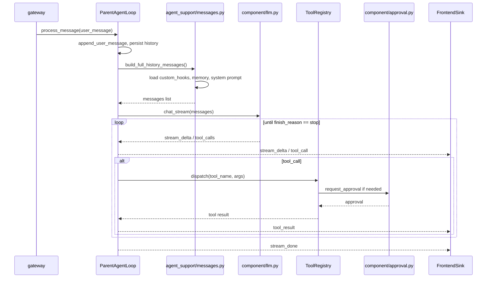

# entry/ — Agent 主循环

`entry/` 包含 Evolve Agent 的核心消息处理循环与相关抽象。它是用户消息进入系统后，经过 LLM、工具、审批、前端事件往返的主战场。

---

## 文件结构

```
entry/
├── base_agent_loop.py       ← AgentLoop 抽象基类
├── parent_agent_loop.py     ← 主 Agent 循环实现
├── agent_sink.py            ← Agent 输出抽象（Frontend / Parent）
└── agent_support/
    ├── messages.py          ← 消息组装：system prompt + hooks + memory + history
    └── multimodal.py        ← 多模态处理与 content block 清洗
```

---

## 关键抽象

### `BaseAgentLoop` / `BasePrivateChatAgentLoop`

`base_agent_loop.py` 提供两类抽象：

- **`BaseAgentLoop`**：最基础的循环抽象，包含：
  - `Inbox` 带类型消息队列（`UserMessage`、`ApprovalDecisionMessage`、`CronResultMessage` 等）。
  - 取消控制（`cancel()`、`is_cancelled()`）。
  - `ToolContext` 注入到工具 handler，替代旧的全局 `get_runtime_context()`。
  - 通用工具执行逻辑 `_execute_tool()`。

- **`BasePrivateChatAgentLoop`**：在基类之上增加 1-on-1 私聊循环模板，包含：
  - 历史管理（`History` 实例）。
  - LLM 调用（`chat` / `chat_stream`）。
  - 工具执行与结果回环。
  - Memory provider 集成。
  - Hooks 加载与上下文注入。

`ParentAgentLoop` 与 `SubAgentLoop` 均继承 `BasePrivateChatAgentLoop`。

### `ParentAgentLoop`

`parent_agent_loop.py` 中的 `ParentAgentLoop` 是面向用户的主循环实现，负责：

- 处理用户消息：`process_message()`。
- 流式 LLM 调用与实时前端推送。
- 工具审批：只读 / 白名单直接执行，其余通过 `sink.request_approval()` 等待确认。
- 会话旋转：当上下文接近上限时，归档旧会话并创建带摘要的延续会话。
- 自动标题与标签生成。
- 子代理调度：通过 `SubAgentOrchestrator` 启动/管理子 Agent。

### `AgentSink` / `FrontendSink` / `ParentAgentSink`

`agent_sink.py` 定义 Agent 向上通信的抽象：

- **`AgentSink`**：抽象接口，定义 `send_user_message`、`request_approval`、`emit` 等方法。
- **`FrontendSink`**：通过 WebSocket 与前端交互，发送 `confirm_request`、`ask_request`、`stream_delta`、`tool_call`、`tool_result`、`task_progress`、`subagent_update` 等事件。
- **`ParentAgentSink`**：子 Agent 使用，将审批/事件转发给父 session 的 `FrontendSink`。

---

## 消息处理流程



主要步骤：

1. `process_message()` 获取锁，消费 inbox 遗留消息。
2. `append_user_message()` 将用户消息追加到 `History` 并回显前端。
3. 延迟初始化 memory providers。
4. 检查上下文是否超限，超限则 `_rotate_session_for_continuation()`。
5. `_build_history_messages()` 组装 system prompt + hooks + memory + 历史。
6. 调用 `_llm.chat_stream()` 流式生成。
7. 解析流中的文本 / tool_call，通过 `FrontendSink` 实时推送。
8. 对 tool_call 执行 `_execute_tool()`：readonly / allowlist 直接执行，否则等待审批。
9. 工具结果加入历史，循环直到 `finish_reason=stop` 或达到 `MAX_TOOL_TURNS`。

---

## 会话旋转与上下文压缩

当单一会话的总 token 接近模型窗口上限时：

1. `ParentAgentLoop` 调用 `_rotate_session_for_continuation()`。
2. 归档当前会话，生成摘要。
3. 创建新的延续会话，保留历史摘要与近期完整消息。
4. 前端通过 `session_history` 回放或刷新来呈现连续性。

上下文压缩策略由 `system/prompt.py` 与模板 `compress.txt` / `compress_full.txt` 控制。

---

## 自动标题与标签

`parent_agent_loop.py` 提供：

- `auto_generate_title(session_id)`：基于会话内容生成标题。
- `generate_session_tags(session_id, force=False)` / `regenerate_session_tags(session_id)`：基于会话摘要生成标签。
- 首条用户消息发送时若标题为空，取前 30 字符作为初始标题。

这些功能通过调用 LLM 与解析 `entity/messages.py` 中的历史实现。

---

## 多模态支持

`agent_support/multimodal.py` 提供：

- `supports_vision()`：检测模型是否支持图像输入。
- `strip_image_blocks()`：当模型不支持图像时，剥离图片 content blocks 并降级为文本提示。
- `tool_result_to_content()`：将工具结果转换为 LLM content blocks。
- `content_to_text()`：将 content blocks 提取为纯文本摘要（用于日志或前端展示）。

---

## 与子代理的关系

`ParentAgentLoop` 通过 `main.py` 中挂载的 `SubAgentOrchestrator` 创建子 Agent。子 Agent 本身也是 `BasePrivateChatAgentLoop` 的实现，但通过 `ParentAgentSink` 将事件路由回父会话的前端。详见 `../subagent/DEV-README.md`。