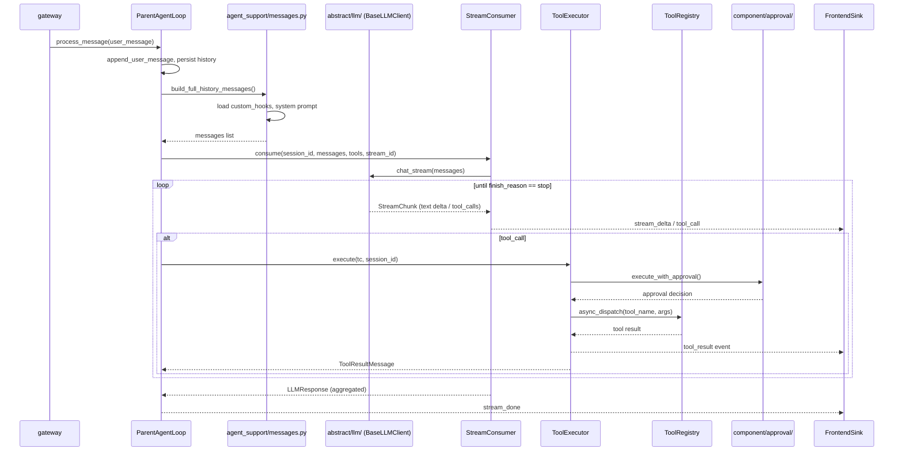

# entry/ — Agent 主循环

`entry/` 包含 Evolve Agent 的核心消息处理循环与相关抽象。它是用户消息进入系统后，经过 LLM、工具、审批、前端事件往返的主战场。

---

## 文件结构

```
entry/
├── base_agent_loop.py            ← BaseAgentLoop + BasePrivateChatAgentLoop + IMainSessionLoop
├── parent_agent_loop.py          ← 主 Agent 循环实现
├── colloquy_loop.py              ← ColloquyLoop（闲聊循环，继承 ParentAgentLoop）
├── multi_agent_loop.py           ← 多 Agent 广播协作循环
├── multi_agent_worker.py         ← 单 Agent tool loop 执行器
├── agent_sink.py                 ← AgentSink / FrontendSink / ParentAgentSink
├── session_message_queue.py      ← 主会话逐条 FIFO 消息队列（每条保留 Profile 名称；drain_injected 额外返回 consumed_client_message_ids 供前端移除已排队徽章）
├── session_manager.py            ← LoopSessionManager（session 生命周期）
├── stream_consumer.py            ← StreamConsumer（LLM 流式响应消费器）
├── tool_executor.py              ← ToolExecutor（统一工具调用执行器）
├── tool_post_dispatch.py         ← finalize_tool_result（工具后处理）
└── agent_support/
    ├── messages.py               ← 消息组装：system prompt + hooks + history
    ├── history_summary.py        ← 会话历史摘要与文本转换
    └── multimodal.py             ← 多模态处理与 content block 清洗
                                 NOTE: content_to_text 会自动过滤 JSON 中所有 _ 前缀字段（_image/_meta/_note），
                                       避免 base64 等载荷泄露到前端/日志。_meta 等字段通过 emit_tool_result
                                       的 tool_call_meta 参数独立传递，不受此过滤影响。
```

---

## 关键抽象

### `BaseAgentLoop` / `BasePrivateChatAgentLoop` / `IMainSessionLoop`

`base_agent_loop.py` 提供三层抽象：

- **`BaseAgentLoop`**：最基础的循环抽象，包含：
  - `Inbox` 带类型消息队列（`UserMessage`；SubAgentLoop 父→子通道使用，主会话已切 SessionMessageQueue）。
  - 取消控制（`interrupt()`、`is_interrupted()`）。
  - `ToolContext` 注入到工具 handler，替代旧的全局 `get_runtime_context()`；上下文携带必填 `round_id`，明确 `ws:` 文件接触通过 `agentspace_access()` fail-closed 登记。
  - 回复轮次文件锁：`begin_agentspace_round()` / `current_agentspace_round()` / `end_agentspace_round()` 按角色管理唯一 round ID，并在完整回复收尾后幂等释放。
  - 通用持久化方法：`save_history()`、`load_history()`。
  - Token 统计：`_token_usage`、`_last_prompt_tokens`。
  - Hooks 加载与上下文收集：`_load_message_hooks()`、`_collect_hooks_context()`。
  - 工具集加载状态：`_loaded_toolsets`（会话级已加载工具集名称集合）、`get_loaded_toolsets()`、`is_toolset_loaded()`、`load_toolsets()`、`_restore_loaded_toolsets()`、`_get_effective_tool_definitions()`（按已加载工具集 × scope 动态计算工具 schema）。
  - `get_tool_availability_scope()`：返回当前 Loop 的 `ToolAvailability`（默认 `EVERY`，子类覆写）。

- **`IMainSessionLoop`**：主会话专属接口，除历史/Profile/轮次能力外，还提供**强制中断**所需的公共实现：
  - `_init_round_registry()`：由主会话实现类在构造时调用，初始化 `_interrupt_lock`、`_active_round_task`、`_active_stream_consumer`。
  - `register_round_task(task)` / `unregister_round_task(task)`：登记/注销当前活动回复任务（队列 consumer 或 HTTP handler task）。
  - `register_active_stream(consumer)`：登记当前活动 `StreamConsumer`，供强制中断时主动关闭底层流。
  - `has_active_round()`：以「是否存在登记的活动任务」判定主会话是否忙碌，不以 `_processing` 为准。
  - `request_interrupt(reason, timeout)`：强制中断权威入口——设置取消事件、关闭活动流、终止本会话登记的活动子进程、取消活动任务，并等待收尾确认；返回 `MainSessionInterruptResult`（idle / cancelled / timeout / failed / not_found）。

- **`BasePrivateChatAgentLoop`**：在基类之上增加 1-on-1 私聊循环模板，包含：
  - 历史管理（`History` 实例）。
  - LLM 调用抽象（`_get_llm_client()`、`_build_system_prompt()`）。
  - 会话级约定块注入：`ParentAgentLoop` 和 `MultiAgentLoop` 在 `_build_system_prompt()` 中注入 `build_session_site_block()`（会话网页 `site/`）和 `build_session_stage_block()`（Agent 舞台层 `stage/`）；`SubAgentLoop` 注入父会话的 site 和 stage block（`owner="parent"`）。
  - 工具执行与结果回环（`_execute_tool()`、`_get_tool_definitions()`）。
  - 上下文超限处理（`_on_context_over_limit()`）。

`ParentAgentLoop` 与 `SubAgentLoop` 均继承 `BasePrivateChatAgentLoop`。

- **`IMainSessionLoop`**：主会话 loop 接口（C#-style interface），不继承 `BaseAgentLoop` 以避免菱形继承。声明主会话特有的能力：`current_character_agent`、`set_profile()`、`pop_session_rotated()`、`get_token_usage()`、`auto_generate_title()`、`regenerate_session_tags()`、`regenerate_summary_for_session()`。`ParentAgentLoop` 和 `MultiAgentLoop` 实现此接口。

### `ParentAgentLoop`

`parent_agent_loop.py` 中的 `ParentAgentLoop` 是面向用户的主循环实现，负责：

- 处理用户消息：`process_message()`。
- 流式 LLM 调用与实时前端推送（通过 `StreamConsumer`）。
- 工具审批：只读 / 白名单直接执行，其余通过 `ToolExecutor` + `execute_with_approval` 等待确认。
- 会话旋转：当上下文接近上限时，通过 `LoopSessionManager` 归档旧会话并创建带摘要的延续会话。
- 自动标题与标签生成。
- 子Agent编排：通过 `SubAgentOrchestrator` 启动/管理子 Agent。
- LLM Profile：活动配置始终是 `Application.llm_profile_store` 根对象中的实例；`set_profile(None)` 表示明确无配置。主会话队列逐条 FIFO 消费，每条前端消息保留自己的 `llm_profile_name`，执行前重新解析并构造客户端。

### `MultiAgentLoop` / `MultiAgentWorker`

`multi_agent_loop.py` + `multi_agent_worker.py` 实现多 Agent 广播协作模式：

- **`MultiAgentLoop`**：继承 `BaseAgentLoop` + 实现 `IMainSessionLoop`，管理共享 `History` 和多 Agent 并发调度。自身不直接调用 LLM，将每个 Agent 的执行委托给 `MultiAgentWorker`。
  - 持有 `dict[str, AgentProfile]` 配置档案。
  - 串行动态队列级联调度（`_cascade()`）：每步弹出一个 Agent，等待完全完成后启动下一个。
  - Agent 可通过 `response_characters` DSL 标签指定下一轮响应者。
  - 最大级联深度：`len(agents) * MULTI_AGENT_MAX_CASCADE_DEPTH`。
  - 聚合各 worker 的 token 统计（`_aggregate_worker_usage()`）。

- **`MultiAgentWorker`**：单个 Agent 的 tool loop 执行器，在独立上下文中执行完整的 LLM → tool_calls → 工具执行 → 循环。
  - 内部创建独立的 `StreamConsumer` 和 `ToolExecutor` 实例。
  - 每轮 LLM 调用使用独立 `stream_id`，确保前端固化为独立消息。
  - 输出自然语言 + DSL 路由标签（`@visible(...)` / `@response(...)`）。
  - 返回 `WorkerResult`（含 `AgentResponse` 解析结果）。

### `AgentSink` / `FrontendSink` / `ParentAgentSink`

`agent_sink.py` 定义 Agent 向上通信的抽象：

- **`AgentSink`**（ABC）：抽象接口，声明 `ask_question`、`request_approval`、`emit_tool_call`、`emit_tool_result`、`emit_stream_delta`、`emit_stream_done`、`emit_usage_update`、`emit_progress`、`emit_clipboard_display`、`emit_subagent_update`、`emit_system_message` 等方法。
- **`FrontendSink`**：主 Agent 使用，通过 WebSocket 与前端交互。持有 `_ws_sinks`（session_id → WebSocket 映射）、`_pending_confirms` / `_pending_asks`（Future 映射），管理审批和提问的异步等待。
- **`ParentAgentSink`**：子 Agent 使用，通过 outbox + orchestrator 与父 Agent 通信。审批请求放入子 Agent 的 `_pending_approvals` 队列；事件转发通过 `Application.current().frontend_sink` 推送到父会话前端。

### `LoopSessionManager`

`session_manager.py` 中的 `LoopSessionManager` 管理单个 `ParentAgentLoop` 实例的 session 生命周期（`ParentAgentLoop` 以 `self._lifecycle` 持有）：

- `initialize()`：从磁盘加载已有历史。
- `is_context_over_limit()`：判断 token 数是否接近配置上限。
- `rotate_session_for_continuation()`：终结旧会话 + 创建继承会话 + 迁移运行态资源。
- `terminate_session()`：归档 + 摘要，不旋转。
- `pop_session_rotated()`：取出旋转通知（old_sid → new_sid）。

> 注意：`MultiAgentLoop` 明确声明不支持 session 旋转和合并（存在 TODO 标记），因此未使用 `LoopSessionManager`。

### `StreamConsumer`

`stream_consumer.py` 中的 `StreamConsumer` 封装 LLM 流式响应的增量消费：

- 接收独立依赖（`llm`、`sink`、`character_name`、`cancel_event`），不绑定任何 loop 类型。
- `consume(session_id, messages, tools, stream_id) -> LLMResponse`：消费完整流式响应，聚合 content/reasoning/tool_calls，推送增量到前端，返回结构化结果。
- **流式空闲超时**：使用独立 next 任务 + `asyncio.wait` 实现，连续 `LLM_STREAM_IDLE_TIMEOUT`（300 秒）未收到任何流式数据（content/reasoning/tool_call/usage）时自动停止本轮，产生明确的 idle-timeout 错误；任一有效数据到达即重置计时。超时与用户取消不共享 `CancelledError` 边界。
- **部分结果快照**：`partial_result(finish_reason="cancelled")` 返回当前已显示内容的快照（完整 tool_calls 之前的部分），供强制中断时保留用户已看到的部分文字；不伪造未完成的工具调用。
- **主动关闭**：`cancel_stream()` 关闭当前活动流的底层异步迭代器，解除 `chat_stream` 的网络阻塞，由主会话层在强制中断时调用。
- 检测 LLM provider 是否返回了 token usage（若未返回则抛异常）。

> 由 `ParentAgentLoop` 持有；`MultiAgentWorker` 内部也创建独立实例使用。

### `ToolExecutor`

`tool_executor.py` 中的 `ToolExecutor` 是统一工具调用执行器：

- 封装单个工具调用的完整流程：取消检查、parse error 处理、审批（复用 `execute_with_approval`）、registry 分发、异常转换、前端事件推送和 UI 事件路由。
- `execute(tc, session_id, *, round_id, ...) -> ToolResultMessage`：执行单个工具调用；`round_id` 传入每个 `ToolContext`。
- `get_tool_stats()`：返回工具调用统计。
- 通过 `IMainSessionLoop.loop` 访问 loop 内部字段（`cancel_event`、`get_sink()`、`get_hooks_context()` 等）。

> 由 `ParentAgentLoop` 和 `MultiAgentWorker` 分别持有独立实例。

---

## Agentspace 回复轮次文件锁

- `ParentAgentLoop._run_tool_loop()` 为主Agent的一次完整 LLM→工具→最终回复创建 round ID，metrics 与事件收尾后释放。
- `MultiAgentLoop._run_single_agent()` 为每个参与Agent worker 独立创建 round ID，worker 结果和 token/metrics 聚合后释放。
- `ToolExecutor.execute()` 必须接收当前 round ID；任何明确 `ws:` 路径登记失败都会阻止对应工具执行。
- 锁只限制命中的工作空间路径，不把整个 Agentspace 设为只读；`custom_tools`、MCP 与绕过应用的外部进程属于不可预锁通道，由 watcher 和内容版本冲突处理。

---

## 消息处理流程


```mermaid
sequenceDiagram
    participant GW as gateway
    participant PAL as ParentAgentLoop
    participant MS as agent_support/messages.py
    participant LLM as abstract/llm/ (BaseLLMClient)
    participant SC as StreamConsumer
    participant TE as ToolExecutor
    participant TR as ToolRegistry
    participant APP as component/approval/
    participant FS as FrontendSink

    GW->>PAL: process_message(user_message)
    PAL->>PAL: append_user_message, persist history
    PAL->>MS: build_full_history_messages()
    MS->>MS: load custom_hooks, system prompt
    MS-->>PAL: messages list
    PAL->>SC: consume(session_id, messages, tools, stream_id)
    SC->>LLM: chat_stream(messages)
    loop until finish_reason == stop
        LLM-->>SC: StreamChunk (text delta / tool_calls)
        SC-->>FS: stream_delta / tool_call
        alt tool_call
            PAL->>TE: execute(tc, session_id)
            TE->>APP: execute_with_approval()
            APP-->>TE: approval decision
            TE->>TR: async_dispatch(tool_name, args)
            TR-->>TE: tool result
            TE-->>FS: tool_result event
            TE-->>PAL: ToolResultMessage
        end
    end
    SC-->>PAL: LLMResponse (aggregated)
    PAL-->>FS: stream_done
```

主要步骤：

1. `process_message()` 获取锁（主会话消息经 SessionMessageQueue 入队，由 `run_pending_round` 消费驱动轮次）。
2. `append_user_message()` 将用户消息追加到 `History` 并回显前端。
3. 检查上下文是否超限，超限则 `LoopSessionManager.rotate_session_for_continuation()`。
4. `_build_history_messages()` 组装 system prompt + hooks + 历史。
5. `StreamConsumer.consume()` 调用 `BaseLLMClient.chat_stream()` 流式生成。
6. 解析流中的文本 / tool_call，通过 `FrontendSink` 实时推送。
7. 对 tool_call 执行 `ToolExecutor.execute()`：safe / allowlist 直接执行，否则等待审批。
8. 工具结果加入历史，循环直到 `finish_reason=stop` 或达到 `MAX_TOOL_TURNS`。

> **延迟渲染与消费确认**：前端发送消息后不乐观渲染气泡，改为在输入栏显示"已排队"徽章。后端通过两条路径确认消费方式：空闲消费时 `emit_user_message` 回显 → 前端渲染正式气泡并移除徽章；工具链注入时 `drain_injected` 在 `queued_messages` 旁返回 `consumed_client_message_ids`，经 `finalize_tool_result` pop 隔离后透传到 `tool_result` 事件 → 前端移除匹配徽章（消息仅留在工具结果内，不显示独立气泡）。中断、切会话、历史重载时清空徽章。

---

## 会话旋转与上下文压缩

当单一会话的总 token 接近模型窗口上限时：

1. `LoopSessionManager.is_context_over_limit()` 检测超限。
2. `rotate_session_for_continuation()` 归档当前会话，生成摘要。
3. 创建新的延续会话，保留历史摘要与近期完整消息（`INHERIT_LAST_ROUNDS` 轮）。
4. 迁移运行态资源（工具副作用、cron 任务）。
5. 前端通过 `session_rotated` 系统消息刷新。

上下文压缩策略由 `system/prompt.py` 与模板 `compress.txt` / `compress_full.txt` 控制。摘要生成逻辑在 `agent_support/history_summary.py` 中实现。

---

## `agent_support/` 子模块

### `messages.py`

- `build_full_history_messages()`：组装 system prompt + hooks 上下文 + 历史消息。
- `collect_all_hooks_context()`：收集所有 custom_hooks 的上下文块。
- `load_message_hooks()`：加载 hooks 定义。
- `build_agent_system_prompt()`：为子 Agent / 多 Agent 构建系统提示词。

### `history_summary.py`

- `summarize_history(history, llm) -> str`：用 LLM 对完整历史做压缩生成摘要。
- `messages_to_text(messages) -> str`：把 `BaseMessage` 列表转换为适合 LLM 阅读的纯文本。
- `extract_last_rounds(history, rounds) -> list[BaseMessage]`：提取最后 N 轮消息的原始对象。

### `multimodal.py`

- `wrap_forwarded_description()`：用特殊标签包裹转发描述文本。
- `tool_result_to_content()`：将工具结果转换为 LLM content blocks。
- `content_to_text()`：将 content blocks 提取为纯文本摘要（用于日志或前端展示）。
- `summarize_message_for_log()`：安全截断消息内容用于日志预览。

---

## 与子代理的关系

`ParentAgentLoop` 通过 `main.py` 中挂载的 `SubAgentOrchestrator` 创建子 Agent。子 Agent 本身也是 `BasePrivateChatAgentLoop` 的实现（`SubAgentLoop`），但通过 `ParentAgentSink` 将事件路由回父会话的前端。详见 `../subagent/DEV-README.md`。