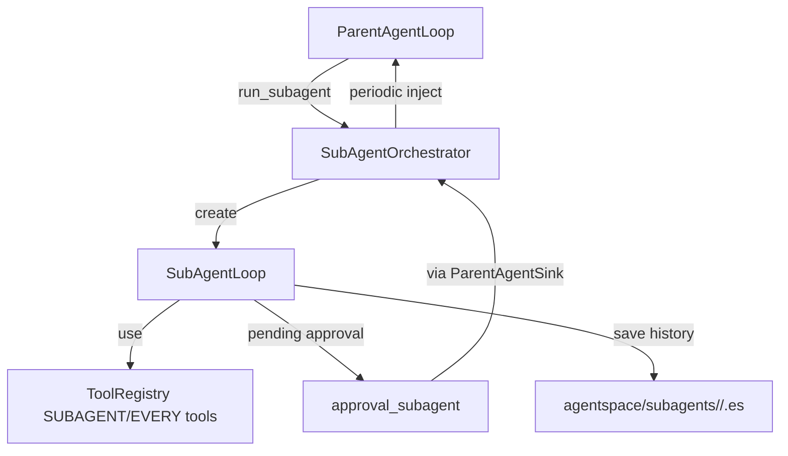

# subagent/ — 子代理与多代理系统

`subagent/` 与 `component/mutliagenttools/` 共同实现 Evolve Agent 的多代理运行时。它包含两套系统：主 Agent → 子 Agent 的编排模式，以及多 Agent 广播协作模式。

---

## 文件结构

```
subagent/
├── orchestrator.py          ← SubAgentOrchestrator + _OrchestratorContext
├── loop.py                  ← SubAgentLoop（子代理循环实现）
└── context.py               ← SubRuntimeContext（子代理运行时上下文构建）

component/mutliagenttools/   ← 多代理 / 子代理工具
├── register_subagent.py     ← register_subagent / register_subagent_from_parent
├── unregister_subagent.py   ← unregister_subagent
├── list_subagents.py        ← list_subagents
├── run_subagent.py          ← run_subagent
├── chat_subagent.py         ← chat_subagent
├── approval_subagent.py     ← approval_subagent
├── stop_subagent.py         ← stop_subagent
├── enter_multi_agent.py     ← enter_multi_agent（切换到多 Agent 协作模式）
├── agents_group.py          ← agents_group（当前未实现）
├── _store.py                ← SubagentStore（子代理注册表磁盘存储）
└── profile_builder.py       ← 多 Agent 模式工具过滤与 Profile 构造
```

---

## 两套多代理系统

### 1. 子代理模式（SubAgent）

主 Agent → 子 Agent 的编排模式：



核心设计：

- **按父会话隔离**：`SubAgentOrchestrator` 为每个 `parent_session_id` 维护一个 `_OrchestratorContext`。
- **一条子代理 = 一个 `SubAgentLoop` 任务**：启动时创建独立 `asyncio.Task`，在 `loop.run()` 内完成 LLM 调用 → 工具执行 → 结果回写。
- **工具权限隔离**：子代理只能看到 `availability` 包含 `SUBAGENT` 或 `EVERY` 的工具；递归创建子代理的 `multiagent` 工具集仅对主代理可见（`MAIN`）。
- **审批流**：只读 / 自动允许列表中的工具直接执行；其余工具调用挂起，等待父代理通过 `approval_subagent` 审批，或走脱手模式的自动审批。
- **结果收集**：后台每 1 秒检查父代理空闲时间，超过 `SUBAGENT_IDLE_TRIGGER_SECONDS`（默认 20s）后把子代理 `outbox` 和待审批列表以 `[subagent-result]` 形式注入父代理消息循环。
- **历史持久化**：停止时通过 `save_history()` 写入 `agentspace/subagents/<name>/<session_id>.es`，使用 `easysave` 多态序列化。

### 2. 多 Agent 协作模式（MultiAgent）

通过 `enter_multi_agent` 工具切换。切换后所有用户消息由 `MultiAgentLoop` 处理：

- 所有参与 Agent 共享同一份对话历史（`History`）。
- 每条用户消息触发一轮串行级联响应。
- Agent 可在回复中通过 `response_characters` DSL 标签指定下一轮的响应者。
- `MultiAgentWorker` 是单个 Agent 的一轮响应执行器，由 `MultiAgentLoop` 创建并聚合 token 统计。
- 多 Agent 模式下 multiagent 工具集被禁用。

详见 `../entry/DEV-README.md` 中的 `MultiAgentLoop` / `MultiAgentWorker` 章节。

---

## 关键类

### `SubAgentOrchestrator`

`subagent/orchestrator.py` 的顶层编排器，职责包括：

- 按父会话维护 `_OrchestratorContext`（活跃子代理、等待队列、后台周期任务）。
- 创建/停止/查询子代理。
- 将子代理事件路由到父会话的 `FrontendSink`。
- 批量收集子代理输出并注入父 Agent 的消息循环。
- 生命周期由 `Application.shutdown()` 管理（`shutdown_all()`）。

### `_OrchestratorContext`

单个父会话的运行时上下文：

- `_active`：当前活跃的子代理映射（`session_id → SubAgentLoop`）。
- `_active_task`：活跃子代理的 asyncio.Task 映射。
- `_waiting_queue`：达到并发上限后 FIFO 排队的子代理请求。
- 后台周期任务：检查空闲并推送结果。

### `SubAgentLoop`

`subagent/loop.py` 中的子代理核心循环，继承 `BasePrivateChatAgentLoop`：

- 处理 inbox/outbox、工具审批、事件推送。
- 使用 `SubRuntimeContext` 拥有独立的 LLM 配置。
- 工具调用挂起时进入 `_pending_approvals`。
- 通过 `ParentAgentSink` 与父 Agent 通信。

### `SubRuntimeContext`

`subagent/context.py` 构建子代理运行时上下文，包含独立的 LLM 客户端配置（通过 `create_llm_client()` 加载）和工具集。

### `SubagentStore`

`component/mutliagenttools/_store.py` 中的子代理注册表磁盘存储：

- 每个子 Agent 独立持久化到 `agentspace/subagents/<name>-setting.json`。
- 通过 `agentspace/subagents/_index.json` 维护已注册名称列表。
- 提供 CRUD API：`get()`、`save()`、`delete()`、`list_names()`。
- 每次操作均真实读写磁盘，不维护内存缓存。

### `profile_builder`

`component/mutliagenttools/profile_builder.py` 提供多 Agent 模式的 Profile 构造逻辑：

- `build_multi_agent_tools(tool_registry)`：返回多 Agent 模式下可用的工具定义（MAIN 工具集排除 multiagent 工具集）。
- `build_agent_profile()`：为多 Agent 模式中的单个 Agent 构造 `AgentProfile`（系统提示词、工具列表、LLM 客户端）。
- 通过 `llm_client_factory` 回调保留不同调用方对 LLM 客户端获取方式的差异。

---

## 子代理工具

| 工具 | 能力 |
|---|---|
| `register_subagent` | 手动注册子代理 LLM 配置（name / base_url / model / api_key / token 上限 / system_prompt_paths），不可覆盖已存在项。 |
| `register_subagent_from_parent` | 继承父代理当前 LLM 配置快速注册。 |
| `unregister_subagent` | 从磁盘注册表删除指定 name。 |
| `list_subagents` | 列出所有注册子代理，并附带当前父会话下的运行状态、待审批、feedback 数量。 |
| `run_subagent` | 启动一个子代理会话；支持 `history_path` 恢复历史；同一父会话同名子代理只能有一个活跃或排队实例；达到并发上限则 FIFO 排队。 |
| `chat_subagent` | 向活跃子代理发消息，进入 inbox，当前 tool-call 链结束后注入；若子代理还有未读反馈则调用失败。 |
| `approval_subagent` | 批量审批/拒绝子代理的工具调用。 |
| `stop_subagent` | 强制停止子代理，保存会话历史，并可能从队列中激活下一个。 |
| `enter_multi_agent` | 将当前主会话切换到多 Agent 协作模式。停止所有活跃子 Agent，multiagent 工具集将被禁用。可通过 `exit_multi_agent` 退出。 |
| `exit_multi_agent` | 退出多 Agent 协作模式，回到普通模式。共享对话历史保留。 |
| `agents_group` | **当前未实现**，调用会抛出 `NotImplementedError`。 |

---

## 工具可见性

子代理的工具集不是"除了 multiagent 之外的所有工具"，而是由 `ToolRegistry.get_definitions_for_availability(ToolAvailability.SUBAGENT)` 决定。每个工具注册时可声明 `availability` 位掩码：

- `MAIN`：仅主 Agent 可见。
- `SUBAGENT`：子 Agent 可见。
- `EVERY`：两者都可见。

例如，创建子代理的 `run_subagent` 等工具标记为 `MAIN`，避免无限递归。

多 Agent 模式下，`profile_builder.build_multi_agent_tools()` 从 MAIN 工具集中排除 `multiagent` toolset 的工具。

---

## 审批与结果注入

1. 子代理执行非只读工具时，调用进入 `_pending_approvals`。
2. `approval_subagent` 工具由父 Agent 调用，批量通过/拒绝。
3. 父 Agent 空闲超过阈值后，`SubAgentOrchestrator` 将子代理 outbox + 待审批列表格式化为 `[subagent-result]` 消息，通过 inbox 注入 `ParentAgentLoop`。
4. 父 Agent 的下一轮 LLM 调用即可看到子代理的产出。

脱手模式下，子代理的工具审批直接走 `request_user_confirm` 到父 session（由 approval 模型审批），不经过 `_pending_approvals` 队列。

---

## 历史持久化

- 运行中：子代理历史保存在内存中的 `SubAgentLoop._history`。
- 停止时：序列化到 `agentspace/subagents/<name>/<session_id>.es`。
- 恢复时：`run_subagent` 可传入 `history_path` 参数，通过 `easysave.load()` 恢复。

> 注意：部分工具描述文案写"保存为 JSONL"，实际使用 `.es`（easysave）格式。