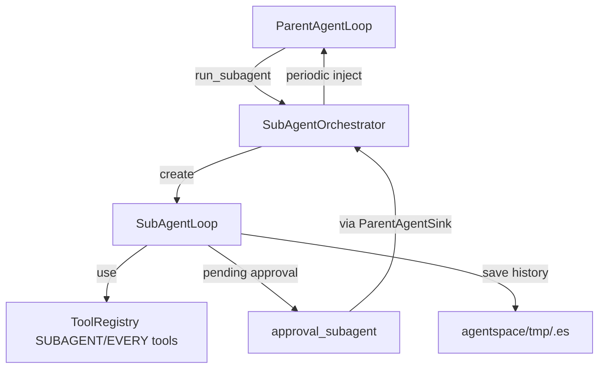

# subagent/ — 子代理与多代理系统

`subagent/` 与 `component/multiagenttools/` 共同实现 Evolve Agent 的多代理运行时。它包含两套系统：主 Agent → 子 Agent 的编排模式，以及多 Agent 广播协作模式。

---

## 文件结构

```
subagent/
├── orchestrator.py          ← SubAgentOrchestrator + _OrchestratorContext
├── loop.py                  ← SubAgentLoop（子代理循环实现）
├── taskloop.py              ← TaskAgentLoop（一次性临时Agent循环）
└── context.py               ← SubRuntimeContext（子代理/临时Agent运行时上下文构建）

component/multiagenttools/   ← 多代理 / 子Agent工具
├── profile_builder.py       ← 动态角色档案到多Agent Profile的构造
├── list_subagents.py        ← ListSubAgents
├── run_subagent.py          ← RunSubAgent
├── stop_subagent.py         ← StopSubAgent
├── run_taskagent.py         ← RunTaskAgent
├── stop_taskagent.py        ← StopTaskAgent
├── chat_subagent.py         ← ChatSubAgent
├── approval_subagent.py     ← ApprovalSubAgent
└── ...                      ← 其他多Agent工具
```

---

## 两套多代理系统

### 1. 子代理模式（SubAgent）

主 Agent → 子 Agent 的编排模式：


```mermaid
graph TD
    A[ParentAgentLoop] -->|run_subagent| B[SubAgentOrchestrator]
    B -->|create| C[SubAgentLoop]
    C -->|use| D[ToolRegistry SUBAGENT/EVERY tools]
    C -->|pending approval| E[approval_subagent]
    E -->|via ParentAgentSink| B
    B -->|periodic inject| A
    C -->|save history| F[agentspace/tmp/<session_id>.es]
```

核心设计：

- **按父会话隔离**：`SubAgentOrchestrator` 为每个 `parent_session_id` 维护一个 `_OrchestratorContext`。
- **一条子代理 = 一个 `SubAgentLoop` 任务**：启动时创建独立 `asyncio.Task`，在 `loop.run()` 内完成 LLM 调用 → 工具执行 → 结果回写。
- **工具权限隔离**：子代理只能看到 `availability` 包含 `SUBAGENT` 或 `EVERY` 的工具；递归创建子代理的 `multiagent` 工具集仅对主代理可见（`MAIN`）。
- **审批流**：只读 / 白名单中的工具直接执行；其余工具调用挂起，等待父代理通过 `approval_subagent` 审批，或走脱手模式的自动审批。
- **结果收集**：事件驱动——子代理 `outbox` 追加或 `pending_approvals` 变化时经 `_outbox_event` 即时触发 waiter，格式化为 `[subagent-result]` 消息 push 到父代理的 `SessionMessageQueue`。
- **历史持久化**：停止时通过 `save_history()` 写入 `agentspace/tmp/<session_id>.es`，使用 `easysave` 多态序列化；角色是否长期保留历史由 Agent 自行移动。

### 2. 多 Agent 协作模式（MultiAgent）

通过 `enter_multi_agent` 工具切换。切换后所有用户消息由 `MultiAgentLoop` 处理：

- 所有参与 Agent 共享同一份对话历史（`History`）。
- 每条用户消息触发一轮串行级联响应。
- Agent 可在回复中通过 `response_characters` DSL 标签指定下一轮的响应者。
- `MultiAgentWorker` 是单个 Agent 的一轮响应执行器，由 `MultiAgentLoop` 创建并聚合 token 统计。
- 多 Agent 模式下 multiagent 工具集被禁用。

详见 `../entry/DEV-README.md` 中的 `MultiAgentLoop` / `MultiAgentWorker` 章节。

---

## 关键类

### `SubAgentOrchestrator`

`subagent/orchestrator.py` 的顶层编排器，职责包括：

- 按父会话维护 `_OrchestratorContext`（活跃子代理、等待队列、后台周期任务）。
- 创建/停止/查询子代理。
- 将子代理事件路由到父会话的 `FrontendSink`。
- 批量收集子代理输出并注入父 Agent 的消息循环。
- 生命周期由 `Application.shutdown()` 管理（`shutdown_all()`）。

### `_OrchestratorContext`

单个父会话的运行时上下文：

- `_active`：当前活跃的子代理映射（`session_id → SubAgentLoop`）。
- `_active_task`：活跃子代理的 asyncio.Task 映射。
- `_waiting_queue`：达到并发上限后 FIFO 排队的子代理请求。
- 事件驱动 waiter：子 Agent 完成后自动收集并推送结果。

### `SubAgentLoop`

`subagent/loop.py` 中的子代理核心循环，继承 `BasePrivateChatAgentLoop`：

- 处理 inbox/outbox、工具审批、事件推送。
- 使用 `SubRuntimeContext` 拥有独立的 LLM 配置。
- 工具调用挂起时进入 `_pending_approvals`。
- 通过 `ParentAgentSink` 与父 Agent 通信。

### `SubRuntimeContext`

`subagent/context.py` 构建子Agent与临时Agent运行时上下文。普通子Agent从动态 `CharacterProfile` 的 `profile.md` 和 `[llm_profile]` 引用构建；临时Agent则保存发起 `RunTaskAgent` 调用时父主会话活动 LLM Profile 的非持久化深快照，并据此创建客户端。

### `TaskAgentLoop`

`subagent/taskloop.py` 实现一次性临时Agent：只接收单个 prompt，无系统提示词、无历史持久化，产生纯文本结果或达到工具循环上限后终止。并发槽位已满时直接失败，不进入子Agent等待队列。

临时Agent的工具定义与执行期授权都使用同一交集：当前实例已加载工具集中的工具，且 `availability` 包含 `TASKAGENT`，同时 `danger_level` 为 `safe`。因此临时Agent不会进入父Agent或审批模型流程；陈旧或伪造的越权工具调用直接返回失败工具结果。`LoadToolset` 本身符合该交集时可以调用，但加载只改变已加载集合，不会授权非 `TASKAGENT` 或非 `safe` 工具。当前新实例默认从 `core` 开始；后续可按任务类型预加载工具集以减少工具循环轮次，但不得绕过权限交集。

### 动态角色档案

`subagent/profile.py::CharacterProfileResolver` 每次从 `agentspace/characters/roleplay/` 和 `agentspace/characters/task/` 扫描角色目录：

- 每个角色目录必须包含 `profile.md` 和同级 `profile.md.meta`。
- `profile.md` 是自定义系统提示词；元数据中的 `[llm_profile]` 直接引用 `llm_profiles.es` 中已有的 Profile 名称。
- 角色名称跨 `roleplay` 与 `task` 全局唯一；重复名称保留为错误条目但不可启动。
- 缺失档案、元数据格式错误、缺少引用或 Profile 不存在时，列表保留条目并返回错误；启动入口拒绝该角色。
- 解析不使用持久化注册表或内存缓存；Profile 配置不复制到角色目录。

### 历史与临时Agent

普通子Agent停止时默认保存到 `ws:tmp/<session_id>.es`。只有 `RunSubAgent` 显式传入 `.es` 的 `history_path` 才会加载历史；Agent 可以自行将临时历史移动到角色目录或其他 `ws:` 路径。

`TaskAgent` 使用调用时活动 LLM Profile 的非持久化快照，不经过角色档案解析、等待队列，也不保存历史。

### `profile_builder`

`component/multiagenttools/profile_builder.py` 提供多 Agent 模式的 Profile 构造逻辑：

- `build_multi_agent_tools(tool_registry)`：返回多 Agent 模式下可用的工具定义（MAIN 工具集排除 multiagent 工具集）。
- `build_agent_profile()`：为多 Agent 模式中的单个 Agent 构造 `AgentProfile`（系统提示词、工具列表、LLM 客户端）。
- 通过 `llm_client_factory` 回调保留不同调用方对 LLM 客户端获取方式的差异。

### 子代理系统提示词注入

`SubAgentLoop._build_system_prompt()` 在 `SubRuntimeContext.system_prompts` 基础上动态注入父会话级约定块（`owner="parent"`）：

- `build_session_site_block(parent_session_id, owner="parent")`：父会话网页 `site/` 约定。
- `build_session_stage_block(parent_session_id, owner="parent")`：父会话 Agent 舞台层 `stage/` 约定。
- `build_toolset_catalog_block()`：已加载工具集目录。

这些约定块告知子 Agent 网站部署区和舞台层属于父会话而非自身，写入路径为 `ws:sessions/<parent_session_id>/site/` 和 `ws:sessions/<parent_session_id>/stage/`。

此外，`SubAgentLoop._build_system_prompt()` 每次调用都会注入 fast 模式全局动态沙盒空间块。动态映射由 Application 的唯一 Sandbox 持有，与父会话、子会话和 LLM Profile 无关，所有子Agent共享；子Agent不能加载仅 MAIN|MULTI_AGENT 可见的管理工具。`TaskAgentLoop` 继续保持无系统提示词，但若任务中已给出动态逻辑路径，文件工具仍通过共享 Sandbox 解析。

---

## 子代理工具

| 工具 | 能力 |
|---|---|
| `ListSubAgents` | 动态扫描所有角色档案，返回档案路径、Profile名称、错误和运行状态。 |
| `RunSubAgent` | 按当前动态角色档案启动子Agent，可显式传入 `.es` 历史。 |
| `ChatSubAgent` | 向活跃子Agent发消息。 |
| `ApprovalSubAgent` | 批量审批/拒绝子Agent的工具调用。 |
| `StopSubAgent` | 停止子Agent并将历史保存到 `ws:tmp/<session_id>.es`。 |
| `EnterMultiAgent` | 将当前主会话切换到多Agent协作模式。 |
| `ExitMultiAgent` | 退出多Agent协作模式。 |
| `AgentsGroup` | **当前未实现**，调用会抛出 `NotImplementedError`。 |

---

## 工具可见性

子代理的工具集不是"除了 multiagent 之外的所有工具"，而是由 `ToolRegistry.get_definitions_for_loaded_toolsets(ToolAvailability.SUBAGENT, loaded_toolsets)` 决定。每个工具注册时可声明 `availability` 位掩码：

- `MAIN`：仅主 Agent 可见。
- `SUBAGENT`：子 Agent 可见。
- `EVERY`：两者都可见。

例如，创建子代理的 `run_subagent` 等工具标记为 `MAIN`，避免无限递归。

子代理拥有独立的会话级工具集加载状态（`_loaded_toolsets`），默认从 `core` 开始。`SubAgentLoop` 和 `TaskAgentLoop` 通过 `get_tool_availability_scope()` 返回各自的 scope（`SUBAGENT` / `TASKAGENT`），工具定义按已加载工具集动态计算。`TaskAgentLoop` 还在定义侧与执行侧同时施加 `danger_level == safe` 过滤，因此其权威范围是“已加载工具集 ∩ TASKAGENT ∩ safe”，不会产生审批请求。

多 Agent 模式下，`MultiAgentLoop._run_single_agent()` 使用 `self._get_effective_tool_definitions()` 动态获取工具定义，参与Agent共享主会话的加载状态。

---

## 审批与结果注入

1. 子代理执行非只读工具时，调用进入 `_pending_approvals`。
2. `approval_subagent` 工具由父 Agent 调用，批量通过/拒绝。
3. 子代理 `outbox` 追加或 `pending_approvals` 变化时，`SubAgentOrchestrator` 的 waiter 即时将 outbox + 待审批列表格式化为 `[subagent-result]` 消息，push 到父代理的 `SessionMessageQueue`。
4. 父 Agent 的下一轮 LLM 调用即可看到子代理的产出。

脱手模式下，子代理的工具审批直接走 `request_user_confirm` 到父 session（由 approval 模型审批），不经过 `_pending_approvals` 队列。

---

## Shell会话所有权

子Agent可按 `SUBAGENT` 可用范围与审批策略使用 Shell工具。临时Agent不能按工具集整体推断权限；只有具体 Shell工具同时属于已加载工具集、标记为 `TASKAGENT` 且危险等级为 `safe` 时才可见和执行。资源所有权使用父主会话 ID 与自身角色名，而不是子会话 ID；因此不同 Agent 不能互相读取、写入、中断或停止 Shell。主会话自动旋转时，ShellManager 迁移 Shell并保留旧父会话 ID 的临时解析别名，使尚未结束的子Agent仍能继续操作；手动终结、永久删除和应用关闭会停止关联 Shell。

## Agentspace 回复轮次文件锁

- `SubAgentLoop` 在初始消息或被 `_wake_event` 唤醒开始回复时创建唯一 round ID；连续工具回环沿用该 ID，纯文本回复完成并进入等待前释放，异常/停止路径在 `finally` 幂等释放。
- `TaskAgentLoop` 的一次性完整回复使用一个 round ID，并在终止 `finally` 释放。
- 子Agent文件工具通过 `ToolContext.round_id` 登记明确 `ws:` 路径；登记失败时 fail-closed。该机制不改变子Agent审批策略或 Evolve Agent `Delete` 的永久删除语义。

---

## 历史持久化

- 运行中：子Agent历史保存在内存中的 `SubAgentLoop._history`。
- 停止时：普通子Agent序列化到 `agentspace/tmp/<session_id>.es`。
- 恢复时：`RunSubAgent` 只有显式传入逻辑 `history_path` 才通过 `easysave.load()` 恢复 `.es` 历史。
- 角色是否长期保留历史由 Agent 自行将临时文件移动到角色目录或其他 `ws:` 路径。

